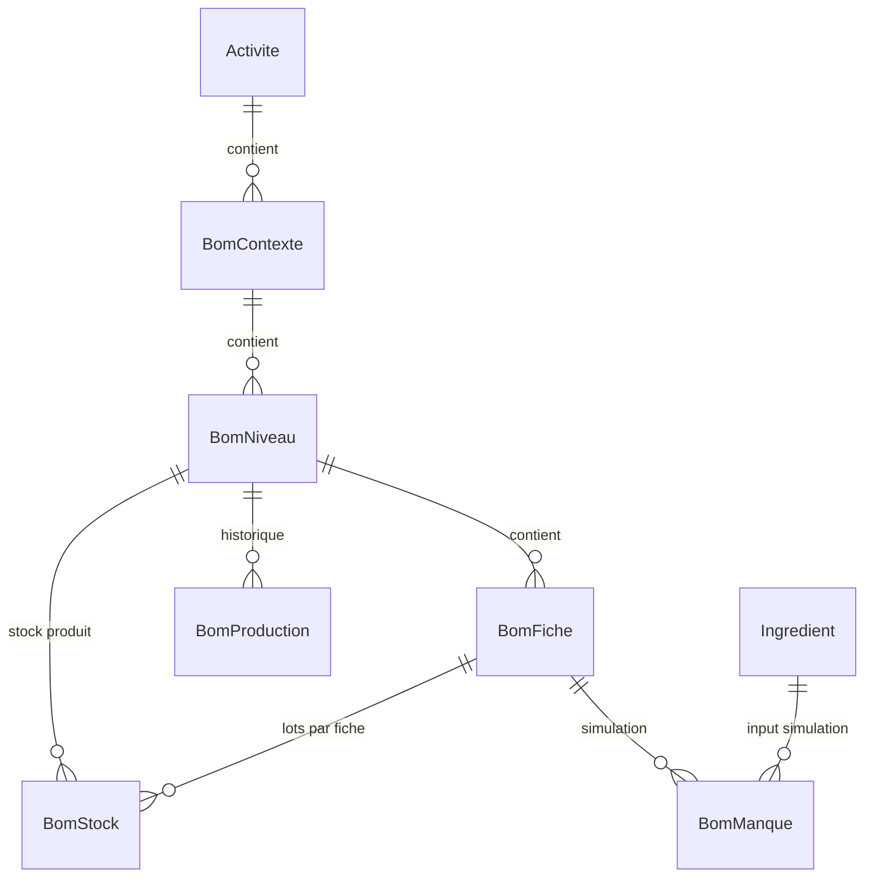
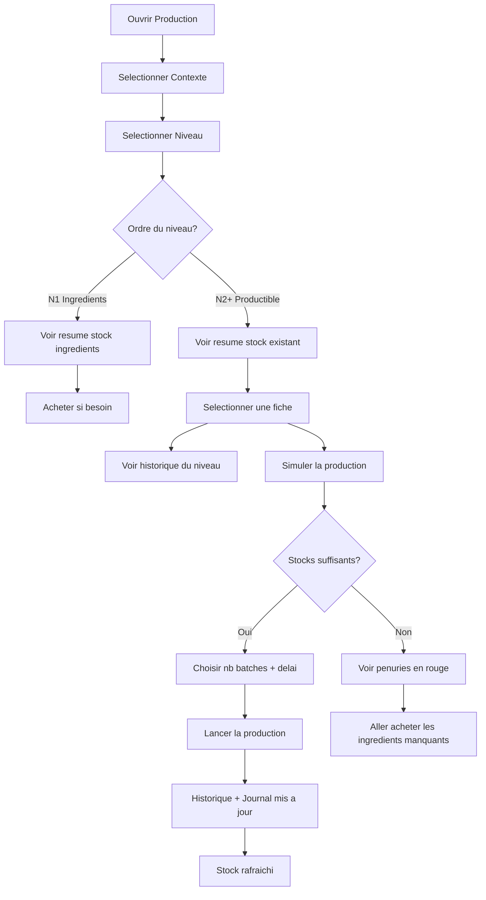
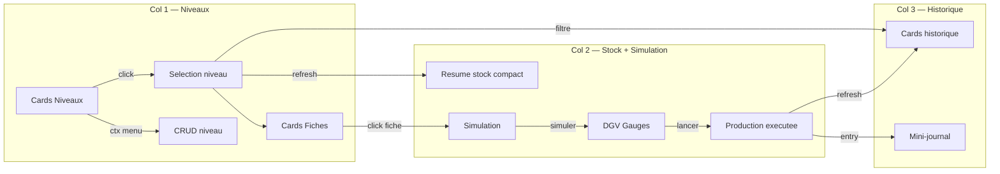

# Fondation — Fusion Production & Contexte/Niveaux
> mentalyas · Full-Stack Dev
> Date : 2026-06-10
> Statut : Brainstorm initial
> Projet : ArtisaStock (CharlesNadejda)

---

## 1. Concept Global

Fusionner les deux ecrans WinForms "Contexte/Niveaux" et "Production" en un seul ecran unifie appele **"Production"**. L'objectif est d'eliminer les redondances massives (combos cascade, cards custom, DGV factory, stock display, helpers Kanban) tout en conservant 100% des fonctionnalites des deux ecrans. Le workflow naturel de l'utilisateur est lineaire : choisir quoi produire -> verifier le stock existant -> simuler les ingredients -> decider la quantite -> lancer -> constater le resultat. Cet ecran unique couvre ce flux complet sans navigation intermediaire.

## 2. Fonctionnalites

### Fonctionnalites core (MVP — cette refonte)

- [ ] **Colonne Niveaux + Fiches** (220px, Dock Left)
  - [ ] Cards niveaux cliquables (tous ordres, N0 inclus)
  - [ ] Bouton "+ Nouveau niveau"
  - [ ] Menu contextuel (supprimer niveau, gerer fiches, lancer production)
  - [ ] Cards fiches du niveau selectionne (N2+ uniquement, selection pour production)
  - [ ] Badge "Final" sur le niveau le plus haut

- [ ] **Colonne centrale Stock + Simulation** (Dock Fill)
  - [ ] Resume stock compact : tableau Fiche | Qte base (unite) | Qte pieces + alerte si 0
  - [ ] Header stock avec boutons action : [Gerer fiches] + [Acheter] (N1 uniquement)
  - [ ] Adaptation N1 : resume stock ingredients (meme format compact)
  - [ ] Adaptation N2+ : resume stock produits + simulation complete
  - [ ] DGV simulation avec gauges (% dispo par ingredient)
  - [ ] Labels resultat + cout estime
  - [ ] Inputs : Nb batches, Delai conservation, Notes
  - [ ] Boutons : Simuler + Lancer

- [ ] **Colonne Historique + Journal** (260px, Dock Right)
  - [ ] Cards productions recentes filtrees par niveau selectionne
  - [ ] Mini-journal (5 dernieres entrees, Dock Bottom)

- [ ] **KPI Bar contextuelle**
  - [ ] 4 KPI cards s'adaptant au niveau selectionne
  - [ ] Productions 7j (du niveau), Stock total (du niveau), Alertes, Fiches actives (du niveau)

- [ ] **Header**
  - [ ] Titre "Production" + sous-titre

- [ ] **Navigation**
  - [ ] Entree unique "Production" dans la sidebar
  - [ ] Suppression de l'entree "Contexte/Niveaux"
  - [ ] Pre-selection du dernier contexte/niveau via `_state`

### Fonctionnalites secondaires (v2+)

- [ ] Drag & drop pour reordonner les niveaux
- [ ] Filtrage historique par fiche (en plus du filtre par niveau)
- [ ] Export historique en CSV
- [ ] Mode "planification" multi-productions en file d'attente

### Hors scope (explicitement exclu)

- Detail approfondi des lots stock (reste dans l'ecran Stock dedie)
- Edition inline des fiches/ingredients (reste dans FrmBomFiches / FrmIngredients)
- Gestion des contextes (creation/suppression) — reste accessible depuis le Hub/sidebar

## 3. Structure de Base de Donnees

> Aucune modification DB requise. La fusion est purement UI.

### Entites concernees (lecture seule depuis DAL)

| Entite | DAL | Usage dans l'ecran |
|--------|-----|-------------------|
| BomContexte | BomContexteDAL.GetAll(idActivite) | Combo contexte |
| BomNiveau | BomNiveauDAL.GetByContexte(idCtx) | Cards niveaux |
| BomFiche | BomFicheDAL.GetByNiveau(idNiv) | Cards fiches + simulation |
| BomStock | BomStockDAL.GetByNiveau(idNiv) | Resume stock N2+ |
| Ingredient | IngredientDAL.GetAll() | Resume stock N1 |
| BomManque | BomProductionDAL.Simuler(...) | DGV simulation gauges |
| BomProduction | BomProductionDAL.GetRecentByActivite(...) | Historique cards |
| BomCout | BomCoutDAL.CalculerCout(...) | Cout estime |

### Diagramme ERD — Entites impliquees



## 4. Diagrammes Use Cases

### Workflow utilisateur principal



### Interactions ecran



## 5. Stack Technologique

> Pas de changement de stack — refactoring interne.

| Couche | Technologie | Justification |
|--------|-------------|---------------|
| Desktop | C# .NET Framework 4.8.1 WinForms | Existant, pas de migration |
| Pattern | Partial class FrmPrincipal | Coherent avec l'architecture actuelle |
| Data | DAL direct MySQL | Existant, pas de changement |
| UI | Custom Paint + FlowLayoutPanel | Pattern Kanban deja en place |

## 6. Algorithmes & Patterns Techniques

### Code a supprimer
- **FrmPrincipal.Contexte.cs** — Fichier entier (~527 lignes) absorbe dans Production
- **FrmPrincipal.Production.cs** — Reecrit completement (~1246 lignes actuelles)
- **ShowContexteScreen()** — Remplace par ShowProductionScreen() unifie
- **Entree sidebar** "Contexte/Niveaux" — Supprimee, ScreenId.ContexteNiveaux retire

### Code a reutiliser directement (static helpers)
- `MakeKanbanHeader(title, color)` — en-tete colonne 32px
- `MakeColumnSeparator()` — separateur 3px avec ombre
- `RoundedRect(bounds, radius)` — GraphicsPath coins arrondis
- `MakeSmallButton(text, bg, fg)` — petit bouton toolbar
- `MakeActionButton(text, bg, fg)` — bouton action
- `BuildProdDgv()` — factory DGV stylee

### Code a fusionner
| Depuis Contexte.cs | Depuis Production.cs | Resultat fusionne |
|---------------------|----------------------|-------------------|
| MakeNiveauCard() | — | Conserve tel quel |
| SelectNiveauRow() | ProdSelectFiche() | SelectNiveauRow() + ProdSelectFiche() |
| ChargerStockNiveau() | ProdChargerStockCards() | ProdChargerStockResume() (compact) |
| DgvStock_CellFormatting | ProdDgvSim_CellFormatting | Les deux conserves |
| BtnAjouterNiveau_Click | — | Conserve |
| SupprimerNiveau() | — | Conserve |
| — | ProdBtnSimuler_Click | Conserve |
| — | ProdBtnLancer_Click | Conserve |
| — | ProdChargerContextes | Conserve |

### Pattern architectural — Zone adaptative (N1 vs N2+)

```csharp
// La colonne centrale s'adapte au type de niveau selectionne
private void ProdOnNiveauSelected(BomNiveau niv)
{
    ProdRefreshKpi(niv);
    ProdRefreshStockResume(niv);
    ProdRefreshHistorique(niv);  // filtre par niveau

    if (niv.Ordre == 1)
    {
        // N1 : masquer simulation, afficher bouton Acheter
        _prodPnlSimulation.Visible = false;
        _prodBtnAchat.Visible = true;
    }
    else
    {
        // N2+ : afficher simulation + fiches
        _prodPnlSimulation.Visible = true;
        _prodBtnAchat.Visible = false;
        ProdChargerFicheCards(niv);
    }
}
```

### Pattern — Resume stock compact

```csharp
// Tableau compact : Fiche | Qte base | Qte pieces
// N1 : IngredientDAL.GetAll() -> Nom, StockActuel, StockPieces
// N2+: BomStockDAL.GetByNiveau() -> agrege par fiche, calcul pieces
// Alerte visuelle si stock = 0
```

## 7. Securite — Bloc Dedie

### Niveau de sensibilite des donnees
**Moyen** — Donnees metier (stocks, couts, productions). Pas de donnees personnelles dans cet ecran.

### Vulnerabilites a anticiper

| Risque | Vecteur | Mitigation |
|--------|---------|------------|
| Injection SQL | Parametres DAL | Requetes parametrees (deja en place via DAL) |
| Race condition | Double-clic Lancer | Desactivation bouton pendant execution async |
| Depassement stock | Lancement concurrent | Verification stock dans BomProductionDAL.Executer (transactionnel) |
| Corruption UI | Exception DAL pendant refresh | try-catch sur chaque chargement, pas de crash UI |

### Checklist securite minimale
- [x] Requetes parametrees via DAL (existant)
- [x] Async/await sur operations longues (existant)
- [x] Confirmation MessageBox avant production (existant)
- [x] Validation ProdSelectionValide() avant simulation/lancement (existant)
- [ ] Verifier que la suppression de Contexte.cs ne laisse pas de dead code

## 8. References

| Reference | Ce qui est inspirant | Ce qu'on fait |
|-----------|---------------------|---------------|
| Ecran Contexte/Niveaux actuel | Kanban 3 colonnes, cards niveaux, DGV stock | On garde le layout et les cards |
| Ecran Production actuel | Simulation gauges, historique cards, journal | On garde la logique metier intacte |
| Trello / Kanban boards | Colonnes avec cards drag & drop | Inspiration visuelle (pas de drag) |

## 9. Vers l'Implementation

### Resume executif
Fusion de deux ecrans redondants en un seul ecran "Production" Kanban 3 colonnes. Elimine ~500 lignes de code duplique, simplifie la navigation utilisateur (1 ecran au lieu de 2), et offre un workflow continu : selection -> verification stock -> simulation -> production -> constat. Aucune modification DB requise.

### Layout final

```
┌─ Header "Production" (Dock Top 52px) ────────────────────────────────┐
├─ KPI Bar contextuelle (Dock Top 92px) ───────────────────────────────┤
├───────────┬──────────────────────────────────────┬───────────────────┤
│ NIVEAUX   │ STOCK + SIMULATION                   │ HISTORIQUE        │
│ 220px     │ Fill                                 │ 260px             │
│           │                                      │                   │
│ [Ctx ▼]   │ ┌─ Stock N2 ──── [Fiches] [Acheter]─┐│ Cards prod       │
│           │ │ Feuilletee  12.5 kg   50 pc        ││ filtrees par     │
│ ┌───────┐ │ │ Pat. choux   3.2 kg   16 pc        ││ niveau           │
│ │ N3 ★  │ │ │ Brisee       0   kg    0 pc  ⚠   ││                   │
│ │Produit│ │ └────────────────────────────────────┘│                   │
│ └───────┘ │                                      │                   │
│ ┌───────┐ │ ┌─ Simulation ──────────────────────┐│                   │
│ │ N2    │ │ │ Resultat + Cout estime            ││                   │
│ │ Pates │ │ │ DGV gauges (ingredients)          ││                   │
│ └───────┘ │ └───────────────────────────────────┘│                   │
│ ┌───────┐ │                                      ├───────────────────┤
│ │ N1    │ │ Batches [__] Delai [__]              │ JOURNAL            │
│ │ Ingr. │ │ Notes [________________________]     │ 5 dernieres        │
│ └───────┘ │ [⚡ Simuler]  [▶ Lancer]             │ entrees            │
│ [+ Niv]   │                                      │                   │
│           │                                      │                   │
│ ──────── │                                      │                   │
│ FICHES    │                                      │                   │
│ ┌───────┐ │                                      │                   │
│ │Fiche 1│◄┤                                      │                   │
│ └───────┘ │                                      │                   │
│ ┌───────┐ │                                      │                   │
│ │Fiche 2│ │                                      │                   │
│ └───────┘ │                                      │                   │
└───────────┴──────────────────────────────────────┴───────────────────┘
```

### Points ouverts / decisions restantes

- [ ] Faut-il un separateur visuel entre la section stock et la section simulation dans la colonne centrale ?
- [ ] Comportement exact quand on selectionne N0 (stock global partage) — meme resume compact ?
- [ ] Calcul des "pieces" pour N2+ : existe-t-il deja un champ `QteParConditionnement` sur BomStock ou faut-il le deduire de `QuantiteOutput` de la fiche ?

### Prochaines etapes

1. Valider ce document de fondation
2. Creer le fichier fusionne FrmPrincipal.Production.cs
3. Migrer les helpers statiques de Contexte.cs vers un fichier partage si pas deja fait
4. Supprimer FrmPrincipal.Contexte.cs
5. Mettre a jour la sidebar (retirer ScreenId.ContexteNiveaux)
6. Adapter les NavigateTo() qui pointaient vers ContexteNiveaux
7. Tester le workflow complet : N1 (stock only) + N2+ (stock + sim + prod)
