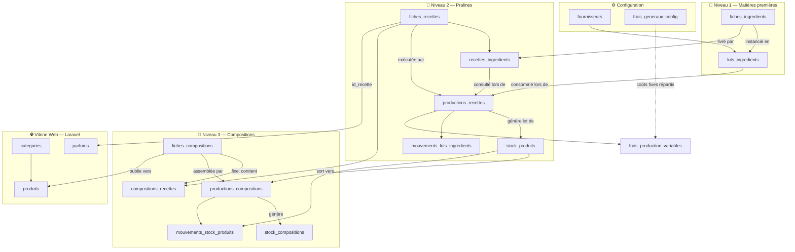
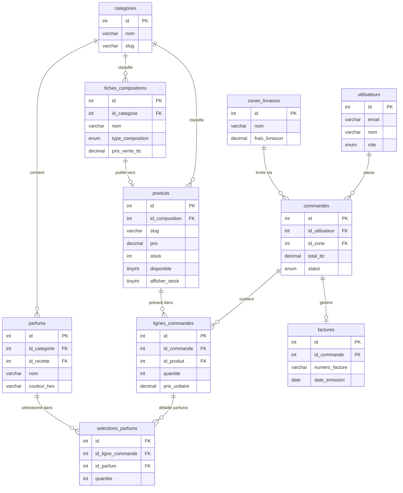
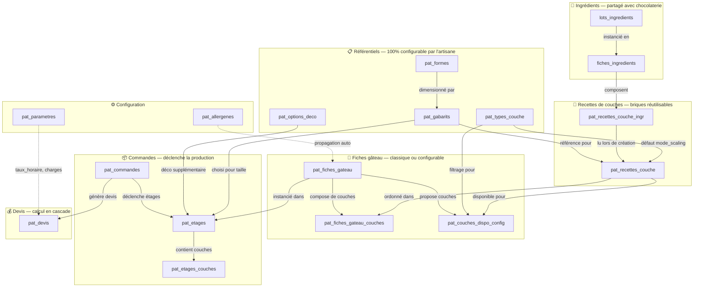
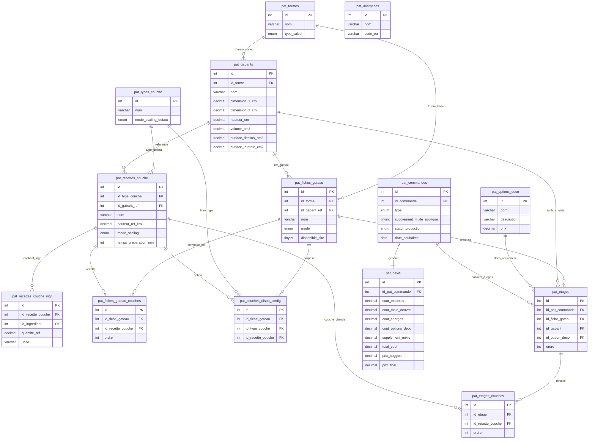

# 01 — Base de Données MySQL

> Schéma complet, script de création et données de test pour le projet Charles & Nadejda.
> Cette base est **partagée** par le site Laravel (PDWEB) et l'application C# ArtisaStock (PDSGBD).
>
> **v3** — Refonte complète du module ArtisaStock après brainstorm approfondi :
> chaîne de production 3 niveaux, séparation fiches/stocks, lots AFSCA, DLC pralines,
> compositions fixes vs configurables, frais généraux, synchronisation web.

---

## 🏗️ Architecture Générale — 3 niveaux de production

```
NIVEAU 1 — Matières premières
  fiches_ingredients (master data, template)
       ↓ instancié à chaque achat (lot AFSCA)
  lots_ingredients (lots réels, DLC précise, prix d'achat réel)
       ↓ consommés à la production (tracé dans mouvements_lots_ingredients)

NIVEAU 2 — Pralines / Chocolats unitaires
  fiches_recettes (définition : ingrédients, rendement, conservation)
       ↓ exécution d'une production_recette
  stock_produits (pralines produites par lot, DLC calculée, coût unitaire)
       ↓ assemblés (tracé dans mouvements_stock_produits)

NIVEAU 3 — Produits finis
  fiches_compositions (définition : fixe ou configurable, frais emballage)
       ├── FIXE : pré-assemblé → productions_compositions → stock_compositions
       └── CONFIGURABLE : assemblé à la commande → bon de commande artisan

VITRINE WEB (Laravel)
  produits (synchronisé depuis fiches_compositions à la publication)
       ↓ stock décrémenté à la vente (webhook Stripe)
```

---

## 📐 Tables — Vue d'ensemble

```
MODULE ARTISASTOCK (géré exclusivement par l'app C#)
══════════════════════════════════════════════════════

fournisseurs
frais_generaux_config         ← paramétrage coûts fixes (élec, eau, usure)
fiches_ingredients            ← "classe" ingrédient (master data, qualité, DLC type)
   └── lots_ingredients       ← "objet" lot acheté (AFSCA, DLC précise, prix réel)
fiches_recettes               ← "classe" recette (composition, rendement, conservation)
   └── recettes_ingredients   ← quels fiches_ingredients en quelle quantité
productions_recettes          ← exécution d'une recette (déstocke lots, crée stock_produits)
   ├── frais_production_variables
   └── mouvements_lots_ingredients ← traçabilité AFSCA modérée
stock_produits                ← pralines disponibles (par lot de prod, DLC, coût)
   └── mouvements_stock_produits   ← sorties vers compositions ou commandes

fiches_compositions           ← "classe" ballotin/sachet (fixe ou configurable)
   └── compositions_recettes  ← pour FIXE : quelle recette, quelle quantité
productions_compositions      ← assemblage d'une composition fixe
   └── frais_production_variables (partagé)
stock_compositions            ← compositions fixes disponibles (DLC, coût, promo)


MODULE BOUTIQUE (partagé Laravel + C#)
══════════════════════════════════════

categories
parfums                       ← lié à fiches_recettes (parfum = praline d'une recette)
fiches_compositions ─publish─► produits   ← vitrine web
produits_parfums
utilisateurs
commandes
   └── lignes_commandes
         └── selections_parfums
factures
zones_livraison
contacts
```

---

## 📊 Diagrammes — Visualisation de la base

### 1. Chaîne de production ArtisaStock (flux)



### 2. Module Boutique — Relations clés (ER)



> **💡 Note** : `parfums.id_recette → fiches_recettes` est le lien crucial entre la vitrine (quel parfum le client choisit) et l'ArtisaStock (quelle praline déduire du stock). `produits.id_composition → fiches_compositions` est le pont entre le catalogue web et la chaîne de production.

### 3. Chaîne de production Pâtisserie (flux)



### 4. Module Pâtisserie — Relations clés (ER)



> **💡 Note pâtisserie** : `pat_formes` + `pat_gabarits` permettent à l'artisane de configurer ses propres tailles. `pat_types_couche` est 100% libre — pas d'énumération fixe. Les paramètres (`taux_horaire`, `taux_charges`, `marge_cible`) sont stockés en clé/valeur pour totale flexibilité. Une pièce montée = `pat_commande` avec N `pat_etages` ; supplément mixte déclenché si ≥ 2 étages ont des `fiche_gateau_id` différents.

---

## 🔧 Script SQL de Création

```sql
-- ============================================================
-- Charles & Nadejda — Script de création BDD v3
-- Auteur : Ernest
-- Ordre : fournisseurs → fiches → recettes → compositions
--         → boutique → lots → productions → stocks
-- ============================================================

CREATE DATABASE IF NOT EXISTS charlesnadejda
    CHARACTER SET utf8mb4
    COLLATE utf8mb4_unicode_ci;

USE charlesnadejda;
SET FOREIGN_KEY_CHECKS = 0;

-- ============================================================
-- MODULE ARTISASTOCK — Couche 0 : Configuration
-- ============================================================

CREATE TABLE IF NOT EXISTS fournisseurs (
    id        INT AUTO_INCREMENT PRIMARY KEY,
    nom       VARCHAR(200) NOT NULL,
    contact   VARCHAR(200),
    email     VARCHAR(255),
    telephone VARCHAR(20),
    adresse   VARCHAR(255),
    notes     TEXT
) ENGINE=InnoDB;

-- Coûts fixes mensuels (électricité, eau, usure matériel)
-- Alloués proportionnellement aux productions du mois
CREATE TABLE IF NOT EXISTS frais_generaux_config (
    id               INT AUTO_INCREMENT PRIMARY KEY,
    type             ENUM('electricite','eau','usure_materiel','autre') NOT NULL,
    libelle          VARCHAR(200) NOT NULL,
    valeur_mensuelle DECIMAL(10,2) NOT NULL,
    actif            TINYINT(1) NOT NULL DEFAULT 1
) ENGINE=InnoDB;

-- ============================================================
-- MODULE ARTISASTOCK — Couche 1 : Ingrédients
-- ============================================================

-- "Classe" ingrédient : données de référence, indépendant des achats
CREATE TABLE IF NOT EXISTS fiches_ingredients (
    id                   INT AUTO_INCREMENT PRIMARY KEY,
    nom                  VARCHAR(200) NOT NULL UNIQUE,
    marque               VARCHAR(200),
    description          TEXT,
    unite_mesure         ENUM('kg','g','l','ml','piece') NOT NULL,
    prix_achat_reference DECIMAL(10,4) NOT NULL,   -- prix de référence (indicatif)
    dlc_jours_reference  INT DEFAULT NULL,          -- durée de vie typique en jours
    qualite_label        VARCHAR(100) DEFAULT NULL, -- ex: Bio, AOC, Grand Cru...
    id_fournisseur_defaut INT DEFAULT NULL,
    seuil_alerte_stock   DECIMAL(10,4) DEFAULT NULL, -- alerte sur stock agrégé total
    actif                TINYINT(1) NOT NULL DEFAULT 1,
    date_creation        DATETIME DEFAULT CURRENT_TIMESTAMP,
    CONSTRAINT fk_fi_fournisseur
        FOREIGN KEY (id_fournisseur_defaut) REFERENCES fournisseurs(id)
        ON DELETE SET NULL ON UPDATE CASCADE
) ENGINE=InnoDB;

-- "Objet" lot acheté : traçabilité AFSCA, DLC précise, prix réel payé
CREATE TABLE IF NOT EXISTS lots_ingredients (
    id                   INT AUTO_INCREMENT PRIMARY KEY,
    id_fiche_ingredient  INT NOT NULL,
    numero_lot           VARCHAR(100) DEFAULT NULL,  -- n° lot AFSCA fournisseur
    id_fournisseur       INT DEFAULT NULL,            -- peut différer du défaut
    date_achat           DATE NOT NULL,
    date_peremption      DATE DEFAULT NULL,           -- DLC précise de ce lot
    quantite_initiale    DECIMAL(10,4) NOT NULL,
    quantite_disponible  DECIMAL(10,4) NOT NULL,     -- décrémenté à la production
    prix_achat_reel      DECIMAL(10,4) NOT NULL,     -- prix réel payé pour ce lot
    reference_facture    VARCHAR(100) DEFAULT NULL,   -- n° facture fournisseur
    notes                TEXT,
    date_creation        DATETIME DEFAULT CURRENT_TIMESTAMP,
    CONSTRAINT fk_lot_fiche
        FOREIGN KEY (id_fiche_ingredient) REFERENCES fiches_ingredients(id)
        ON DELETE RESTRICT ON UPDATE CASCADE,
    CONSTRAINT fk_lot_fournisseur
        FOREIGN KEY (id_fournisseur) REFERENCES fournisseurs(id)
        ON DELETE SET NULL ON UPDATE CASCADE
) ENGINE=InnoDB;

-- ============================================================
-- MODULE ARTISASTOCK — Couche 2 : Recettes
-- ============================================================

-- "Classe" recette : définition de la composition d'une praline/chocolat
CREATE TABLE IF NOT EXISTS fiches_recettes (
    id                       INT AUTO_INCREMENT PRIMARY KEY,
    nom                      VARCHAR(200) NOT NULL UNIQUE,
    description              TEXT,
    type_rendement           ENUM('par_lot','par_unite') NOT NULL DEFAULT 'par_lot',
    -- par_lot  : les quantités d'ingrédients sont pour rendement_quantite pièces
    -- par_unite: les quantités d'ingrédients sont pour 1 seule pièce
    rendement_quantite       DECIMAL(10,4) NOT NULL DEFAULT 1,
    poids_unitaire_indicatif DECIMAL(8,4) DEFAULT NULL,  -- calculé auto (somme masses / rendement)
    poids_unitaire_reel      DECIMAL(8,4) DEFAULT NULL,  -- saisi et validé manuellement
    conservation_jours       INT NOT NULL DEFAULT 30,    -- base calcul DLC des pralines produites
    temps_preparation        INT DEFAULT NULL,            -- en minutes
    actif                    TINYINT(1) NOT NULL DEFAULT 1
) ENGINE=InnoDB;

-- Composition d'une recette : quels fiches_ingredients et en quelle quantité
-- La quantité s'interprète selon type_rendement de la fiche_recette :
--   par_lot  → quantité pour produire rendement_quantite pièces
--   par_unite → quantité pour produire 1 pièce
CREATE TABLE IF NOT EXISTS recettes_ingredients (
    id_recette          INT NOT NULL,
    id_fiche_ingredient INT NOT NULL,
    quantite            DECIMAL(10,4) NOT NULL,
    PRIMARY KEY (id_recette, id_fiche_ingredient),
    CONSTRAINT fk_ri_recette
        FOREIGN KEY (id_recette) REFERENCES fiches_recettes(id)
        ON DELETE CASCADE ON UPDATE CASCADE,
    CONSTRAINT fk_ri_ingredient
        FOREIGN KEY (id_fiche_ingredient) REFERENCES fiches_ingredients(id)
        ON DELETE RESTRICT ON UPDATE CASCADE
) ENGINE=InnoDB;

-- ============================================================
-- MODULE BOUTIQUE — Catalogue (shared)
-- ============================================================

CREATE TABLE IF NOT EXISTS categories (
    id               INT AUTO_INCREMENT PRIMARY KEY,
    nom              VARCHAR(100) NOT NULL UNIQUE,
    description      TEXT,
    ordre_affichage  INT NOT NULL DEFAULT 0
) ENGINE=InnoDB;

-- Un parfum = la déclinaison client d'une fiche_recette
-- Ex: "Praliné" (parfum web) ↔ "Praline Praliné Noisette" (fiche_recette C#)
-- id_recette nullable : parfum sans recette liée = non géré en stock production
CREATE TABLE IF NOT EXISTS parfums (
    id          INT AUTO_INCREMENT PRIMARY KEY,
    nom         VARCHAR(100) NOT NULL UNIQUE,
    description VARCHAR(255),
    type_parfum VARCHAR(50) DEFAULT NULL,  -- Classique | Pur chocolat | Ganache | Fruité | Alcoolisé | Original
    couleur_hex VARCHAR(7) DEFAULT '#6F4E37',
    id_recette  INT DEFAULT NULL,          -- FK vers fiches_recettes (lien production)
    disponible  TINYINT(1) NOT NULL DEFAULT 1,
    CONSTRAINT fk_parfum_recette
        FOREIGN KEY (id_recette) REFERENCES fiches_recettes(id)
        ON DELETE SET NULL ON UPDATE CASCADE
) ENGINE=InnoDB;

-- ============================================================
-- MODULE ARTISASTOCK — Couche 3 : Compositions / Produits finis
-- ============================================================

-- "Classe" composition : définition d'un ballotin, sachet, boîte...
-- FIXE        : composition prédéfinie, pré-assemblée en stock
-- CONFIGURABLE: quantité/poids définis par l'artisan, parfums choisis par le client
CREATE TABLE IF NOT EXISTS fiches_compositions (
    id                INT AUTO_INCREMENT PRIMARY KEY,
    id_categorie      INT NOT NULL,
    nom               VARCHAR(200) NOT NULL,
    description       TEXT,
    type_composition  ENUM('fixe','configurable') NOT NULL,
    poids_cible_grammes DECIMAL(8,2) DEFAULT NULL,  -- poids cible (ex: 250g)
    capacite_max      INT DEFAULT NULL,             -- pour configurables : nb max de pièces
    frais_emballage   DECIMAL(10,2) NOT NULL DEFAULT 0.00,
    image_url         VARCHAR(500) DEFAULT NULL,    -- URL Cloudinary
    afficher_stock_web TINYINT(1) NOT NULL DEFAULT 0, -- afficher le stock sur le site
    mode_prix         ENUM('manuel','coefficient') NOT NULL DEFAULT 'manuel',
    coefficient_marge DECIMAL(5,2) DEFAULT 1.00,   -- multiplicateur sur coût de revient
    prix_vente_ttc    DECIMAL(10,2) DEFAULT NULL,  -- prix de vente TTC final
    prix_calcule      DECIMAL(10,2) DEFAULT NULL,  -- coût de revient calculé par l'app
    saisonnier        TINYINT(1) NOT NULL DEFAULT 0,
    saison_debut      VARCHAR(20) DEFAULT NULL,    -- ex: 'octobre'
    saison_fin        VARCHAR(20) DEFAULT NULL,    -- ex: 'janvier'
    actif             TINYINT(1) NOT NULL DEFAULT 1,
    date_creation     DATETIME DEFAULT CURRENT_TIMESTAMP,
    CONSTRAINT fk_fcomp_categorie
        FOREIGN KEY (id_categorie) REFERENCES categories(id)
        ON DELETE RESTRICT ON UPDATE CASCADE
) ENGINE=InnoDB;

-- Composition d'une fiche FIXE : quelles recettes et en quelle quantité
-- Non utilisé pour les configurables (le client choisit ses parfums)
CREATE TABLE IF NOT EXISTS compositions_recettes (
    id_composition INT NOT NULL,
    id_recette     INT NOT NULL,
    quantite       INT NOT NULL,  -- nb de pièces de ce type dans la composition
    PRIMARY KEY (id_composition, id_recette),
    CONSTRAINT fk_cr_composition
        FOREIGN KEY (id_composition) REFERENCES fiches_compositions(id)
        ON DELETE CASCADE ON UPDATE CASCADE,
    CONSTRAINT fk_cr_recette
        FOREIGN KEY (id_recette) REFERENCES fiches_recettes(id)
        ON DELETE RESTRICT ON UPDATE CASCADE
) ENGINE=InnoDB;

-- ============================================================
-- MODULE BOUTIQUE — Produits vitrine web (synchro depuis fiches_compositions)
-- ============================================================

-- Table partagée : lue par Laravel, écrite par C# (via publication)
-- id_composition NULL = produit sans lien ArtisaStock (pâte à tartiner, créations...)
CREATE TABLE IF NOT EXISTS produits (
    id               INT AUTO_INCREMENT PRIMARY KEY,
    id_categorie     INT NOT NULL,
    id_composition   INT DEFAULT NULL,             -- FK vers fiches_compositions (nullable)
    nom              VARCHAR(200) NOT NULL,
    description      TEXT,
    prix_ttc         DECIMAL(10,2) NOT NULL,
    prix_htva        DECIMAL(10,2) GENERATED ALWAYS AS (ROUND(prix_ttc / 1.21, 2)) STORED,
    prix_promo       DECIMAL(10,2) DEFAULT NULL,   -- prix promotionnel (DLC proche)
    stock            INT NOT NULL DEFAULT 0,
    afficher_stock   TINYINT(1) NOT NULL DEFAULT 0, -- afficher stock sur site (FOMO)
    image_url        VARCHAR(500) DEFAULT NULL,
    configurable     TINYINT(1) NOT NULL DEFAULT 0, -- 1 = client choisit les parfums
    capacite_max     INT DEFAULT NULL,              -- nb exact de chocolats (configurables)
    saisonnier       TINYINT(1) NOT NULL DEFAULT 0,
    saison_debut     VARCHAR(20) DEFAULT NULL,
    saison_fin       VARCHAR(20) DEFAULT NULL,
    disponible       TINYINT(1) NOT NULL DEFAULT 1,
    date_creation    DATETIME DEFAULT CURRENT_TIMESTAMP,
    CONSTRAINT fk_produit_categorie
        FOREIGN KEY (id_categorie) REFERENCES categories(id)
        ON DELETE RESTRICT ON UPDATE CASCADE,
    CONSTRAINT fk_produit_composition
        FOREIGN KEY (id_composition) REFERENCES fiches_compositions(id)
        ON DELETE SET NULL ON UPDATE CASCADE
) ENGINE=InnoDB;

CREATE TABLE IF NOT EXISTS produits_parfums (
    id_produit INT NOT NULL,
    id_parfum  INT NOT NULL,
    PRIMARY KEY (id_produit, id_parfum),
    CONSTRAINT fk_pp_produit
        FOREIGN KEY (id_produit) REFERENCES produits(id)
        ON DELETE CASCADE ON UPDATE CASCADE,
    CONSTRAINT fk_pp_parfum
        FOREIGN KEY (id_parfum) REFERENCES parfums(id)
        ON DELETE CASCADE ON UPDATE CASCADE
) ENGINE=InnoDB;

-- ============================================================
-- MODULE BOUTIQUE — Utilisateurs & commandes
-- ============================================================

CREATE TABLE IF NOT EXISTS utilisateurs (
    id               INT AUTO_INCREMENT PRIMARY KEY,
    nom              VARCHAR(100) NOT NULL,
    prenom           VARCHAR(100) NOT NULL,
    email            VARCHAR(255) NOT NULL UNIQUE,
    mot_de_passe     VARCHAR(255) NOT NULL,  -- BCrypt (compatible PHP + C# BCrypt.Net-Next)
    role             ENUM('client','admin') NOT NULL DEFAULT 'client',
    telephone        VARCHAR(20),
    adresse          VARCHAR(255),
    code_postal      VARCHAR(10),
    ville            VARCHAR(100),
    date_inscription DATETIME DEFAULT CURRENT_TIMESTAMP,
    actif            TINYINT(1) NOT NULL DEFAULT 1
) ENGINE=InnoDB;

CREATE TABLE IF NOT EXISTS commandes (
    id                    INT AUTO_INCREMENT PRIMARY KEY,
    id_client             INT NOT NULL,
    date_commande         DATETIME DEFAULT CURRENT_TIMESTAMP,
    date_souhaitee        DATE NOT NULL,    -- >= date_commande + 7 jours
    type_reception        ENUM('livraison','retrait') NOT NULL DEFAULT 'retrait',
    statut                ENUM('en_attente','confirmee','en_preparation','prete','livree','annulee') NOT NULL DEFAULT 'en_attente',
    statut_paiement       ENUM('en_attente','paye','rembourse','echec') NOT NULL DEFAULT 'en_attente',
    methode_paiement      ENUM('bancontact','carte','virement','especes') DEFAULT NULL,
    stripe_session_id     VARCHAR(255) DEFAULT NULL,
    stripe_payment_intent VARCHAR(255) DEFAULT NULL,
    frais_livraison       DECIMAL(10,2) NOT NULL DEFAULT 0.00,
    total_ttc             DECIMAL(10,2) NOT NULL,
    total_avec_livraison  DECIMAL(10,2) GENERATED ALWAYS AS (total_ttc + frais_livraison) STORED,
    adresse_livraison     VARCHAR(255),
    code_postal_livraison VARCHAR(10),
    ville_livraison       VARCHAR(100),
    pays_livraison        VARCHAR(50) DEFAULT 'Belgique',
    notes                 TEXT,
    notes_internes        TEXT,  -- visible uniquement par l'admin (CRM)
    CONSTRAINT fk_commande_client
        FOREIGN KEY (id_client) REFERENCES utilisateurs(id)
        ON DELETE RESTRICT ON UPDATE CASCADE
) ENGINE=InnoDB;

CREATE TABLE IF NOT EXISTS factures (
    id             INT AUTO_INCREMENT PRIMARY KEY,
    id_commande    INT NOT NULL,
    numero_facture VARCHAR(30) NOT NULL UNIQUE,  -- FAC-YYYY-XXXX
    date_emission  DATETIME DEFAULT CURRENT_TIMESTAMP,
    total_htva     DECIMAL(10,2) NOT NULL,
    montant_tva    DECIMAL(10,2) NOT NULL,
    total_ttc      DECIMAL(10,2) NOT NULL,
    pdf_path       VARCHAR(255) DEFAULT NULL,
    CONSTRAINT fk_facture_commande
        FOREIGN KEY (id_commande) REFERENCES commandes(id)
        ON DELETE RESTRICT ON UPDATE CASCADE
) ENGINE=InnoDB;

CREATE TABLE IF NOT EXISTS zones_livraison (
    id              INT AUTO_INCREMENT PRIMARY KEY,
    nom             VARCHAR(100) NOT NULL,
    pays_code       VARCHAR(5) NOT NULL,
    code_postal_min VARCHAR(10) DEFAULT NULL,
    code_postal_max VARCHAR(10) DEFAULT NULL,
    frais           DECIMAL(10,2) NOT NULL,
    delai_jours     INT NOT NULL DEFAULT 3,
    actif           TINYINT(1) NOT NULL DEFAULT 1
) ENGINE=InnoDB;

CREATE TABLE IF NOT EXISTS lignes_commandes (
    id            INT AUTO_INCREMENT PRIMARY KEY,
    id_commande   INT NOT NULL,
    id_produit    INT NOT NULL,
    quantite      INT NOT NULL DEFAULT 1,
    prix_unitaire DECIMAL(10,2) NOT NULL,  -- prix capturé au moment de la commande
    CONSTRAINT fk_ligne_commande
        FOREIGN KEY (id_commande) REFERENCES commandes(id)
        ON DELETE CASCADE ON UPDATE CASCADE,
    CONSTRAINT fk_ligne_produit
        FOREIGN KEY (id_produit) REFERENCES produits(id)
        ON DELETE RESTRICT ON UPDATE CASCADE
) ENGINE=InnoDB;

-- Pour les produits configurables : les parfums choisis par le client
-- SUM(quantite) par id_ligne_commande = capacite_max du produit (validé Laravel + JS)
CREATE TABLE IF NOT EXISTS selections_parfums (
    id                INT AUTO_INCREMENT PRIMARY KEY,
    id_ligne_commande INT NOT NULL,
    id_parfum         INT NOT NULL,
    quantite          INT NOT NULL DEFAULT 1,
    CONSTRAINT fk_selection_ligne
        FOREIGN KEY (id_ligne_commande) REFERENCES lignes_commandes(id)
        ON DELETE CASCADE ON UPDATE CASCADE,
    CONSTRAINT fk_selection_parfum
        FOREIGN KEY (id_parfum) REFERENCES parfums(id)
        ON DELETE RESTRICT ON UPDATE CASCADE
) ENGINE=InnoDB;

CREATE TABLE IF NOT EXISTS contacts (
    id         INT AUTO_INCREMENT PRIMARY KEY,
    nom        VARCHAR(100) NOT NULL,
    email      VARCHAR(255) NOT NULL,
    sujet      VARCHAR(200),
    message    TEXT NOT NULL,
    date_envoi DATETIME DEFAULT CURRENT_TIMESTAMP,
    lu         TINYINT(1) NOT NULL DEFAULT 0
) ENGINE=InnoDB;

-- ============================================================
-- MODULE ARTISASTOCK — Productions & stocks réels
-- ============================================================

-- Log d'exécution d'une recette (déstocke des lots, crée du stock_produits)
CREATE TABLE IF NOT EXISTS productions_recettes (
    id                   INT AUTO_INCREMENT PRIMARY KEY,
    id_recette           INT NOT NULL,
    date_production      DATETIME DEFAULT CURRENT_TIMESTAMP,
    quantite_produite    DECIMAL(10,4) NOT NULL,
    poids_lot_reel       DECIMAL(8,2) DEFAULT NULL,   -- poids réel mesuré du lot
    poids_unitaire_reel  DECIMAL(8,4) DEFAULT NULL,   -- poids_lot_reel / quantite_produite
    cout_ingredients     DECIMAL(10,2) NOT NULL,       -- somme des coûts lots utilisés
    frais_fixes_alloues  DECIMAL(10,2) NOT NULL DEFAULT 0.00, -- portion frais généraux
    cout_total           DECIMAL(10,2) NOT NULL,
    cout_unitaire        DECIMAL(10,4) NOT NULL,
    notes                TEXT,
    CONSTRAINT fk_prod_recette
        FOREIGN KEY (id_recette) REFERENCES fiches_recettes(id)
        ON DELETE RESTRICT ON UPDATE CASCADE
) ENGINE=InnoDB;

-- Traçabilité AFSCA modérée : quel lot a été consommé dans quelle production_recette
CREATE TABLE IF NOT EXISTS mouvements_lots_ingredients (
    id                   INT AUTO_INCREMENT PRIMARY KEY,
    id_lot               INT NOT NULL,
    id_production_recette INT DEFAULT NULL,
    type_mouvement       ENUM('entree','sortie','ajustement') NOT NULL,
    quantite             DECIMAL(10,4) NOT NULL,
    prix_unitaire_moment DECIMAL(10,4) NOT NULL,
    motif                VARCHAR(255),
    reference            VARCHAR(255),
    date_mouvement       DATETIME DEFAULT CURRENT_TIMESTAMP,
    CONSTRAINT fk_mvt_lot
        FOREIGN KEY (id_lot) REFERENCES lots_ingredients(id)
        ON DELETE RESTRICT ON UPDATE CASCADE,
    CONSTRAINT fk_mvt_production
        FOREIGN KEY (id_production_recette) REFERENCES productions_recettes(id)
        ON DELETE SET NULL ON UPDATE CASCADE
) ENGINE=InnoDB;

-- Stock de pralines disponibles (par lot de production, avec DLC calculée)
-- statut géré par l'app C# : normal → alerte_dlc → critique → perime → promo
CREATE TABLE IF NOT EXISTS stock_produits (
    id                    INT AUTO_INCREMENT PRIMARY KEY,
    id_recette            INT NOT NULL,
    id_production_recette INT NOT NULL,
    quantite_disponible   DECIMAL(10,4) NOT NULL,
    cout_unitaire         DECIMAL(10,4) NOT NULL,
    date_production       DATE NOT NULL,
    date_dlc              DATE NOT NULL,  -- date_production + fiches_recettes.conservation_jours
    statut                ENUM('normal','alerte_dlc','critique','perime','promo') NOT NULL DEFAULT 'normal',
    prix_promo            DECIMAL(10,2) DEFAULT NULL,
    CONSTRAINT fk_sp_recette
        FOREIGN KEY (id_recette) REFERENCES fiches_recettes(id)
        ON DELETE RESTRICT ON UPDATE CASCADE,
    CONSTRAINT fk_sp_production
        FOREIGN KEY (id_production_recette) REFERENCES productions_recettes(id)
        ON DELETE RESTRICT ON UPDATE CASCADE
) ENGINE=InnoDB;

-- Log d'assemblage d'une composition FIXE (déstocke stock_produits)
CREATE TABLE IF NOT EXISTS productions_compositions (
    id                  INT AUTO_INCREMENT PRIMARY KEY,
    id_composition      INT NOT NULL,
    date_production     DATETIME DEFAULT CURRENT_TIMESTAMP,
    quantite_produite   INT NOT NULL,
    cout_produits       DECIMAL(10,2) NOT NULL,   -- coût des pralines utilisées
    cout_emballage      DECIMAL(10,2) NOT NULL DEFAULT 0.00,
    frais_fixes_alloues DECIMAL(10,2) NOT NULL DEFAULT 0.00,
    cout_total          DECIMAL(10,2) NOT NULL,
    cout_unitaire       DECIMAL(10,2) NOT NULL,
    notes               TEXT,
    CONSTRAINT fk_pcomp_composition
        FOREIGN KEY (id_composition) REFERENCES fiches_compositions(id)
        ON DELETE RESTRICT ON UPDATE CASCADE
) ENGINE=InnoDB;

-- Frais variables manuels par production (un seul ou l'autre FK doit être renseigné)
-- Ex: "Frais de nettoyage four : 1.50€" attaché à une production_recette
CREATE TABLE IF NOT EXISTS frais_production_variables (
    id                         INT AUTO_INCREMENT PRIMARY KEY,
    id_production_recette      INT DEFAULT NULL,
    id_production_composition  INT DEFAULT NULL,
    libelle                    VARCHAR(255) NOT NULL,
    montant                    DECIMAL(10,2) NOT NULL,
    CONSTRAINT fk_fpv_prod_recette
        FOREIGN KEY (id_production_recette) REFERENCES productions_recettes(id)
        ON DELETE CASCADE ON UPDATE CASCADE,
    CONSTRAINT fk_fpv_prod_composition
        FOREIGN KEY (id_production_composition) REFERENCES productions_compositions(id)
        ON DELETE CASCADE ON UPDATE CASCADE
) ENGINE=InnoDB;

-- Stock de compositions FIXES disponibles (avec DLC et gestion promo)
CREATE TABLE IF NOT EXISTS stock_compositions (
    id                        INT AUTO_INCREMENT PRIMARY KEY,
    id_composition            INT NOT NULL,
    id_production_composition INT NOT NULL,
    quantite_disponible       INT NOT NULL,
    cout_unitaire             DECIMAL(10,2) NOT NULL,
    date_production           DATE NOT NULL,
    date_dlc                  DATE DEFAULT NULL,  -- calculée si composition a une DLC
    statut                    ENUM('normal','alerte_dlc','critique','perime','promo') NOT NULL DEFAULT 'normal',
    prix_promo                DECIMAL(10,2) DEFAULT NULL,
    CONSTRAINT fk_sc_composition
        FOREIGN KEY (id_composition) REFERENCES fiches_compositions(id)
        ON DELETE RESTRICT ON UPDATE CASCADE,
    CONSTRAINT fk_sc_production
        FOREIGN KEY (id_production_composition) REFERENCES productions_compositions(id)
        ON DELETE RESTRICT ON UPDATE CASCADE
) ENGINE=InnoDB;

-- Traçabilité modérée : quel lot de pralines a été utilisé dans quelle composition
-- ou pour quelle commande client (ballotin configurable assemblé)
CREATE TABLE IF NOT EXISTS mouvements_stock_produits (
    id                        INT AUTO_INCREMENT PRIMARY KEY,
    id_stock_produit          INT NOT NULL,
    id_production_composition INT DEFAULT NULL,  -- si utilisé dans une composition fixe
    id_commande               INT DEFAULT NULL,  -- si utilisé pour une commande configurable
    type_mouvement            ENUM('entree','sortie','ajustement') NOT NULL,
    quantite                  DECIMAL(10,4) NOT NULL,
    motif                     VARCHAR(255),
    date_mouvement            DATETIME DEFAULT CURRENT_TIMESTAMP,
    CONSTRAINT fk_msp_stock
        FOREIGN KEY (id_stock_produit) REFERENCES stock_produits(id)
        ON DELETE RESTRICT ON UPDATE CASCADE,
    CONSTRAINT fk_msp_prod_comp
        FOREIGN KEY (id_production_composition) REFERENCES productions_compositions(id)
        ON DELETE SET NULL ON UPDATE CASCADE,
    CONSTRAINT fk_msp_commande
        FOREIGN KEY (id_commande) REFERENCES commandes(id)
        ON DELETE SET NULL ON UPDATE CASCADE
) ENGINE=InnoDB;

SET FOREIGN_KEY_CHECKS = 1;
```

---

## 🌱 Seed Data de référence

```sql
USE charlesnadejda;

-- ──────────────────────────────────────────────
-- Frais généraux (config mensuelle artisan)
-- ──────────────────────────────────────────────
INSERT INTO frais_generaux_config (type, libelle, valeur_mensuelle) VALUES
('electricite',    'Consommation four et éclairage atelier', 85.00),
('eau',            'Eau atelier + nettoyage',                18.00),
('usure_materiel', 'Amortissement matériel chocolaterie',   45.00);

-- ──────────────────────────────────────────────
-- Fournisseurs
-- ──────────────────────────────────────────────
INSERT INTO fournisseurs (nom, contact, email, telephone) VALUES
('Barry Callebaut Belgique', 'Service Artisanat', 'artisans@callebaut.com', '+32 3 555 00 00'),
('Métro Bruxelles',          'Service Pro',       'pro@metro.be',           '+32 2 555 00 00');

-- ──────────────────────────────────────────────
-- Fiches ingrédients (templates master data)
-- ──────────────────────────────────────────────
INSERT INTO fiches_ingredients (nom, marque, unite_mesure, prix_achat_reference, dlc_jours_reference, qualite_label, id_fournisseur_defaut, seuil_alerte_stock) VALUES
('Chocolat noir 70%', 'Callebaut', 'kg',  12.50, 730, 'Grand Cru',    1, 1.000),
('Chocolat lait 33%', 'Callebaut', 'kg',  11.00, 730, 'Qualité Pro',  1, 1.000),
('Chocolat blanc',    'Callebaut', 'kg',  13.00, 730, 'Qualité Pro',  1, 0.500),
('Crème fraîche 35%', NULL,        'l',    2.80, 14,  NULL,           2, 0.500),
('Beurre doux AOP',   NULL,        'kg',   8.50, 60,  'AOP',          2, 0.500),
('Sucre fin',         NULL,        'kg',   1.20, 365, NULL,           2, 1.000),
('Praliné noisette',  'Callebaut', 'kg',  18.00, 365, 'Qualité Pro',  1, 0.500),
('Caramel liquide',   NULL,        'kg',   4.50, 180, NULL,           2, 0.300),
('Fleur de sel',      NULL,        'kg',   6.00, 730, 'Guérande',     2, 0.100),
('Jus d''orange bio', NULL,        'l',    3.50, 7,   'Bio',          2, 0.200);

-- ──────────────────────────────────────────────
-- Lots d'achat (exemples)
-- ──────────────────────────────────────────────
INSERT INTO lots_ingredients (id_fiche_ingredient, numero_lot, id_fournisseur, date_achat, date_peremption, quantite_initiale, quantite_disponible, prix_achat_reel, reference_facture) VALUES
(1, 'CAL-2026-047', 1, '2026-03-01', '2028-03-01', 5.000, 5.000, 12.50, 'FAC-CAL-2026-089'),
(2, 'CAL-2026-048', 1, '2026-03-01', '2028-03-01', 4.000, 4.000, 11.00, 'FAC-CAL-2026-089'),
(3, 'CAL-2026-049', 1, '2026-03-01', '2028-03-01', 3.000, 3.000, 13.00, 'FAC-CAL-2026-089'),
(4, NULL,           2, '2026-03-10', '2026-03-24', 3.000, 3.000,  2.80, 'FAC-MET-2026-112'),
(5, NULL,           2, '2026-03-10', '2026-05-10', 2.000, 2.000,  8.50, 'FAC-MET-2026-112'),
(7, 'CAL-2026-031', 1, '2026-02-15', '2027-02-15', 2.000, 2.000, 17.80, 'FAC-CAL-2026-071'),
(8, NULL,           2, '2026-03-10', '2026-09-10', 1.500, 1.500,  4.50, 'FAC-MET-2026-112'),
(9, NULL,           2, '2026-03-10', '2028-03-10', 0.500, 0.500,  6.00, 'FAC-MET-2026-112');

-- ──────────────────────────────────────────────
-- Fiches recettes
-- conservation_jours : praline bien tempérée ≈ 21 à 28 jours
-- ──────────────────────────────────────────────
INSERT INTO fiches_recettes (nom, description, type_rendement, rendement_quantite, conservation_jours, temps_preparation) VALUES
('Praline Praliné Noisette',
 'Ganache praliné noisette enrobée chocolat au lait. Classique de la maison.',
 'par_lot', 20, 28, 45),
('Praline Caramel Fleur de Sel',
 'Caramel coulant au beurre salé, fleur de sel de Guérande, enrobé chocolat noir.',
 'par_lot', 20, 28, 60),
('Truffe Champagne',
 'Ganache champagne rosé enrobée chocolat blanc, roulée dans le cacao pur.',
 'par_lot', 24, 21, 30);

-- Composition recette 1 : Praline Praliné (pour 20 pièces)
INSERT INTO recettes_ingredients (id_recette, id_fiche_ingredient, quantite) VALUES
(1, 2, 0.200),  -- 200g chocolat lait (enrobage)
(1, 7, 0.150),  -- 150g praliné noisette
(1, 5, 0.030),  -- 30g beurre
(1, 4, 0.050);  -- 50ml crème

-- Composition recette 2 : Caramel Fleur de Sel (pour 20 pièces)
INSERT INTO recettes_ingredients (id_recette, id_fiche_ingredient, quantite) VALUES
(2, 1, 0.200),  -- 200g chocolat noir
(2, 8, 0.120),  -- 120g caramel
(2, 5, 0.040),  -- 40g beurre
(2, 9, 0.005);  -- 5g fleur de sel

-- Composition recette 3 : Truffe Champagne (pour 24 pièces) - placeholder ingrédients
INSERT INTO recettes_ingredients (id_recette, id_fiche_ingredient, quantite) VALUES
(3, 3, 0.150),  -- 150g chocolat blanc
(3, 4, 0.080),  -- 80ml crème
(3, 5, 0.020);  -- 20g beurre

-- ──────────────────────────────────────────────
-- Catégories (boutique)
-- ──────────────────────────────────────────────
INSERT INTO categories (nom, description, ordre_affichage) VALUES
('Ballotins',            'Assortiments de chocolats fins. Composition libre selon vos envies.',  1),
('Boules de Noël',       'Chocolats de Noël en boule décorative, disponibles octobre–janvier.',  2),
('Créations Originales', 'Pièces artistiques en chocolat faites à la main sur mesure.',          3),
('Pâtes à tartiner',     'Pâtes à tartiner artisanales au chocolat. 250g.',                     4),
('Pâtisseries',          'Gâteaux et entremets de saison (disponibles bientôt).',               5);

-- ──────────────────────────────────────────────
-- Parfums (lien vers fiches_recettes pour la déduction de stock)
-- ⚠️ PRIX ET CAPACITÉS EXACTS (source: lib/products.js ancien projet)
-- ──────────────────────────────────────────────
INSERT INTO parfums (nom, description, type_parfum, couleur_hex, id_recette) VALUES
('Praliné',       'Praliné noisette onctueux, la signature.',     'Classique',    '#C8860A', 1),
('Caramel',       'Caramel au beurre salé, texture coulante.',    'Classique',    '#D4A017', 2),
('Noir 70%',      'Chocolat noir grand cru, intense.',            'Pur chocolat', '#1C1008', NULL),
('Lait',          'Chocolat au lait crémeux.',                    'Pur chocolat', '#8B5E3C', NULL),
('Blanc',         'Chocolat blanc velouté, notes vanillées.',     'Pur chocolat', '#F5E6C8', NULL),
('Café',          'Ganache café arabica grand cru.',              'Ganache',      '#3D1C02', NULL),
('Noisette',      'Praliné noisette torréfié, croquant.',         'Ganache',      '#9C5A2D', NULL),
('Orange',        'Écorces d''orange confites, fraîcheur.',       'Fruité',       '#E8791A', NULL),
('Framboise',     'Ganache framboise acidulée.',                  'Fruité',       '#C72C48', NULL),
('Citron',        'Ganache citron bergamote.',                    'Fruité',       '#F5D033', NULL),
('Passion',       'Ganache fruit de la passion.',                 'Fruité',       '#FF6B35', NULL),
('Rhum Raisin',   'Raisins macérés au rhum ambré.',              'Alcoolisé',    '#6B1E1E', NULL),
('Champagne',     'Ganache champagne rosé.',                      'Alcoolisé',    '#E8D5A3', 3),
('Grand Marnier', 'Ganache Grand Marnier, agrumes et cognac.',   'Alcoolisé',    '#FF8C00', NULL),
('Fleur de sel',  'Caramel fleur de sel de Guérande.',           'Original',     '#D4AF37', 2);

-- ──────────────────────────────────────────────
-- Fiches compositions (définitions ArtisaStock)
-- ──────────────────────────────────────────────
INSERT INTO fiches_compositions (id_categorie, nom, description, type_composition, poids_cible_grammes, capacite_max, frais_emballage, afficher_stock_web, mode_prix, prix_vente_ttc) VALUES
-- Configurables (client choisit ses parfums, pas de stock pré-assemblé)
(1, 'Ballotin 250g',
 'Coffret doré avec ruban satin. Composez librement vos 19 chocolats parmi 15 parfums.',
 'configurable', 250.00, 19, 1.20, 0, 'manuel', 13.00),
(1, 'Ballotin 500g',
 'Grand coffret doré. Composez librement vos 39 chocolats parmi 15 parfums.',
 'configurable', 500.00, 39, 1.80, 0, 'manuel', 23.00),
(2, 'Boule de Noël 220g',
 'Boule décorative réutilisable. 8 chocolats au choix. Disponible oct–jan.',
 'configurable', 220.00, 8, 2.50, 0, 'manuel', 15.00),
(2, 'Boule de Noël 500g',
 'Grande boule décorative réutilisable. 19 chocolats au choix. Oct–jan.',
 'configurable', 500.00, 19, 3.00, 0, 'manuel', 29.00),
-- Fixe (pré-assemblé, stock affiché sur le site)
(1, 'Sachet Truffes Champagne (6 pcs)',
 'Sachet cadeau de 6 truffes au champagne rosé. Idéal pour les fêtes.',
 'fixe', 90.00, NULL, 0.80, 1, 'coefficient', 9.50);

-- Composition du Sachet Truffes (fixe) : 6 truffes champagne
INSERT INTO compositions_recettes (id_composition, id_recette, quantite) VALUES
(5, 3, 6);  -- 6 truffes champagne

-- ──────────────────────────────────────────────
-- Produits vitrine web (synchronisés depuis fiches_compositions)
-- id_composition lié pour les ballotins, NULL pour les autres
-- ──────────────────────────────────────────────
INSERT INTO produits (id_categorie, id_composition, nom, description, prix_ttc, stock, configurable, capacite_max, disponible) VALUES
(1, 1, 'Ballotin 250g',
 'Coffret doré avec ruban satin chocolat. Composez librement vos 19 chocolats parmi 15 parfums artisanaux.',
 13.00, 0, 1, 19, 1),
(1, 2, 'Ballotin 500g',
 'Grand coffret doré avec ruban satin. Composez librement vos 39 chocolats parmi 15 parfums artisanaux.',
 23.00, 0, 1, 39, 1);

INSERT INTO produits (id_categorie, id_composition, nom, description, prix_ttc, stock, configurable, capacite_max, saisonnier, saison_debut, saison_fin, disponible) VALUES
(2, 3, 'Boule de Noël 220g',
 'Boule décorative réutilisable. Garnie de 8 chocolats au choix. Oct–jan.',
 15.00, 0, 1, 8, 1, 'octobre', 'janvier', 1),
(2, 4, 'Boule de Noël 500g',
 'Grande boule décorative réutilisable. 19 chocolats au choix. Oct–jan.',
 29.00, 0, 1, 19, 1, 'octobre', 'janvier', 1);

-- Sachet truffes (fixe, stock affiché)
INSERT INTO produits (id_categorie, id_composition, nom, description, prix_ttc, stock, afficher_stock, configurable, disponible) VALUES
(1, 5, 'Sachet Truffes Champagne (6 pcs)',
 'Sachet cadeau de 6 truffes au champagne rosé.',
 9.50, 0, 1, 0, 1);

-- Créations originales (pas de composition ArtisaStock liée)
INSERT INTO produits (id_categorie, nom, description, prix_ttc, stock, configurable, disponible) VALUES
(3, 'Chaussure en chocolat',
 'Sculpture artisanale en chocolat noir belge. Pièce unique, idéal cadeau.',
 15.00, 5, 0, 1),
(3, 'Bouteille de Champagne en chocolat',
 'Réplique d''une bouteille sculptée en chocolat. Idéal célébration.',
 15.00, 5, 0, 1),
(4, 'La Pâte à tartiner',
 'Pâte à tartiner artisanale au chocolat noir belge. 250g.',
 10.00, 20, 0, 1);

-- Association tous les produits configurables ↔ tous les parfums
INSERT INTO produits_parfums (id_produit, id_parfum)
SELECT p.id, f.id FROM produits p CROSS JOIN parfums f WHERE p.configurable = 1;

-- ──────────────────────────────────────────────
-- Zones de livraison
-- ──────────────────────────────────────────────
INSERT INTO zones_livraison (nom, pays_code, frais, delai_jours) VALUES
('Belgique',          'BE', 6.95, 3),
('Nord de la France', 'FR', 9.95, 4);

-- ──────────────────────────────────────────────
-- Utilisateurs
-- mot de passe = 'password' (BCrypt — à régénérer en prod !)
-- ──────────────────────────────────────────────
INSERT INTO utilisateurs (nom, prenom, email, mot_de_passe, role, telephone, ville) VALUES
('Artisan', 'Charles', 'charles@charlesnadejda.be',
 '$2y$10$92IXUNpkjO0rOQ5byMi.Ye4oKoEa3Ro9llC/.og/at2.uheWG/igi', 'admin', '+32 2 123 45 67', 'Bruxelles'),
('Artisan', 'Nadejda', 'nadejda@charlesnadejda.be',
 '$2y$10$92IXUNpkjO0rOQ5byMi.Ye4oKoEa3Ro9llC/.og/at2.uheWG/igi', 'admin', '+32 2 123 45 67', 'Bruxelles'),
('Dupont',  'Marie',   'marie.dupont@test.be',
 '$2y$10$92IXUNpkjO0rOQ5byMi.Ye4oKoEa3Ro9llC/.og/at2.uheWG/igi', 'client', NULL, 'Bruxelles');

-- ──────────────────────────────────────────────
-- Commande de test (Marie, Ballotin 250g + 500g)
-- ──────────────────────────────────────────────
INSERT INTO commandes (id_client, date_souhaitee, type_reception, statut, statut_paiement,
    methode_paiement, frais_livraison, total_ttc, notes)
VALUES (3, DATE_ADD(CURDATE(), INTERVAL 8 DAY), 'retrait', 'confirmee', 'paye',
    'bancontact', 0.00, 36.00, 'Cadeau anniversaire, emballage soigné svp');

INSERT INTO lignes_commandes (id_commande, id_produit, quantite, prix_unitaire) VALUES
(1, 1, 1, 13.00),
(1, 2, 1, 23.00);

-- Sélections Ballotin 250g : EXACTEMENT 19 chocolats
INSERT INTO selections_parfums (id_ligne_commande, id_parfum, quantite) VALUES
(1,1,5),(1,2,4),(1,3,4),(1,8,3),(1,9,3);  -- total = 19 ✓

-- Sélections Ballotin 500g : EXACTEMENT 39 chocolats
INSERT INTO selections_parfums (id_ligne_commande, id_parfum, quantite) VALUES
(2,1,6),(2,2,6),(2,3,5),(2,4,5),(2,6,5),(2,8,4),(2,9,4),(2,15,4);  -- total = 39 ✓

INSERT INTO factures (id_commande, numero_facture, total_htva, montant_tva, total_ttc)
VALUES (1, 'FAC-2026-0001', ROUND(36.00/1.21,2), ROUND(36.00 - 36.00/1.21,2), 36.00);

INSERT INTO contacts (nom, email, sujet, message) VALUES
('Thomas Lebrun', 'thomas@test.be', 'Commande mariage 80 personnes',
 'Bonjour, je souhaite commander des ballotins pour un mariage de 80 personnes en juin. Offre possible ?');
```

---

## 🔍 Requêtes Clés (examen)

### Boutique

```sql
-- Commandes avec client
SELECT c.id, u.nom, u.prenom, c.date_commande, c.statut, c.total_avec_livraison
FROM commandes c JOIN utilisateurs u ON c.id_client = u.id
ORDER BY c.date_commande DESC;

-- Détail commande avec parfums choisis
SELECT lc.id, p.nom AS produit, lc.quantite, lc.prix_unitaire,
       f.nom AS parfum, sp.quantite AS qte_parfum
FROM lignes_commandes lc
JOIN produits p ON lc.id_produit = p.id
LEFT JOIN selections_parfums sp ON sp.id_ligne_commande = lc.id
LEFT JOIN parfums f ON sp.id_parfum = f.id
WHERE lc.id_commande = 1;

-- Kanban admin : nb commandes par statut
SELECT statut, COUNT(*) AS nb, SUM(total_avec_livraison) AS CA
FROM commandes GROUP BY statut;
```

### ArtisaStock — Stock & DLC

```sql
-- Stock agrégé par ingrédient (vue globale avec prix moyen)
SELECT fi.nom, fi.unite_mesure,
       SUM(l.quantite_disponible)       AS stock_total,
       ROUND(AVG(l.prix_achat_reel), 4) AS prix_moyen,
       MIN(l.date_peremption)           AS prochaine_dlc
FROM fiches_ingredients fi
LEFT JOIN lots_ingredients l ON fi.id = l.id_fiche_ingredient AND l.quantite_disponible > 0
GROUP BY fi.id, fi.nom, fi.unite_mesure;

-- Lots en alerte DLC (< 30 jours)
SELECT fi.nom, l.numero_lot, l.quantite_disponible, l.date_peremption,
       DATEDIFF(l.date_peremption, CURDATE()) AS jours_restants
FROM lots_ingredients l JOIN fiches_ingredients fi ON l.id_fiche_ingredient = fi.id
WHERE l.quantite_disponible > 0
  AND DATEDIFF(l.date_peremption, CURDATE()) <= 30
ORDER BY l.date_peremption ASC;

-- Pralines en alerte DLC
SELECT fr.nom AS recette, sp.quantite_disponible, sp.date_dlc, sp.statut,
       DATEDIFF(sp.date_dlc, CURDATE()) AS jours_restants
FROM stock_produits sp JOIN fiches_recettes fr ON sp.id_recette = fr.id
WHERE sp.quantite_disponible > 0
ORDER BY sp.date_dlc ASC;
```

### ArtisaStock — Calculs production

```sql
-- Coût de revient d'une recette (pour 1 pièce)
SELECT fr.nom, fr.rendement_quantite,
       SUM(ri.quantite * fi.prix_achat_reference)                        AS cout_ingredients_lot,
       ROUND(SUM(ri.quantite * fi.prix_achat_reference) / fr.rendement_quantite, 4) AS cout_par_piece
FROM fiches_recettes fr
JOIN recettes_ingredients ri ON fr.id = ri.id_recette
JOIN fiches_ingredients fi   ON ri.id_fiche_ingredient = fi.id
WHERE fr.id = 1
GROUP BY fr.id, fr.nom, fr.rendement_quantite;

-- Capacité de production maximale (combien de fois puis-je faire cette recette ?)
SELECT fr.nom AS recette,
       MIN(FLOOR(l_stock.stock_total / ri.quantite_par_lot)) AS productions_max_possibles,
       MIN(FLOOR(l_stock.stock_total / ri.quantite_par_lot)) * fr.rendement_quantite AS pieces_max
FROM fiches_recettes fr
JOIN recettes_ingredients ri ON fr.id = ri.id_recette
JOIN (
    SELECT id_fiche_ingredient, SUM(quantite_disponible) AS stock_total
    FROM lots_ingredients GROUP BY id_fiche_ingredient
) l_stock ON ri.id_fiche_ingredient = l_stock.id_fiche_ingredient
JOIN fiches_ingredients fi ON ri.id_fiche_ingredient = fi.id,
(SELECT rendement_quantite FROM fiches_recettes WHERE id = 1) fr_ref
CROSS JOIN (SELECT 1) dummy  -- simplifié, à adapter avec CROSS JOIN fr
WHERE fr.id = 1
GROUP BY fr.id, fr.nom, fr.rendement_quantite;

-- Version simplifiée : vérifier les ingrédients manquants pour N productions
-- Remplacer @n_lots par le nombre de fois qu'on veut faire la recette
SELECT fi.nom AS ingredient, fi.unite_mesure,
       ri.quantite * @n_lots                          AS quantite_necessaire,
       COALESCE(SUM(l.quantite_disponible), 0)        AS stock_disponible,
       CASE WHEN COALESCE(SUM(l.quantite_disponible), 0) >= ri.quantite * @n_lots
            THEN '✓ OK' ELSE '✗ INSUFFISANT' END      AS statut
FROM recettes_ingredients ri
JOIN fiches_ingredients fi ON ri.id_fiche_ingredient = fi.id
LEFT JOIN lots_ingredients l ON fi.id = l.id_fiche_ingredient AND l.quantite_disponible > 0
WHERE ri.id_recette = @id_recette
GROUP BY fi.id, fi.nom, fi.unite_mesure, ri.quantite;

-- Traçabilité AFSCA modérée : ingrédients utilisés dans une production
SELECT pr.date_production, fi.nom AS ingredient, l.numero_lot,
       mli.quantite AS quantite_utilisee, mli.prix_unitaire_moment,
       l.date_peremption
FROM mouvements_lots_ingredients mli
JOIN lots_ingredients l     ON mli.id_lot = l.id
JOIN fiches_ingredients fi  ON l.id_fiche_ingredient = fi.id
JOIN productions_recettes pr ON mli.id_production_recette = pr.id
WHERE mli.id_production_recette = @id_production;
```

---

## ⚠️ Règles d'Intégrité Référentielle

| Action | Comportement |
|--------|-------------|
| Supprimer une `fiche_ingredient` | INTERDIT si des `lots_ingredients` ou `recettes_ingredients` y font référence |
| Supprimer un `lot_ingredient` | INTERDIT si des `mouvements_lots_ingredients` y font référence |
| Supprimer une `fiche_recette` | INTERDIT si des `recettes_ingredients`, `stock_produits`, `fiches_compositions` ou `parfums` y font référence |
| Supprimer une `fiche_composition` | INTERDIT si des `produits` ou `stock_compositions` y font référence |
| Supprimer un `produit` | INTERDIT si des `lignes_commandes` y font référence |
| Supprimer une `commande` | CASCADE sur `lignes_commandes` et `selections_parfums` |

> **Règle C# app** : avant toute suppression, l'app doit afficher un dialogue explicite listant tout ce qui sera impacté. Ne jamais laisser crasher sur une FK violation.

---

## 🔒 Sécurité

- **Laravel** : `password_hash($mdp, PASSWORD_BCRYPT)` + `password_verify()` + PDO requêtes préparées
- **C#** : `BCrypt.Net.BCrypt.Verify()` + `MySqlCommand` avec `Parameters.AddWithValue()` — jamais de concaténation SQL
- **Toutes les FK violations** : capturées et affichées à l'utilisateur avec un message explicite

---

## 🟡 Logique DLC & Alertes (référence C# app)

```
stock_produits.date_dlc = date_production + fiches_recettes.conservation_jours

Calcul statut automatique (à l'affichage, pas stocké) :
  DATEDIFF(date_dlc, CURDATE()) > 14     → statut 'normal'   (vert)
  DATEDIFF entre 7 et 14 jours           → statut 'alerte_dlc' (orange) "Priorité de vente"
  DATEDIFF entre 3 et 7 jours            → statut 'critique'   (rouge)  "À écouler"
  DATEDIFF <= 3 jours ou dépassé         → statut 'perime'     (gris)   "Retirer du stock"
  statut 'promo' défini manuellement     → affichage prix_promo sur le site
```

---

> **Note pour Claude** : Ce schéma est la source de vérité. Ne jamais inventer des noms de tables ou de colonnes — toujours relire ce fichier avant d'écrire du code.
> La section Pâtisserie sera ajoutée en v4 après brainstorm.
