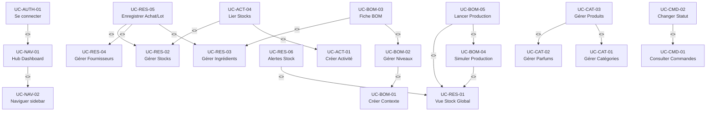

# 11 — Cas d'utilisation — ArtisaStock

> **Livrable :** BA/FA (Business Analyst / Functional Analyst)
> **Produit pour :** ArtisaStock — ERP artisanal (C# WinForms + MySQL)
> **Version :** 1.0
> **Date :** 2026-05-15
> **Auteur :** Equipe Analyse / Agent BA

---

## Table des matières

1. [Acteurs](#1-acteurs)
2. [Diagramme global des cas d'utilisation](#2-diagramme-global-des-cas-dutilisation)
3. [Fiches détaillées par cas d'utilisation](#3-fiches-détaillées-par-cas-dutilisation)
   - [MODULE AUTH](#module-auth)
   - [MODULE NAVIGATION](#module-navigation)
   - [MODULE ACTIVITÉS](#module-activités)
   - [MODULE RESSOURCES](#module-ressources)
   - [MODULE BOM / PRODUCTION](#module-bom--production)
   - [MODULE CATALOGUE WEB](#module-catalogue-web)
   - [MODULE COMMANDES WEB](#module-commandes-web)
4. [Relations entre cas d'utilisation](#4-relations-entre-cas-dutilisation)
5. [Référentiel des règles métier](#5-référentiel-des-règles-métier)

---

## 1. Acteurs

| Acteur | Type | Description |
|--------|------|-------------|
| **Artisan (Admin)** | Primaire humain | Charles ou Nadejda — accès complet à l'application C# WinForms. Seul rôle autorisé à se connecter. |
| **Client Web** | Primaire humain | Client final — interagit uniquement avec le site Laravel. Aucun accès direct à l'ERP C#. |
| **Système** | Secondaire automatique | Processus automatisés internes : conversion d'unités, calcul FIFO, alertes stock, calcul de coûts. |

---

## 2. Diagramme global des cas d'utilisation

```mermaid
flowchart LR
    %% Acteurs
    ART([👤 Artisan\nAdmin])
    CLI([👤 Client Web])
    SYS([⚙️ Système])

    %% MODULE AUTH
    subgraph AUTH["MODULE AUTH"]
        UC_AUTH_01["UC-AUTH-01\nSe connecter"]
    end

    %% MODULE NAVIGATION
    subgraph NAV["MODULE NAVIGATION"]
        UC_NAV_01["UC-NAV-01\nConsulter le hub / dashboard"]
        UC_NAV_02["UC-NAV-02\nNaviguer via la sidebar"]
    end

    %% MODULE ACTIVITÉS
    subgraph ACT["MODULE ACTIVITÉS"]
        UC_ACT_01["UC-ACT-01\nCréer une activité"]
        UC_ACT_02["UC-ACT-02\nModifier une activité"]
        UC_ACT_03["UC-ACT-03\nDésactiver une activité"]
        UC_ACT_04["UC-ACT-04\nLier des stocks à une activité"]
    end

    %% MODULE RESSOURCES
    subgraph RES["MODULE RESSOURCES"]
        UC_RES_01["UC-RES-01\nConsulter la vue stock global"]
        UC_RES_02["UC-RES-02\nGérer les stocks physiques"]
        UC_RES_03["UC-RES-03\nGérer les ingrédients"]
        UC_RES_04["UC-RES-04\nGérer les fournisseurs"]
        UC_RES_05["UC-RES-05\nEnregistrer un achat / lot"]
        UC_RES_06["UC-RES-06\nConsulter les alertes stock"]
    end

    %% MODULE BOM
    subgraph BOM["MODULE BOM / PRODUCTION"]
        UC_BOM_01["UC-BOM-01\nCréer un contexte de production"]
        UC_BOM_02["UC-BOM-02\nGérer les niveaux de production"]
        UC_BOM_03["UC-BOM-03\nCréer / modifier une fiche BOM"]
        UC_BOM_04["UC-BOM-04\nSimuler une production"]
        UC_BOM_05["UC-BOM-05\nLancer une production"]
        UC_BOM_06["UC-BOM-06\nConsulter l'historique des productions"]
    end

    %% MODULE CATALOGUE
    subgraph CAT["MODULE CATALOGUE WEB"]
        UC_CAT_01["UC-CAT-01\nGérer les catégories produits"]
        UC_CAT_02["UC-CAT-02\nGérer les parfums"]
        UC_CAT_03["UC-CAT-03\nGérer les produits du catalogue"]
    end

    %% MODULE COMMANDES
    subgraph CMD["MODULE COMMANDES WEB"]
        UC_CMD_01["UC-CMD-01\nConsulter les commandes web"]
        UC_CMD_02["UC-CMD-02\nChanger le statut d'une commande"]
    end

    %% Relations Artisan
    ART --> UC_AUTH_01
    ART --> UC_NAV_01
    ART --> UC_NAV_02
    ART --> UC_ACT_01
    ART --> UC_ACT_02
    ART --> UC_ACT_03
    ART --> UC_ACT_04
    ART --> UC_RES_01
    ART --> UC_RES_02
    ART --> UC_RES_03
    ART --> UC_RES_04
    ART --> UC_RES_05
    ART --> UC_RES_06
    ART --> UC_BOM_01
    ART --> UC_BOM_02
    ART --> UC_BOM_03
    ART --> UC_BOM_04
    ART --> UC_BOM_05
    ART --> UC_BOM_06
    ART --> UC_CAT_01
    ART --> UC_CAT_02
    ART --> UC_CAT_03
    ART --> UC_CMD_01
    ART --> UC_CMD_02

    %% Relations Système
    SYS --> UC_RES_06
    SYS --> UC_BOM_04
    SYS --> UC_BOM_05

    %% Le Client Web passe ses commandes via le site Laravel (pas via l'ERP C#).
    %% L'artisan consulte ces commandes dans l'ERP via la base MySQL partagée.
```

---

## 3. Fiches détaillées par cas d'utilisation

---

### MODULE AUTH

---

#### UC-AUTH-01 — Se connecter

| Champ | Valeur |
|-------|--------|
| **Acteur principal** | Artisan (Admin) |
| **Acteurs secondaires** | Système (vérification BCrypt, contrôle rôle) |
| **Préconditions** | L'application C# est lancée. Un compte avec `role = 'admin'` et `actif = 1` existe en base. |
| **Postconditions** | L'artisan est authentifié. `FrmLogin` se ferme. `FrmPrincipal` s'affiche en plein écran avec l'identité de l'artisan en mémoire. |
| **Déclencheur** | L'artisan lance l'application. `FrmLogin` s'affiche automatiquement au démarrage. |

**Scénario nominal :**

1. L'artisan saisit son adresse email dans `txtEmail`.
2. L'artisan saisit son mot de passe dans `txtMotDePasse` (caractères masqués par `•`).
3. L'artisan clique sur **Se connecter** ou appuie sur la touche `Entrée`.
4. Le Système vérifie que les deux champs sont non vides (validation inline).
5. Le Système exécute une requête paramétrée `SELECT ... WHERE email = @email AND actif = 1`.
6. Le Système vérifie le mot de passe via `BCrypt.Net.BCrypt.Verify(motDePasse, hashStocke)`.
7. Le Système contrôle que `role = 'admin'`.
8. L'artisan est authentifié : `FrmLogin` se ferme, `FrmPrincipal` s'ouvre.

**Scénarios alternatifs :**

- **SA-1 — Appui sur Entrée depuis `txtMotDePasse`** → le système déclenche la même action que le clic sur **Se connecter** (step 3 → step 4).
- **SA-2 — Saisie incorrecte corrigée** → l'artisan vide et ressaisit ses champs ; `lblErreur` se masque dès que l'artisan modifie un champ.

**Scénarios d'exception :**

- **SE-1 — Champ vide** → le Système affiche un message inline "Veuillez remplir tous les champs." sans appel base de données.
- **SE-2 — Identifiants incorrects (email inconnu ou hash non correspondant)** → le Système affiche "Identifiants incorrects." (message neutre, sans révéler si c'est l'email ou le mot de passe qui est faux). Aucune information de la base n'est exposée.
- **SE-3 — Compte désactivé (`actif = 0`)** → la requête ne retourne aucun résultat ; le Système affiche "Identifiants incorrects." (comportement identique à SE-2 pour ne pas révéler l'existence du compte).
- **SE-4 — Rôle non admin (`role != 'admin'`)** → le Système affiche "Accès refusé. Ce compte ne dispose pas des droits nécessaires."
- **SE-5 — Erreur de connexion MySQL** → le Système affiche "Erreur système. Veuillez contacter l'administrateur." et journalise l'exception (sans exposer la stack trace à l'UI).

**Règles métier :**

- **RG-AUTH-01 :** Le mot de passe n'est jamais stocké en clair. Comparaison exclusivement via `BCrypt.Net.BCrypt.Verify`.
- **RG-AUTH-02 :** La requête SQL utilise obligatoirement des paramètres (`@email`) — aucune concaténation de chaîne.
- **RG-AUTH-03 :** Seul le rôle `admin` est autorisé à accéder à `FrmPrincipal`.
- **RG-AUTH-04 :** Les messages d'erreur ne distinguent jamais email inconnu / mot de passe incorrect (principe de non-divulgation).

---

### MODULE NAVIGATION

---

#### UC-NAV-01 — Consulter le hub / dashboard

| Champ | Valeur |
|-------|--------|
| **Acteur principal** | Artisan (Admin) |
| **Acteurs secondaires** | Système (agrégation des indicateurs en temps réel) |
| **Préconditions** | L'artisan est authentifié (UC-AUTH-01 complété). `FrmPrincipal` est affiché. |
| **Postconditions** | Le hub affiche les indicateurs clés à jour : alertes stock, dernières commandes, activités actives, niveaux de stock. |
| **Déclencheur** | L'artisan clique sur **Hub** dans la sidebar, ou le hub s'affiche par défaut après la connexion. |

**Scénario nominal :**

1. L'artisan est connecté et `FrmPrincipal` vient de s'ouvrir.
2. Le Système charge automatiquement le panneau Hub dans la zone de contenu centrale.
3. Le Système interroge la base de données pour agréger : nombre d'alertes stock actives, nombre de commandes en attente, liste des activités actives, indicateurs de stock (jauge stock cible par emplacement).
4. Le panneau Hub affiche les tuiles d'indicateurs avec code couleur (rouge / orange / vert / bleu selon RG-STOCK-CIBLE).
5. L'artisan consulte les informations sans interaction obligatoire.

**Scénarios alternatifs :**

- **SA-1 — Aucune alerte stock** → la section "Alertes" affiche "Aucune alerte en cours."
- **SA-2 — Aucune commande en attente** → la section "Commandes" affiche "Aucune commande en attente."
- **SA-3 — L'artisan clique sur une tuile de raccourci** → le Système navigue vers le module correspondant (inclut UC-NAV-02).

**Scénarios d'exception :**

- **SE-1 — Erreur de chargement des données** → le Système affiche "Impossible de charger les indicateurs." et propose un bouton **Réessayer**.

**Règles métier :**

- **RG-STOCK-CIBLE :** La jauge de stock utilise le code couleur suivant : rouge si < 20 % du stock cible, orange si 20–50 %, vert si 50–100 %, bleu si > 100 %.
- **RG-NAV-01 :** Le hub est le point d'entrée par défaut après chaque connexion réussie.

---

#### UC-NAV-02 — Naviguer via la sidebar

| Champ | Valeur |
|-------|--------|
| **Acteur principal** | Artisan (Admin) |
| **Acteurs secondaires** | — |
| **Préconditions** | L'artisan est authentifié. `FrmPrincipal` est affiché avec la sidebar visible. |
| **Postconditions** | Le panneau de contenu central affiche le module sélectionné. L'élément actif de la sidebar est mis en surbrillance. |
| **Déclencheur** | L'artisan clique sur un élément de la sidebar. |

**Scénario nominal :**

1. L'artisan identifie le module désiré dans la sidebar (Activités, Ressources, BOM, Catalogue, Commandes, Hub).
2. L'artisan clique sur l'élément de la sidebar correspondant.
3. Le Système remplace le contenu central par le panneau du module sélectionné (pattern SPA — Single Form Application, sans ouverture de nouvelle fenêtre).
4. L'élément cliqué est mis en surbrillance dans la sidebar pour indiquer le module actif.
5. Si le module possède des sous-sections, le Système affiche les onglets ou sous-panneaux correspondants.

**Scénarios alternatifs :**

- **SA-1 — Clic sur le module déjà actif** → le Système ne recharge pas le panneau (pas de rafraîchissement inutile) ou le recharge selon la politique de rafraîchissement du module.

**Scénarios d'exception :**

- **SE-1 — Erreur de chargement du panneau** → le Système affiche un message d'erreur dans la zone de contenu central et conserve la sidebar fonctionnelle.

**Règles métier :**

- **RG-NAV-02 :** Aucune fenêtre modale secondaire ne s'ouvre pour la navigation entre modules (SFA pattern — Single Form Application). Exception unique : `FrmLogin`.
- **RG-NAV-03 :** La sidebar reste toujours visible et accessible, quel que soit le module affiché.

---

### MODULE ACTIVITÉS

---

#### UC-ACT-01 — Créer une activité

| Champ | Valeur |
|-------|--------|
| **Acteur principal** | Artisan (Admin) |
| **Acteurs secondaires** | Système (validation, persistance) |
| **Préconditions** | L'artisan est authentifié. Le panneau Activités est affiché. |
| **Postconditions** | Une nouvelle activité est créée en base avec `actif = 1`. Elle apparaît dans la liste des activités. |
| **Déclencheur** | L'artisan clique sur le bouton **Nouvelle activité**. |

**Scénario nominal :**

1. L'artisan clique sur **Nouvelle activité** dans le panneau Activités.
2. Le Système affiche un formulaire inline (ou volet latéral) de création avec les champs : Nom, Description, Couleur (optionnel).
3. L'artisan saisit le nom de l'activité (ex. : "Chocolaterie", "Pâtisserie").
4. L'artisan saisit optionnellement une description et choisit une couleur d'identification.
5. L'artisan clique sur **Enregistrer**.
6. Le Système valide : nom non vide, unicité du nom (insensible à la casse).
7. Le Système insère la nouvelle activité avec `actif = 1` dans la table `activites`.
8. La liste des activités se rafraîchit et affiche la nouvelle entrée.

**Scénarios alternatifs :**

- **SA-1 — L'artisan annule la saisie** → le formulaire se ferme sans modification en base.

**Scénarios d'exception :**

- **SE-1 — Nom vide** → le Système affiche "Le nom de l'activité est obligatoire." et bloque la sauvegarde.
- **SE-2 — Nom déjà existant** → le Système affiche "Une activité portant ce nom existe déjà." (contrôle d'unicité).
- **SE-3 — Erreur de persistance MySQL** → le Système affiche "Erreur lors de l'enregistrement. Veuillez réessayer."

**Règles métier :**

- **RG-ACT-01 :** Le nom de l'activité est unique (contrôle insensible à la casse).
- **RG-ACT-02 :** Toute nouvelle activité est créée avec `actif = 1`.

---

#### UC-ACT-02 — Modifier une activité

| Champ | Valeur |
|-------|--------|
| **Acteur principal** | Artisan (Admin) |
| **Acteurs secondaires** | Système (validation, mise à jour) |
| **Préconditions** | L'artisan est authentifié. Au moins une activité active existe. L'activité à modifier est sélectionnée dans la liste. |
| **Postconditions** | Les informations de l'activité sont mises à jour en base. La liste se rafraîchit. |
| **Déclencheur** | L'artisan sélectionne une activité et clique sur **Modifier** (ou double-clique sur l'entrée). |

**Scénario nominal :**

1. L'artisan sélectionne une activité dans la liste.
2. L'artisan clique sur **Modifier**.
3. Le Système charge les données de l'activité sélectionnée dans le formulaire d'édition.
4. L'artisan modifie les champs souhaités (Nom, Description, Couleur).
5. L'artisan clique sur **Enregistrer**.
6. Le Système valide les champs (nom non vide, unicité si le nom a changé).
7. Le Système exécute un `UPDATE` sur la table `activites`.
8. La liste se rafraîchit avec les données mises à jour.

**Scénarios alternatifs :**

- **SA-1 — Aucune modification effectuée** → l'artisan clique sur **Annuler** ; aucune écriture en base.

**Scénarios d'exception :**

- **SE-1 — Nom vide** → blocage avec message "Le nom de l'activité est obligatoire."
- **SE-2 — Nom déjà utilisé par une autre activité** → blocage avec message "Ce nom est déjà utilisé par une autre activité."
- **SE-3 — Activité supprimée entre la sélection et la sauvegarde** → le Système affiche "Cette activité n'existe plus. La liste va être rafraîchie."

**Règles métier :**

- **RG-ACT-01 :** Unicité du nom (insensible à la casse), sauf pour l'activité elle-même lors d'une modification.

---

#### UC-ACT-03 — Désactiver une activité

| Champ | Valeur |
|-------|--------|
| **Acteur principal** | Artisan (Admin) |
| **Acteurs secondaires** | Système (contrôle FK, soft delete) |
| **Préconditions** | L'artisan est authentifié. L'activité sélectionnée est active (`actif = 1`). |
| **Postconditions** | L'activité passe à `actif = 0`. Elle n'apparaît plus dans les listes de sélection des autres modules. Elle reste en base (soft delete). |
| **Déclencheur** | L'artisan sélectionne une activité active et clique sur **Désactiver**. |

**Scénario nominal :**

1. L'artisan sélectionne une activité active dans la liste.
2. L'artisan clique sur **Désactiver**.
3. Le Système affiche une demande de confirmation : "Êtes-vous sûr de vouloir désactiver l'activité «[Nom]» ? Elle ne sera plus proposée dans les listes."
4. L'artisan confirme.
5. Le Système vérifie l'absence de dépendances actives bloquantes (contextes BOM actifs liés).
6. Le Système exécute `UPDATE activites SET actif = 0 WHERE id = @id`.
7. La liste des activités se rafraîchit ; l'activité disparaît de la vue active.

**Scénarios alternatifs :**

- **SA-1 — L'artisan annule la confirmation** → aucune modification en base.

**Scénarios d'exception :**

- **SE-1 — Dépendances actives détectées** → le Système affiche "Cette activité est utilisée par [N] contexte(s) de production actif(s). Désactivez-les d'abord." et bloque l'opération (RG-FK-GUARD).

**Règles métier :**

- **RG-SOFT-DELETE :** Les activités ne sont jamais physiquement supprimées. La désactivation positionne `actif = 0`. L'historique et les données liées sont préservés.
- **RG-FK-GUARD :** Toute tentative de désactivation vérifie l'absence de dépendances actives en cascade avant d'exécuter l'opération.

---

#### UC-ACT-04 — Lier des stocks à une activité

| Champ | Valeur |
|-------|--------|
| **Acteur principal** | Artisan (Admin) |
| **Acteurs secondaires** | Système |
| **Préconditions** | L'artisan est authentifié. Au moins une activité active et au moins un emplacement de stock existent. |
| **Postconditions** | La table de liaison `activite_stocks` est mise à jour. L'activité est associée aux stocks sélectionnés. |
| **Déclencheur** | L'artisan sélectionne une activité et accède à la section "Stocks liés". |

**Scénario nominal :**

1. L'artisan sélectionne une activité dans la liste.
2. L'artisan ouvre le volet "Stocks liés" (onglet ou section inline).
3. Le Système charge la liste de tous les emplacements de stock disponibles, avec indication de ceux déjà liés.
4. L'artisan coche ou décoche les emplacements de stock à associer à l'activité.
5. L'artisan clique sur **Enregistrer les liaisons**.
6. Le Système met à jour la table de liaison `activite_stocks` (inserts + deletes différentiels).
7. Le Système affiche une confirmation "Stocks mis à jour."

**Scénarios alternatifs :**

- **SA-1 — Aucun changement effectué** → l'artisan clique sur **Annuler** ; la table de liaison n'est pas modifiée.

**Scénarios d'exception :**

- **SE-1 — Stock supprimé entre le chargement et la sauvegarde** → le Système ignore silencieusement la liaison orpheline et rafraîchit la liste.

**Règles métier :**

- **RG-ACT-03 :** Une activité peut être liée à zéro, un ou plusieurs emplacements de stock.
- **RG-TRANSACTION :** La mise à jour des liaisons (suppression des anciennes + insertion des nouvelles) s'effectue dans une transaction atomique `MySqlTransaction`.

---

### MODULE RESSOURCES

---

#### UC-RES-01 — Consulter la vue stock global

| Champ | Valeur |
|-------|--------|
| **Acteur principal** | Artisan (Admin) |
| **Acteurs secondaires** | Système (agrégation FIFO, calcul jauge) |
| **Préconditions** | L'artisan est authentifié. Des ingrédients et des lots d'achat existent en base. |
| **Postconditions** | L'artisan visualise l'état consolidé de tous les stocks par ingrédient (quantité disponible, coût moyen pondéré, jauge stock cible). |
| **Déclencheur** | L'artisan clique sur **Vue Stock Global** dans le module Ressources. |

**Scénario nominal :**

1. L'artisan accède à la vue Stock Global.
2. Le Système agrège les quantités disponibles par ingrédient en convertissant toutes les unités dans l'unité de référence (RG-UNIT).
3. Le Système calcule le pourcentage d'atteinte du stock cible pour chaque ingrédient.
4. La vue affiche un DataGridView (DGV — grille de données tabulaire) avec colonnes : Ingrédient, Quantité disponible, Unité, Stock cible, % atteinte, Coût moyen pondéré, Statut (jauge couleur).
5. Les lignes sont colorées selon RG-STOCK-CIBLE (rouge / orange / vert / bleu).
6. L'artisan peut filtrer par activité ou par statut d'alerte.

**Scénarios alternatifs :**

- **SA-1 — Filtre par activité** → le Système n'affiche que les ingrédients liés aux stocks de l'activité sélectionnée.
- **SA-2 — Filtre "alertes uniquement"** → le Système n'affiche que les lignes en rouge ou orange.
- **SA-3 — Clic sur une ligne** → le volet détail latéral s'ouvre avec le détail des lots (FIFO), la traçabilité BOM et les fournisseurs.

**Scénarios d'exception :**

- **SE-1 — Aucun stock enregistré** → la grille affiche "Aucun stock disponible." avec invitation à enregistrer un premier achat.

**Règles métier :**

- **RG-UNIT :** Toute comparaison de quantités entre lots ou entre unités différentes passe obligatoirement par `UnitConvertisseur` (convertisseur d'unités centralisé). Aucun calcul direct en unités hétérogènes.
- **RG-STOCK-CIBLE :** Jauge rouge < 20 %, orange 20–50 %, vert 50–100 %, bleu > 100 % du stock cible défini.
- **RG-DLC :** Les lots dont la DLC (Date Limite de Consommation) est dépassée sont surlignés en rouge. Les lots dont la DLC est dans moins de 7 jours sont surlignés en orange.

---

#### UC-RES-02 — Gérer les stocks physiques (CRUD)

| Champ | Valeur |
|-------|--------|
| **Acteur principal** | Artisan (Admin) |
| **Acteurs secondaires** | Système |
| **Préconditions** | L'artisan est authentifié. Le panneau Stocks est affiché. |
| **Postconditions** | L'emplacement de stock (ex. : "Frigo 1", "Réserve sèche") est créé, modifié ou désactivé en base. |
| **Déclencheur** | L'artisan interagit avec les boutons CRUD du panneau Stocks. |

**Scénario nominal — Création :**

1. L'artisan clique sur **Nouveau stock**.
2. Le Système affiche le formulaire avec les champs : Nom, Description, Type (froid / ambiant / congélateur), Activité liée (optionnel).
3. L'artisan renseigne les champs et clique sur **Enregistrer**.
4. Le Système valide (nom non vide, unicité) et insère en base.
5. La liste des stocks se rafraîchit.

**Scénario nominal — Modification :**

1. L'artisan sélectionne un stock et clique sur **Modifier**.
2. Le Système charge les données dans le formulaire.
3. L'artisan modifie et valide.
4. Le Système exécute le `UPDATE`.

**Scénario nominal — Suppression :**

1. L'artisan sélectionne un stock et clique sur **Supprimer**.
2. Le Système vérifie l'absence de lots actifs associés (RG-FK-GUARD).
3. Si aucune dépendance : confirmation → suppression physique.

**Scénarios d'exception :**

- **SE-1 — Nom vide** → message "Le nom de l'emplacement est obligatoire."
- **SE-2 — Suppression avec lots actifs** → "Cet emplacement contient des lots actifs. Transférez ou consommez les lots avant de supprimer l'emplacement."

**Règles métier :**

- **RG-FK-GUARD :** Vérification systématique des dépendances avant toute suppression.
- **RG-TRANSACTION :** Les opérations impliquant plusieurs tables (stock + liaisons activité) sont atomiques.

---

#### UC-RES-03 — Gérer les ingrédients (CRUD)

| Champ | Valeur |
|-------|--------|
| **Acteur principal** | Artisan (Admin) |
| **Acteurs secondaires** | Système (conversion d'unités, alertes) |
| **Préconditions** | L'artisan est authentifié. Le panneau Ingrédients est affiché. |
| **Postconditions** | L'ingrédient est créé, modifié ou supprimé. Les paramètres de conversion et d'alerte sont persistés. |
| **Déclencheur** | L'artisan interagit avec les boutons CRUD du panneau Ingrédients. |

**Scénario nominal — Création :**

1. L'artisan clique sur **Nouvel ingrédient**.
2. Le Système affiche le formulaire : Nom, Unité de référence (kg / L / unité), Densité (optionnel, pour conversion volume↔masse), Stock cible, Seuil d'alerte.
3. L'artisan renseigne les champs.
4. L'artisan clique sur **Enregistrer**.
5. Le Système valide et insère en base.

**Scénarios alternatifs :**

- **SA-1 — Densité renseignée** → `UnitConvertisseur` peut convertir entre grammes et millilitres pour cet ingrédient.
- **SA-2 — Modification de l'unité de référence** → le Système avertit : "Modifier l'unité de référence peut invalider les conversions existantes. Confirmer ?"

**Scénarios d'exception :**

- **SE-1 — Nom vide** → blocage avec message.
- **SE-2 — Densité négative ou nulle** → "La densité doit être un nombre positif."
- **SE-3 — Suppression avec lots actifs liés** → bloquée par RG-FK-GUARD.

**Règles métier :**

- **RG-UNIT :** L'unité de référence est immuable une fois des lots créés, sauf confirmation explicite avec avertissement de risque.
- **RG-STOCK-CIBLE :** Le stock cible et le seuil d'alerte de chaque ingrédient alimentent la jauge de UC-RES-01.

---

#### UC-RES-04 — Gérer les fournisseurs (CRUD)

| Champ | Valeur |
|-------|--------|
| **Acteur principal** | Artisan (Admin) |
| **Acteurs secondaires** | Système |
| **Préconditions** | L'artisan est authentifié. Le panneau Fournisseurs est affiché. |
| **Postconditions** | Le fournisseur est créé, modifié ou supprimé (soft delete si des achats y sont liés). |
| **Déclencheur** | L'artisan interagit avec les boutons CRUD du panneau Fournisseurs. |

**Scénario nominal — Création :**

1. L'artisan clique sur **Nouveau fournisseur**.
2. Le Système affiche le formulaire : Nom, Contact, Téléphone, Email, Adresse, Notes.
3. L'artisan renseigne les champs et clique sur **Enregistrer**.
4. Le Système valide (nom non vide) et insère en base.

**Scénarios d'exception :**

- **SE-1 — Nom vide** → blocage avec message.
- **SE-2 — Suppression avec achats liés** → le Système applique un soft delete (`actif = 0`) plutôt qu'une suppression physique pour préserver l'historique des achats.
- **SE-3 — Email invalide** → le Système avertit si le format email est incorrect (validation de format).

**Règles métier :**

- **RG-FK-GUARD :** Un fournisseur lié à des achats n'est pas physiquement supprimé. Il est désactivé (soft delete).
- **RG-SOFT-DELETE :** Applicable aux fournisseurs ayant des achats associés, par cohérence de l'historique.

---

#### UC-RES-05 — Enregistrer un achat / lot

| Champ | Valeur |
|-------|--------|
| **Acteur principal** | Artisan (Admin) |
| **Acteurs secondaires** | Système (gestion FIFO, calcul coût moyen pondéré) |
| **Préconditions** | L'artisan est authentifié. Au moins un ingrédient et un fournisseur existent. Un emplacement de stock est disponible. |
| **Postconditions** | Un nouveau lot est enregistré en base avec sa date d'achat, sa quantité, son coût unitaire, son emplacement et sa DLC. Il entre dans la file FIFO pour la consommation future. |
| **Déclencheur** | L'artisan clique sur **Nouvel achat** dans le panneau Achats / Lots. |

**Scénario nominal :**

1. L'artisan clique sur **Nouvel achat**.
2. Le Système affiche le formulaire : Ingrédient, Fournisseur, Emplacement de stock, Quantité achetée, Unité, Prix unitaire (€), Date d'achat, DLC (Date Limite de Consommation).
3. L'artisan renseigne tous les champs.
4. L'artisan clique sur **Enregistrer**.
5. Le Système valide les données (quantité > 0, prix ≥ 0, DLC > date d'achat).
6. Le Système insère le lot dans la table `lots` avec `quantite_disponible = quantite_achetee`.
7. Le lot est désormais disponible pour la consommation FIFO lors des productions.
8. La vue Stock Global se met à jour.

**Scénarios alternatifs :**

- **SA-1 — Unité différente de l'unité de référence de l'ingrédient** → le Système effectue la conversion via `UnitConvertisseur` et stocke la quantité en unité de référence.
- **SA-2 — DLC déjà dépassée à la saisie** → le Système affiche un avertissement "Attention : la DLC est déjà dépassée." et demande confirmation avant d'enregistrer.

**Scénarios d'exception :**

- **SE-1 — Quantité nulle ou négative** → blocage avec message "La quantité doit être supérieure à zéro."
- **SE-2 — DLC antérieure à la date d'achat** → blocage avec message "La DLC doit être postérieure à la date d'achat."
- **SE-3 — Ingrédient, fournisseur ou stock non sélectionné** → blocage avec message de champ obligatoire.

**Règles métier :**

- **RG-FIFO :** Les lots sont consommés dans l'ordre croissant de leur `date_achat` (premier entré, premier sorti). La `quantite_disponible` est décrémentée lors de chaque production.
- **RG-DLC :** Les lots dont la DLC est dépassée sont surlignés en rouge dans toutes les vues. Les lots expirant dans moins de 7 jours sont surlignés en orange.
- **RG-UNIT :** La quantité est toujours stockée dans l'unité de référence de l'ingrédient après conversion.
- **RG-RESERVATION :** `dispo_réelle = lot.quantite_disponible - SUM(réservations)` — les productions en cours peuvent réserver des quantités avant consommation effective.

---

#### UC-RES-06 — Consulter les alertes stock

| Champ | Valeur |
|-------|--------|
| **Acteur principal** | Artisan (Admin) |
| **Acteurs secondaires** | Système (calcul automatique des seuils) |
| **Préconditions** | L'artisan est authentifié. Des ingrédients avec seuils d'alerte définis existent. |
| **Postconditions** | L'artisan visualise la liste des ingrédients dont le stock disponible est en dessous du seuil d'alerte, ou dont des lots sont expirés / proches d'expiration. |
| **Déclencheur** | L'artisan accède à la section Alertes, ou une notification d'alerte apparaît dans le hub (UC-NAV-01). |

**Scénario nominal :**

1. L'artisan accède à la vue Alertes (depuis la sidebar ou depuis le hub).
2. Le Système interroge la base et calcule pour chaque ingrédient : stock disponible agrégé (converti en unité de référence) vs. seuil d'alerte.
3. Le Système identifie également les lots dont la DLC est dépassée ou dans les 7 prochains jours.
4. La liste d'alertes s'affiche, groupée par type : **Stock bas**, **Lot expiré**, **Lot bientôt périmé**.
5. Chaque alerte indique : l'ingrédient concerné, le stock disponible, le seuil, le delta, et pour les DLC : la date et le lot concerné.

**Scénarios alternatifs :**

- **SA-1 — Aucune alerte active** → le Système affiche "Aucune alerte en cours. Tous les stocks sont au niveau nominal."

**Scénarios d'exception :**

- **SE-1 — Seuil d'alerte non défini pour un ingrédient** → cet ingrédient n'apparaît pas dans les alertes de stock bas (les alertes DLC s'appliquent quand même).

**Règles métier :**

- **RG-STOCK-CIBLE :** Seuil d'alerte déclenché si `stock_disponible < seuil_alerte` défini sur l'ingrédient.
- **RG-DLC :** Lots expirés → rouge. Lots expirant dans < 7 jours → orange.
- **RG-UNIT :** Tous les calculs de seuil se font en unité de référence après conversion.

---

### MODULE BOM / PRODUCTION

> **Glossaire BOM :** BOM = Bill of Materials (Nomenclature de Production) — structure hiérarchique décrivant les ingrédients et sous-assemblages nécessaires à la fabrication d'un produit.

---

#### UC-BOM-01 — Créer un contexte de production

| Champ | Valeur |
|-------|--------|
| **Acteur principal** | Artisan (Admin) |
| **Acteurs secondaires** | Système |
| **Préconditions** | L'artisan est authentifié. Au moins une activité active existe. |
| **Postconditions** | Un nouveau contexte de production est créé en base, rattaché à une activité. Le niveau N0 (niveau racine) est automatiquement créé. |
| **Déclencheur** | L'artisan clique sur **Nouveau contexte** dans le module BOM. |

**Scénario nominal :**

1. L'artisan clique sur **Nouveau contexte**.
2. Le Système affiche le formulaire : Nom du contexte, Activité associée, Description.
3. L'artisan renseigne les champs et clique sur **Créer**.
4. Le Système valide (nom non vide, activité sélectionnée).
5. Le Système insère le contexte en base et crée automatiquement le **niveau N0** (niveau racine obligatoire, `ordre = 0`).
6. Le contexte apparaît dans la liste des contextes du module BOM.

**Scénarios alternatifs :**

- **SA-1 — Nom déjà utilisé dans l'activité** → le Système avertit : "Un contexte de même nom existe déjà pour cette activité."

**Scénarios d'exception :**

- **SE-1 — Aucune activité disponible** → le Système affiche "Aucune activité active. Créez d'abord une activité." avec lien de navigation.
- **SE-2 — Erreur de transaction** → le Système annule la création du contexte et du niveau N0 dans la même transaction (RG-TRANSACTION).

**Règles métier :**

- **RG-N0 :** Le niveau N0 est créé automatiquement à la création du contexte. Il ne peut jamais être supprimé.
- **RG-TRANSACTION :** Création du contexte + création du niveau N0 dans une unique transaction atomique.

---

#### UC-BOM-02 — Gérer les niveaux de production

| Champ | Valeur |
|-------|--------|
| **Acteur principal** | Artisan (Admin) |
| **Acteurs secondaires** | Système (contrôle de hiérarchie) |
| **Préconditions** | L'artisan est authentifié. Un contexte de production est sélectionné. Le niveau N0 existe. |
| **Postconditions** | Un nouveau niveau est ajouté ou le niveau le plus haut est supprimé. La hiérarchie des niveaux est cohérente. |
| **Déclencheur** | L'artisan clique sur **Ajouter un niveau** ou **Supprimer le niveau** dans le contexte sélectionné. |

**Scénario nominal — Ajout d'un niveau :**

1. L'artisan sélectionne un contexte.
2. L'artisan clique sur **Ajouter un niveau**.
3. Le Système détermine l'`ordre` du nouveau niveau : `MAX(ordre) + 1` parmi les niveaux du contexte.
4. Le Système affiche un formulaire : Nom du niveau.
5. L'artisan saisit le nom (ex. : "Ganache", "Biscuit", "Assemblage") et valide.
6. Le Système insère le nouveau niveau.

**Scénario nominal — Suppression d'un niveau :**

1. L'artisan clique sur **Supprimer le niveau**.
2. Le Système identifie le niveau de `MAX(ordre)`.
3. Le Système vérifie l'absence de fiches BOM liées au niveau (RG-FK-GUARD).
4. Le Système affiche une confirmation.
5. L'artisan confirme → suppression physique du niveau.

**Scénarios d'exception :**

- **SE-1 — Tentative de suppression du niveau N0** → bloquée par le Système avec message "Le niveau de base (N0) ne peut pas être supprimé."
- **SE-2 — Tentative de suppression d'un niveau qui n'est pas le plus haut** → bloquée : "Seul le niveau le plus haut peut être supprimé. Supprimez d'abord les niveaux supérieurs."
- **SE-3 — Niveau à supprimer contient des fiches BOM** → bloquée : "Ce niveau contient des fiches de production. Supprimez-les d'abord."

**Règles métier :**

- **RG-N0 :** Le niveau N0 (ordre = 0) est indestructible.
- **RG-TOP-DELETE :** Seul le niveau de rang `MAX(ordre)` peut être supprimé.
- **RG-BOM-LEVEL :** Le niveau N consomme uniquement les sorties du niveau N−1. Les sauts de niveaux sont interdits.
- **RG-FK-GUARD :** Vérification des fiches BOM liées avant toute suppression de niveau.

---

#### UC-BOM-03 — Créer / modifier une fiche BOM (recette)

| Champ | Valeur |
|-------|--------|
| **Acteur principal** | Artisan (Admin) |
| **Acteurs secondaires** | Système (calcul des coûts, validation des conversions) |
| **Préconditions** | L'artisan est authentifié. Un contexte et au moins deux niveaux existent (N0 + N1 minimum pour une recette avec ingrédients). Des ingrédients existent en base. |
| **Postconditions** | Une fiche BOM est créée ou mise à jour, associée à un niveau. Les lignes de la fiche (ingrédients/composants et quantités) sont persistées. |
| **Déclencheur** | L'artisan clique sur **Nouvelle fiche** ou **Modifier la fiche** dans un niveau du contexte. |

**Scénario nominal — Création :**

1. L'artisan sélectionne un niveau et clique sur **Nouvelle fiche BOM**.
2. Le Système affiche le formulaire : Nom de la fiche, Quantité produite par lot (`QuantiteOutput`), Unité de sortie.
3. L'artisan renseigne le nom et la quantité de sortie.
4. L'artisan ajoute des lignes de nomenclature :
   - Pour le niveau N0 : sélection d'ingrédients bruts (stocks) + quantité + unité.
   - Pour le niveau N > 0 : sélection de fiches du niveau N−1 + quantité.
5. L'artisan clique sur **Enregistrer**.
6. Le Système valide toutes les lignes (quantités > 0, unités compatibles via `UnitConvertisseur`).
7. Le Système calcule et enregistre le coût estimé de la fiche (sum des coûts des lignes).
8. La fiche est persistée avec toutes ses lignes.

**Scénarios alternatifs :**

- **SA-1 — Modification d'une fiche existante** → le Système charge les données existantes. Les lignes modifiables directement dans la grille. Le coût est recalculé à la sauvegarde.
- **SA-2 — Duplication d'une fiche** → le Système crée une copie de la fiche avec un nouveau nom, sur le même niveau.

**Scénarios d'exception :**

- **SE-1 — Quantité de sortie nulle ou négative** → blocage "La quantité produite doit être supérieure à zéro."
- **SE-2 — Ligne sans ingrédient sélectionné** → blocage "Chaque ligne doit avoir un ingrédient ou composant sélectionné."
- **SE-3 — Unité incompatible sans densité définie** → "Conversion impossible : la densité de [ingrédient] n'est pas définie. Définissez-la dans la fiche ingrédient."
- **SE-4 — Référence circulaire (fiche A → fiche B → fiche A)** → le Système détecte la circularité et bloque : "Référence circulaire détectée dans la nomenclature."

**Règles métier :**

- **RG-BOM-LEVEL :** Les lignes du niveau N référencent exclusivement des fiches du niveau N−1 (ou des ingrédients bruts pour N0).
- **RG-UNIT :** Toutes les quantités des lignes sont converties en unité de référence avant calcul de coût.
- **RG-BATCH :** `QuantiteOutput` représente la quantité produite par **un lot**. La production de N lots donne `N × QuantiteOutput`.

---

#### UC-BOM-04 — Simuler une production

| Champ | Valeur |
|-------|--------|
| **Acteur principal** | Artisan (Admin) |
| **Acteurs secondaires** | Système (calcul de disponibilité, FIFO virtuel) |
| **Préconditions** | L'artisan est authentifié. Une fiche BOM existe. Des lots en stock sont disponibles. |
| **Postconditions** | Le Système affiche un rapport de simulation : quantité maximale réalisable, ingrédients manquants, lots qui seraient consommés (FIFO), coût estimé. Aucune modification de stock. |
| **Déclencheur** | L'artisan sélectionne une fiche BOM et clique sur **Simuler**. |

**Scénario nominal :**

1. L'artisan sélectionne un contexte → un niveau → une fiche BOM.
2. L'artisan saisit le nombre de lots à simuler (`quantiteCible`).
3. L'artisan clique sur **Simuler**.
4. Le Système calcule les besoins totaux en ingrédients : `besoins = quantiteCible × quantité_par_lot` pour chaque ingrédient, en cascade via tous les niveaux BOM.
5. Le Système compare les besoins aux stocks disponibles (en tenant compte des réservations existantes : RG-RESERVATION).
6. Le Système simule le FIFO virtuel : identifie quels lots seraient consommés dans quel ordre.
7. Le Système affiche le rapport de simulation :
   - Lots réalisables au maximum,
   - Ingrédients en déficit avec la quantité manquante,
   - Détail des lots FIFO qui seraient consommés,
   - Coût estimé total.
8. Aucune écriture en base n'est effectuée.

**Scénarios alternatifs :**

- **SA-1 — Stock suffisant pour tous les lots demandés** → rapport affiche "Production réalisable en totalité."
- **SA-2 — Stock partiellement suffisant** → rapport affiche le nombre de lots réalisables (< `quantiteCible`) et les ingrédients manquants.
- **SA-3 — Stock insuffisant pour le moindre lot** → rapport affiche "Production impossible. Stocks insuffisants pour réaliser même un lot."

**Scénarios d'exception :**

- **SE-1 — Quantité cible nulle ou négative** → blocage "Le nombre de lots doit être supérieur à zéro."
- **SE-2 — Fiche BOM sans lignes** → "Cette fiche ne contient aucune ligne. Ajoutez des ingrédients avant de simuler."

**Règles métier :**

- **RG-FIFO :** La simulation respecte l'ordre FIFO (date_achat ASC). Les lots expirés sont exclus du calcul de disponibilité.
- **RG-BATCH :** `quantiteCible` = nombre de lots, pas la quantité finale. Quantité finale = `quantiteCible × QuantiteOutput`.
- **RG-RESERVATION :** `dispo_réelle = lot.quantite_disponible - SUM(réservations)` ; la simulation ne comptabilise que la disponibilité réelle.
- **RG-UNIT :** Toutes les comparaisons de quantités passent par `UnitConvertisseur`.

---

#### UC-BOM-05 — Lancer une production

| Champ | Valeur |
|-------|--------|
| **Acteur principal** | Artisan (Admin) |
| **Acteurs secondaires** | Système (consommation FIFO réelle, création de lot de sortie) |
| **Préconditions** | L'artisan est authentifié. La simulation préalable a confirmé la faisabilité (au moins partiellement). Le stock est suffisant pour au moins un lot. |
| **Postconditions** | Les lots d'ingrédients sont décrémentés selon FIFO. Un nouveau lot de sortie est créé dans le stock cible. Une entrée est ajoutée à l'historique des productions. |
| **Déclencheur** | L'artisan valide la simulation (UC-BOM-04) et clique sur **Lancer la production**. |

**Scénario nominal :**

1. L'artisan a effectué une simulation et consulte le rapport.
2. L'artisan saisit le nombre de lots effectivement à produire (peut être ≤ à la quantité simulée).
3. L'artisan sélectionne l'emplacement de stock de destination pour le produit fini.
4. L'artisan clique sur **Lancer la production**.
5. Le Système ouvre une transaction `MySqlTransaction`.
6. Le Système décrémente `quantite_disponible` des lots source dans l'ordre FIFO (date_achat ASC).
7. Le Système crée un nouveau lot dans le stock de destination : `qteProduite = nbLots × QuantiteOutput`, coût calculé sur la base des lots consommés.
8. Le Système enregistre l'entrée dans la table `historique_productions`.
9. Le Système valide (`COMMIT`) la transaction.
10. Le Système affiche "Production réalisée avec succès. [N] lots produits."
11. La vue Stock Global est rafraîchie.

**Scénarios alternatifs :**

- **SA-1 — Stock devenu insuffisant entre la simulation et le lancement** → le Système re-vérifie la disponibilité en début de transaction. Si insuffisant, il annule (`ROLLBACK`) et affiche "Le stock a changé depuis la simulation. Relancez une simulation."

**Scénarios d'exception :**

- **SE-1 — Erreur MySQL pendant la transaction** → `ROLLBACK` automatique. Le Système affiche "Erreur lors de la production. Aucune modification n'a été appliquée."
- **SE-2 — Nombre de lots à produire supérieur au maximum simulé** → le Système bloque et demande de relancer la simulation avec le bon nombre.

**Règles métier :**

- **RG-FIFO :** La consommation réelle respecte l'ordre des lots par `date_achat ASC`.
- **RG-BATCH :** `qteProduite = nbLots × QuantiteOutput` (nombre de lots × quantité par lot).
- **RG-TRANSACTION :** Toutes les écritures de production (décréments lots + création lot sortie + historique) sont dans une unique `MySqlTransaction`. Succès total ou ROLLBACK total.
- **RG-RESERVATION :** Les réservations sont levées après la consommation effective des lots.

---

#### UC-BOM-06 — Consulter l'historique des productions

| Champ | Valeur |
|-------|--------|
| **Acteur principal** | Artisan (Admin) |
| **Acteurs secondaires** | Système |
| **Préconditions** | L'artisan est authentifié. Au moins une production a été réalisée. |
| **Postconditions** | L'artisan visualise la liste des productions passées avec leur détail. |
| **Déclencheur** | L'artisan accède à l'onglet **Historique** dans le module BOM. |

**Scénario nominal :**

1. L'artisan accède à l'onglet Historique du module BOM.
2. Le Système charge la liste des productions depuis `historique_productions`, triée par date décroissante.
3. La liste affiche : Date, Fiche BOM produite, Contexte / Niveau, Nombre de lots, Quantité totale produite, Coût total, Emplacement de destination.
4. L'artisan peut filtrer par : période, activité, contexte, fiche BOM.
5. L'artisan clique sur une ligne pour afficher le détail : lots source consommés avec leurs quantités, coût unitaire par lot.

**Scénarios alternatifs :**

- **SA-1 — Filtre par période** → le Système n'affiche que les productions de la période sélectionnée.
- **SA-2 — Export** → l'artisan peut exporter la liste filtrée en CSV ou imprimer.

**Scénarios d'exception :**

- **SE-1 — Aucune production dans la période filtrée** → "Aucune production trouvée pour les critères sélectionnés."

**Règles métier :**

- **RG-FIFO :** L'historique trace quels lots ont été consommés dans quel ordre, avec quelle quantité prélevée.

---

### MODULE CATALOGUE WEB

---

#### UC-CAT-01 — Gérer les catégories produits

| Champ | Valeur |
|-------|--------|
| **Acteur principal** | Artisan (Admin) |
| **Acteurs secondaires** | Système |
| **Préconditions** | L'artisan est authentifié. Le panneau Catalogue est affiché. |
| **Postconditions** | La catégorie est créée, modifiée ou supprimée (soft delete si des produits y sont liés). |
| **Déclencheur** | L'artisan interagit avec les boutons CRUD de la section Catégories. |

**Scénario nominal — Création :**

1. L'artisan clique sur **Nouvelle catégorie**.
2. Le Système affiche le formulaire : Nom, Description, Image (optionnel via Cloudinary).
3. L'artisan renseigne les champs et clique sur **Enregistrer**.
4. Le Système valide (nom non vide, unicité) et insère en base.
5. La catégorie est immédiatement disponible pour l'association de produits.

**Scénarios d'exception :**

- **SE-1 — Suppression avec produits actifs liés** → bloquée : "Cette catégorie contient des produits actifs. Déplacez ou désactivez les produits avant de supprimer la catégorie."
- **SE-2 — Nom vide** → blocage avec message.

**Règles métier :**

- **RG-FK-GUARD :** Vérification des produits liés avant suppression.
- **RG-SOFT-DELETE :** Si des produits (même inactifs) sont liés, la catégorie est désactivée plutôt que supprimée.

---

#### UC-CAT-02 — Gérer les parfums

| Champ | Valeur |
|-------|--------|
| **Acteur principal** | Artisan (Admin) |
| **Acteurs secondaires** | Système |
| **Préconditions** | L'artisan est authentifié. Le panneau Catalogue est affiché. |
| **Postconditions** | Le parfum est créé, modifié ou supprimé. |
| **Déclencheur** | L'artisan interagit avec les boutons CRUD de la section Parfums. |

**Scénario nominal — Création :**

1. L'artisan clique sur **Nouveau parfum**.
2. Le Système affiche le formulaire : Nom, Description, Allergènes associés, Couleur d'identification (optionnel).
3. L'artisan renseigne les champs et clique sur **Enregistrer**.
4. Le Système valide et insère en base.
5. Le parfum est disponible pour l'association aux produits configurables (RG-CONFIGURABLE).

**Scénarios d'exception :**

- **SE-1 — Nom vide** → blocage avec message.
- **SE-2 — Suppression avec produits liés** → bloquée ou soft delete selon la politique.

**Règles métier :**

- **RG-CONFIGURABLE :** Les parfums sont assignés aux produits configurables que le client peut choisir jusqu'à `capacite_max` sur le site Laravel.
- **RG-FK-GUARD :** Vérification des produits liés avant suppression.

---

#### UC-CAT-03 — Gérer les produits du catalogue

| Champ | Valeur |
|-------|--------|
| **Acteur principal** | Artisan (Admin) |
| **Acteurs secondaires** | Système (upload Cloudinary, calcul prix) |
| **Préconditions** | L'artisan est authentifié. Au moins une catégorie existe. |
| **Postconditions** | Le produit est créé, modifié ou désactivé dans le catalogue. Il est visible (ou non) sur le site Laravel selon son statut `actif`. |
| **Déclencheur** | L'artisan interagit avec les boutons CRUD de la section Produits. |

**Scénario nominal — Création :**

1. L'artisan clique sur **Nouveau produit**.
2. Le Système affiche le formulaire : Nom, Catégorie, Type (Configurable / Fixe), Prix, Description, Allergènes, Image, `actif`.
3. **Si type = Configurable :** l'artisan sélectionne les parfums disponibles et saisit `capacite_max` (nombre maximum de parfums que le client peut choisir).
4. **Si type = Fixe :** la composition est déterminée à l'avance, sans choix client.
5. L'artisan charge une image (upload vers Cloudinary — service de stockage d'images en ligne).
6. L'artisan clique sur **Enregistrer**.
7. Le Système valide (nom non vide, catégorie sélectionnée, prix ≥ 0) et insère en base avec l'URL Cloudinary de l'image.

**Scénarios alternatifs :**

- **SA-1 — Pas d'image fournie** → le Système utilise une image par défaut de la catégorie.
- **SA-2 — Désactivation d'un produit (`actif = 0`)** → le produit disparaît du catalogue en ligne sans suppression en base. L'historique des commandes est préservé.

**Scénarios d'exception :**

- **SE-1 — Échec upload Cloudinary** → le Système affiche "Erreur lors de l'upload de l'image. Le produit peut être enregistré sans image et l'image ajoutée ultérieurement."
- **SE-2 — Prix négatif** → blocage "Le prix doit être un montant positif ou nul."
- **SE-3 — `capacite_max` = 0 pour un produit configurable** → blocage "Un produit configurable doit autoriser au moins un parfum."

**Règles métier :**

- **RG-CONFIGURABLE :** Les produits configurables permettent au client de choisir N parfums jusqu'à `capacite_max`. Les produits fixes ont une composition déterminée.
- **RG-SOFT-DELETE :** Les produits ne sont pas supprimés physiquement si des commandes y sont liées. Soft delete via `actif = 0`.
- **RG-FK-GUARD :** Vérification des commandes liées avant toute suppression physique.

---

### MODULE COMMANDES WEB

---

#### UC-CMD-01 — Consulter les commandes web

| Champ | Valeur |
|-------|--------|
| **Acteur principal** | Artisan (Admin) |
| **Acteurs secondaires** | Système (lecture depuis la base Laravel/MySQL partagée), Client Web (génère les commandes indirectement via le site) |
| **Préconditions** | L'artisan est authentifié. La connexion à la base de données partagée (Laravel ↔ C#) est établie. |
| **Postconditions** | L'artisan visualise la liste des commandes passées sur le site Laravel, avec leur détail. |
| **Déclencheur** | L'artisan accède au module Commandes dans la sidebar. |

**Scénario nominal :**

1. L'artisan accède au module Commandes.
2. Le Système interroge la table `commandes` de la base partagée.
3. La liste des commandes s'affiche en DGV : Date, Client (nom + email), Statut, Montant total, Produits commandés.
4. L'artisan peut filtrer par statut (en attente / en préparation / expédié / annulé) et par période.
5. L'artisan clique sur une commande pour afficher le détail : lignes de commande, parfums choisis (si configurable), adresse de livraison, notes client.

**Scénarios alternatifs :**

- **SA-1 — Filtre par statut** → le Système n'affiche que les commandes du statut sélectionné.
- **SA-2 — Filtre par période** → le Système filtre par plage de dates.
- **SA-3 — Aucune commande** → la grille affiche "Aucune commande trouvée pour les critères sélectionnés."

**Scénarios d'exception :**

- **SE-1 — Impossibilité de se connecter à la base partagée** → le Système affiche "Impossible de récupérer les commandes. Vérifiez la connexion à la base de données." et permet de relancer le chargement manuellement.

**Règles métier :**

- **RG-CMD-01 :** L'application C# lit les commandes en mode lecture seule pour le détail client. Seul le statut peut être modifié (UC-CMD-02).
- **RG-CONFIGURABLE :** Les commandes de produits configurables affichent les parfums choisis par le client.

---

#### UC-CMD-02 — Changer le statut d'une commande

| Champ | Valeur |
|-------|--------|
| **Acteur principal** | Artisan (Admin) |
| **Acteurs secondaires** | Système (mise à jour base partagée) |
| **Préconditions** | L'artisan est authentifié. Une commande est sélectionnée dans la liste (UC-CMD-01). Le statut actuel de la commande autorise la transition souhaitée. |
| **Postconditions** | Le statut de la commande est mis à jour dans la base partagée. Le site Laravel reflète immédiatement le nouveau statut pour le client. |
| **Déclencheur** | L'artisan sélectionne une commande et clique sur **Changer le statut** ou sur un bouton d'action rapide de statut. |

**Scénario nominal :**

1. L'artisan sélectionne une commande dans la liste.
2. L'artisan clique sur le nouveau statut souhaité (bouton **En préparation**, **Expédié**, **Annulé**).
3. Le Système vérifie que la transition de statut est valide selon le workflow :
   - `en_attente` → `en_preparation` ✓
   - `en_preparation` → `expedie` ✓
   - `en_attente` ou `en_preparation` → `annule` ✓
   - `expedie` → tout autre statut ✗ (commande expédiée = finale)
4. Le Système affiche une confirmation : "Passer la commande #[ID] au statut «[nouveau statut]» ?"
5. L'artisan confirme.
6. Le Système exécute `UPDATE commandes SET statut = @statut, updated_at = NOW() WHERE id = @id`.
7. La liste des commandes se rafraîchit avec le nouveau statut.

**Scénarios alternatifs :**

- **SA-1 — Transition vers "Annulé"** → le Système demande confirmation supplémentaire avec motif optionnel : "Raison de l'annulation (optionnel) : [_____]".

**Scénarios d'exception :**

- **SE-1 — Transition de statut invalide** → le Système affiche "Cette transition de statut n'est pas autorisée. Statut actuel : [X]. Transitions possibles : [Y, Z]."
- **SE-2 — Commande modifiée entre la sélection et la sauvegarde** → le Système détecte le conflit et affiche "Le statut de cette commande a été modifié. La liste va être rafraîchie."
- **SE-3 — Erreur de connexion à la base partagée** → le Système affiche "Impossible de mettre à jour le statut. Vérifiez la connexion."

**Règles métier :**

- **RG-CMD-02 :** Le workflow de statut est unidirectionnel. Une commande expédiée ne peut pas être réouverte.
- **RG-TRANSACTION :** La mise à jour du statut est atomique. En cas d'erreur, aucun statut intermédiaire n'est persisté.

---

## 4. Relations entre cas d'utilisation

### Table des relations `<<include>>` et `<<extend>>`

| UC source | Relation | UC cible | Description |
|-----------|----------|----------|-------------|
| UC-AUTH-01 | `<<include>>` | UC-NAV-01 | Après connexion, le hub s'affiche automatiquement |
| UC-NAV-01 | `<<extend>>` | UC-NAV-02 | Un clic sur une tuile du hub navigue via la sidebar |
| UC-BOM-04 | `<<include>>` | UC-RES-01 | La simulation lit les stocks disponibles |
| UC-BOM-05 | `<<include>>` | UC-BOM-04 | Le lancement de production présuppose une simulation préalable |
| UC-BOM-05 | `<<include>>` | UC-RES-01 | La production met à jour les stocks (lecture FIFO avant décrémentation) |
| UC-BOM-03 | `<<include>>` | UC-RES-03 | La fiche BOM référence des ingrédients gérés dans UC-RES-03 |
| UC-BOM-02 | `<<include>>` | UC-BOM-01 | Les niveaux appartiennent à un contexte préalablement créé |
| UC-BOM-03 | `<<include>>` | UC-BOM-02 | Une fiche BOM est rattachée à un niveau |
| UC-RES-05 | `<<include>>` | UC-RES-03 | Un achat référence un ingrédient existant |
| UC-RES-05 | `<<include>>` | UC-RES-04 | Un achat référence un fournisseur existant |
| UC-RES-05 | `<<include>>` | UC-RES-02 | Un lot est stocké dans un emplacement de stock existant |
| UC-ACT-04 | `<<include>>` | UC-ACT-01 | On ne peut lier des stocks qu'à une activité existante |
| UC-ACT-04 | `<<include>>` | UC-RES-02 | La liaison référence des stocks existants |
| UC-RES-06 | `<<extend>>` | UC-RES-01 | Les alertes sont un sous-ensemble de la vue stock global |
| UC-CMD-02 | `<<include>>` | UC-CMD-01 | On change le statut depuis la liste des commandes |
| UC-CAT-03 | `<<include>>` | UC-CAT-01 | Un produit est rattaché à une catégorie existante |
| UC-CAT-03 | `<<extend>>` | UC-CAT-02 | Un produit configurable peut référencer des parfums |

---

### Diagramme des relations

---

## 5. Référentiel des règles métier

| Code | Intitulé | Description | UC(s) concernés |
|------|----------|-------------|-----------------|
| **RG-FIFO** | Consommation FIFO | Les lots sont consommés dans l'ordre croissant de `date_achat` (First In, First Out — premier entré, premier sorti). Les lots expirés sont exclus. | UC-RES-05, UC-BOM-04, UC-BOM-05, UC-BOM-06 |
| **RG-UNIT** | Conversion d'unités obligatoire | Toute comparaison ou opération sur des quantités passe obligatoirement par `UnitConvertisseur`. Aucun calcul direct entre unités hétérogènes. | UC-RES-01, UC-RES-03, UC-RES-05, UC-BOM-03, UC-BOM-04, UC-BOM-05 |
| **RG-BOM-LEVEL** | Hiérarchie des niveaux BOM | Le niveau N consomme exclusivement les sorties du niveau N−1. Les sauts de niveaux sont interdits. | UC-BOM-02, UC-BOM-03 |
| **RG-SOFT-DELETE** | Suppression logique | Les entités liées à des données historiques (activités, fournisseurs, produits) ne sont jamais physiquement supprimées. Le champ `actif` est positionné à 0. | UC-ACT-03, UC-RES-04, UC-CAT-01, UC-CAT-03 |
| **RG-STOCK-CIBLE** | Jauge de stock cible | Code couleur : rouge < 20 %, orange 20–50 %, vert 50–100 %, bleu > 100 % du stock cible. | UC-NAV-01, UC-RES-01, UC-RES-06 |
| **RG-BATCH** | Lots de production | `quantiteCible` = nombre de lots (pas la quantité finale). `qteProduite = nbLots × QuantiteOutput`. | UC-BOM-04, UC-BOM-05 |
| **RG-RESERVATION** | Disponibilité réelle | `dispo_réelle = lot.quantite_disponible - SUM(réservations)`. Les réservations de productions en cours sont déduites. | UC-RES-05, UC-BOM-04, UC-BOM-05 |
| **RG-N0** | Niveau racine indestructible | Le niveau N0 est créé automatiquement avec le contexte. Il ne peut jamais être supprimé. | UC-BOM-01, UC-BOM-02 |
| **RG-TOP-DELETE** | Suppression du niveau supérieur uniquement | Seul le niveau de rang `MAX(ordre)` peut être supprimé. | UC-BOM-02 |
| **RG-FK-GUARD** | Garde de clés étrangères | Toute suppression vérifie l'absence de dépendances (FK — Foreign Key, clé étrangère) avant d'exécuter l'opération. | UC-ACT-03, UC-RES-02, UC-RES-03, UC-RES-04, UC-BOM-02, UC-CAT-01, UC-CAT-02, UC-CAT-03 |
| **RG-TRANSACTION** | Atomicité des opérations multi-tables | Toute opération impliquant plusieurs tables est enveloppée dans une `MySqlTransaction`. Succès total ou ROLLBACK total. | UC-ACT-04, UC-BOM-01, UC-BOM-05, UC-RES-02, UC-CMD-02 |
| **RG-DLC** | Gestion des dates de péremption | Lots expirés → surligné rouge. Lots expirant dans < 7 jours → surligné orange. Les lots expirés sont exclus des calculs de disponibilité. | UC-RES-05, UC-RES-06, UC-BOM-04 |
| **RG-CONFIGURABLE** | Produits configurables | Les produits de type configurable permettent au client de choisir des parfums jusqu'à `capacite_max` lors de la commande sur le site Laravel. | UC-CAT-02, UC-CAT-03, UC-CMD-01 |
| **RG-AUTH-01** | Hachage des mots de passe | Les mots de passe sont stockés et vérifiés exclusivement via BCrypt. Aucune comparaison en clair. | UC-AUTH-01 |
| **RG-AUTH-02** | Requêtes paramétrées | Toutes les requêtes SQL utilisent des paramètres nommés. Aucune concaténation de chaîne dans les requêtes. | UC-AUTH-01, tous UC avec accès DB |
| **RG-AUTH-03** | Contrôle de rôle | Seul le rôle `admin` peut accéder à `FrmPrincipal`. | UC-AUTH-01 |
| **RG-AUTH-04** | Non-divulgation des erreurs d'authentification | Les messages d'erreur de connexion ne distinguent pas email inconnu et mot de passe incorrect. | UC-AUTH-01 |
| **RG-CMD-01** | Lecture seule des commandes | L'application C# lit les données client en mode lecture seule. Seul le statut est modifiable depuis l'ERP. | UC-CMD-01, UC-CMD-02 |
| **RG-CMD-02** | Workflow de statut unidirectionnel | Une commande expédiée ne peut pas retourner à un statut antérieur. | UC-CMD-02 |
| **RG-NAV-01** | Hub par défaut | Le hub est le panneau affiché par défaut après chaque connexion réussie. | UC-AUTH-01, UC-NAV-01 |
| **RG-NAV-02** | Single Form Application | Aucune fenêtre modale secondaire pour la navigation. Exception unique : `FrmLogin`. | UC-NAV-02, tous les UC de navigation |
| **RG-ACT-01** | Unicité du nom d'activité | Le nom d'activité est unique, insensible à la casse. | UC-ACT-01, UC-ACT-02 |
| **RG-ACT-02** | Création active par défaut | Toute nouvelle activité est créée avec `actif = 1`. | UC-ACT-01 |

---

*Document généré dans le cadre du livrable BA/FA du projet ArtisaStock — ERP artisanal C# WinForms + MySQL.*
*Toutes les règles métier sont référencées dans les fiches UC et centralisées dans la section 5.*
