# 12 — Diagrammes d'Activité — ArtisaStock ERP

> **Livrable BA/FA (Business Analyst / Functional Analyst)**
> Projet : ArtisaStock — ERP artisanal (Chocolaterie / Pâtisserie)
> Stack : C# WinForms · MySQL · Architecture SFA (Single-Form Architecture)
> Version : 1.0 — Mai 2026
> Auteur : Équipe projet Charles & Nadejda

---

## Table des matières

| # | Diagramme | Description |
|---|-----------|-------------|
| 1 | [Flux d'authentification](#1-flux-dauthentification) | Connexion, BCrypt, rôles |
| 2 | [Flux de navigation SFA](#2-flux-de-navigation-sfa) | ScreenRouter, AppState, panneau droit |
| 3 | [Flux de gestion des activités](#3-flux-de-gestion-des-activités) | CRUD activités, soft delete, sidebar |
| 4 | [Flux d'approvisionnement](#4-flux-dapprovisionnement-achatslots) | Achats, lots, FIFO, DLC |
| 5 | [Flux de gestion des ingrédients](#5-flux-de-gestion-des-ingrédients) | Création, seuils, jauge stock cible |
| 6 | [Flux de configuration BOM complet](#6-flux-de-configuration-bom-complet) | Contextes, niveaux, fiches, lignes |
| 7 | [Flux de simulation de production](#7-flux-de-simulation-de-production) | Explosion BOM, disponibilité, réservation |
| 8 | [Flux d'exécution de production](#8-flux-dexécution-de-production) | Transaction FIFO, lots consommés, stocks sortie |
| 9 | [Flux de gestion du catalogue web](#9-flux-de-gestion-du-catalogue-web) | CRUD produits, Cloudinary, configurateur |
| 10 | [Flux de traitement des commandes web](#10-flux-de-traitement-des-commandes-web) | Statuts, DGV, mise à jour partagée |
| 11 | [Flux de conversion d'unités](#11-flux-de-conversion-dunités-transversal) | UnitConvertisseur, densité, FormatQte |
| 12 | [Vue d'ensemble — Flux métier global](#12-vue-densemble--flux-métier-global) | Macro-vision bout en bout |

---

## Conventions graphiques

| Symbole Mermaid | Signification |
|-----------------|---------------|
| `([Nœud])` | Début / Fin (terminal) |
| `[Action]` | Processus / étape |
| `{Condition?}` | Décision (losange) |
| `[(Base de données)]` | Stockage persistant |
| `>Annotation]` | Commentaire / note |
| `subgraph Acteur` | Couloir de nage (swimlane) |
| Flèche `-- Oui -->` | Branche de décision étiquetée |

---

## 1. Flux d'authentification

> **Acteurs :** Utilisateur, FrmLogin, DAL (Data Access Layer — couche d'abstraction des accès base de données), MySQL
> **Déclencheur :** Lancement de l'application
> **Résultat attendu :** Session utilisateur ouverte sur FrmPrincipal (rôle admin validé)

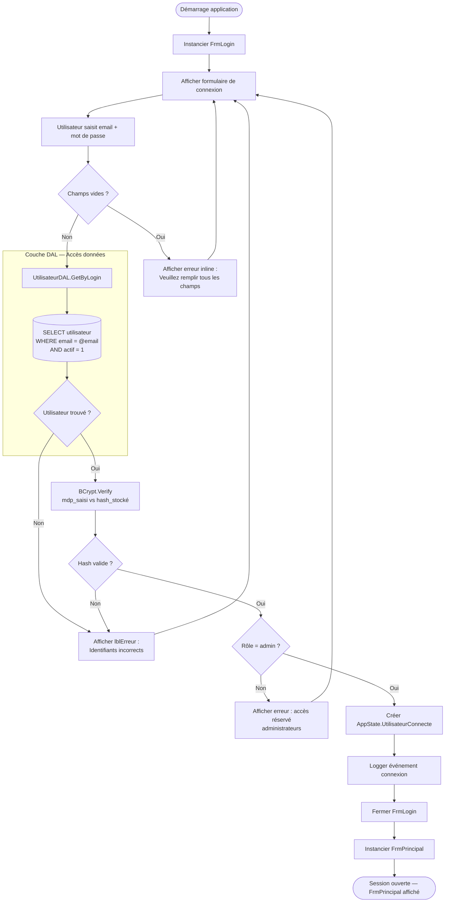

**Points clés :**
- Le mot de passe n'est jamais stocké en clair — BCrypt (hachage adaptatif avec sel) est utilisé.
- La requête DAL est paramétrée (`@email`) — aucune concaténation SQL.
- Le message d'erreur est neutre ("Identifiants incorrects") — ne révèle pas si l'email ou le mot de passe est faux.
- Seul le rôle `admin` accède à l'ERP desktop ; les rôles `client` sont réservés au portail web.

---

## 2. Flux de navigation SFA

> **Acteurs :** Utilisateur, Sidebar, ScreenRouter, AppState, _pnlDroit
> **SFA (Single-Form Architecture) :** une seule FrmPrincipal — les écrans sont des UserControls chargés dynamiquement dans le panneau droit.
> **Déclencheur :** Clic sur un élément de la sidebar

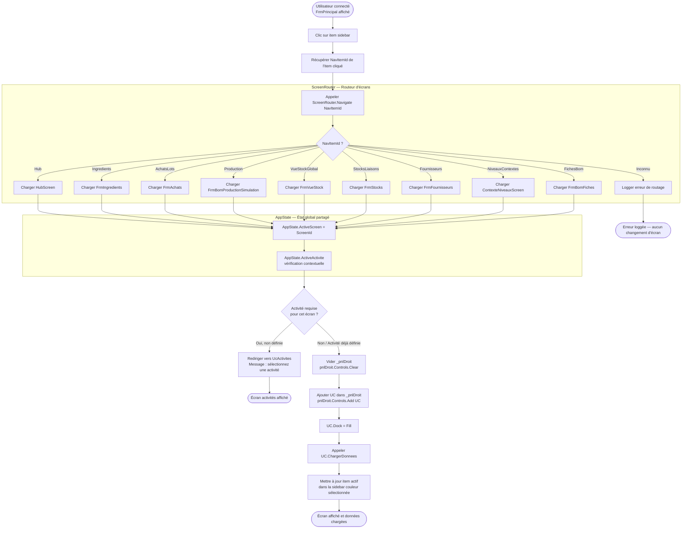

**Points clés :**
- Un seul formulaire principal reste ouvert tout au long de la session (SFA).
- `AppState` centralise l'état : `ActiveActivite`, `ActiveContexte`, `ActiveNiveau`, `ActiveScreen`, `RessourceActive`.
- `_pnlDroit` est vidé (`ClearAndDisposePanel`) et rechargé à chaque navigation — pas de cache.
- Certains écrans (Ingrédients, Achats, Production, Fiches) nécessitent qu'une activité soit sélectionnée.

---

## 3. Flux de gestion des activités

> **Acteurs :** Utilisateur, UcActivites, FrmActiviteEdit, DAL, Sidebar
> **Déclencheur :** Navigation vers l'écran Activités
> **Résultat attendu :** Activité créée/modifiée/désactivée, sidebar rafraîchie

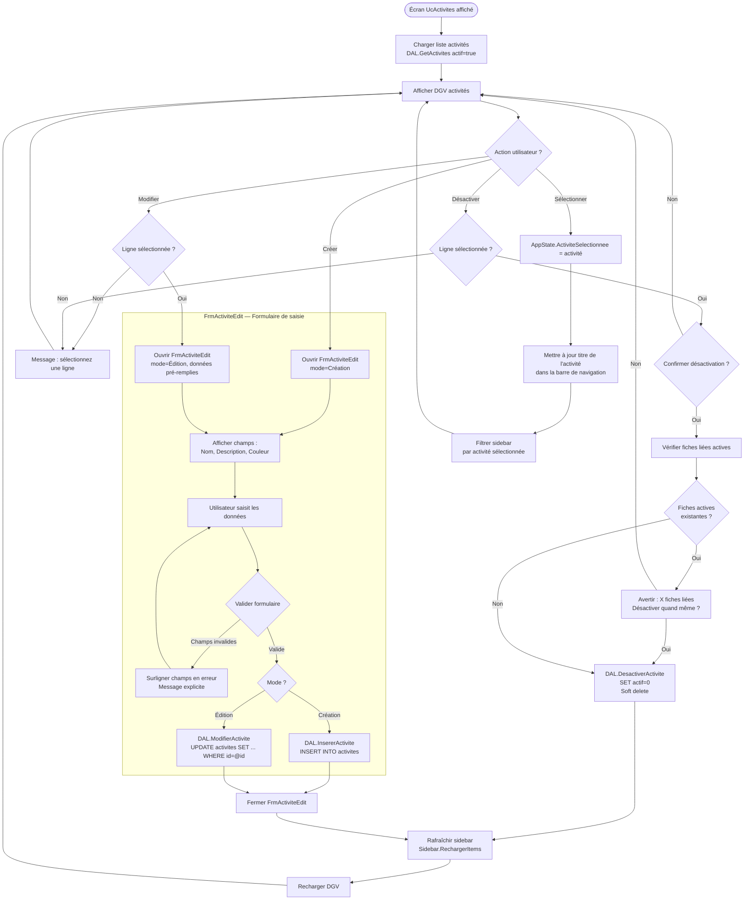

**Points clés :**
- La désactivation est un **soft delete** — l'enregistrement reste en base avec `actif = 0`.
- La sidebar est rafraîchie dynamiquement après chaque opération.
- Une activité liée à des fiches actives déclenche un avertissement, pas un blocage.
- Les couleurs d'activité permettent une identification visuelle rapide dans la sidebar.

---

## 4. Flux d'approvisionnement (Achats/Lots)

> **Acteurs :** Utilisateur, UcLots, FrmAchatEdit, DAL, stock_ingredients
> **Déclencheur :** Navigation vers l'écran Lots / Achats
> **Résultat attendu :** Lot créé, stock mis à jour, FIFO respecté

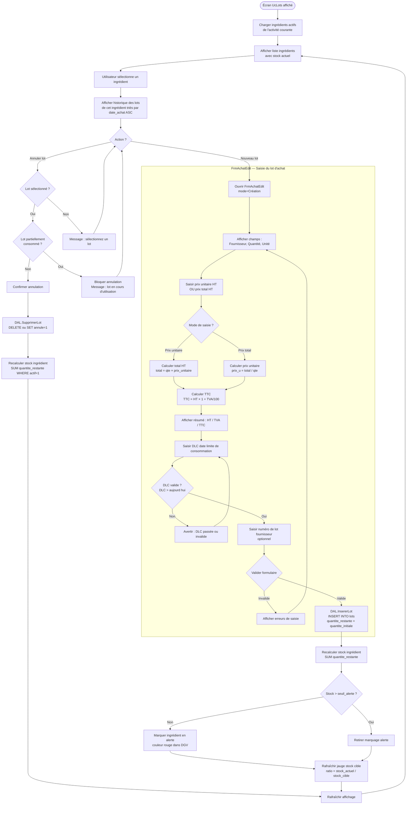

**Points clés :**
- Les lots sont ordonnés par `date_achat ASC` — c'est le fondement du FIFO (First In, First Out — premier entré, premier sorti).
- Le calcul HT/TTC est bidirectionnel : l'utilisateur peut saisir l'un ou l'autre.
- La DLC est validée à la saisie pour éviter l'intégration de lots périmés.
- `quantite_restante` diminue lors des consommations de production — jamais modifiée directement.

---

## 5. Flux de gestion des ingrédients

> **Acteurs :** Utilisateur, UcIngredients, FrmIngredientEdit, DAL, UcStockDetail
> **Déclencheur :** Navigation vers l'écran Ingrédients
> **Résultat attendu :** Ingrédient créé/modifié avec champs conditionnels, seuils configurés

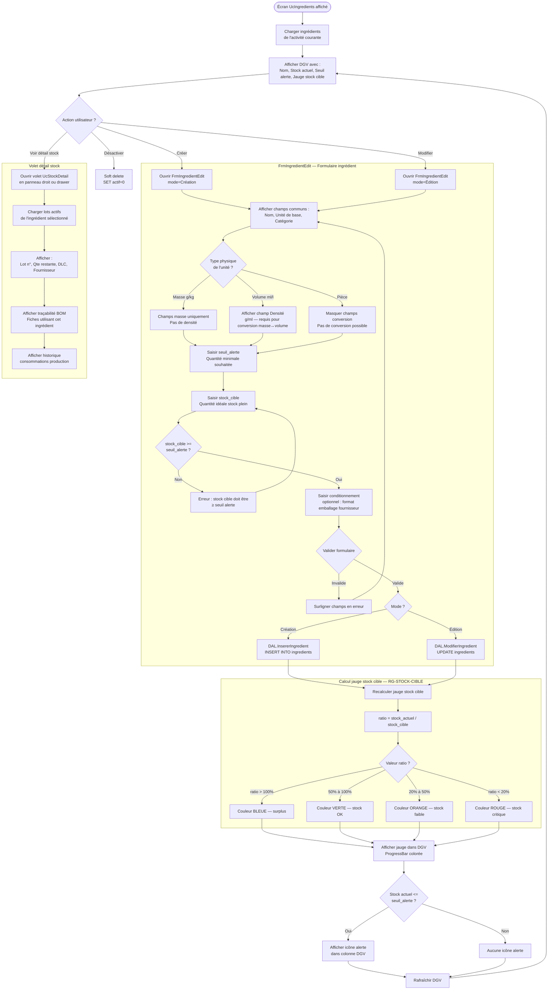

**Points clés :**
- Le champ densité n'apparaît que pour les unités volumiques — nécessaire à la conversion masse ↔ volume.
- La jauge stock cible utilise 4 paliers de couleur : rouge (<20%), orange (20-50%), vert (50-100%), bleu (>100% surplus).
- Le `seuil_alerte` déclenche une icône visuelle dans la DGV (DataGridView — grille de données).
- Le volet détail offre la traçabilité complète : lots, fiches consommatrices, historique.

---

## 6. Flux de configuration BOM complet

> **BOM (Bill of Materials) :** nomenclature hiérarchique multi-niveaux décrivant la composition d'un produit fini.
> **Acteurs :** Utilisateur, UcActivites (contextes), UcNiveaux, UcFiches, FrmFicheEdit, DAL
> **Déclencheur :** Configuration d'une nouvelle activité de production
> **Résultat attendu :** Arbre BOM complet — contexte → niveaux → fiches → lignes

```mermaid
flowchart TD
    A([Activité sélectionnée]) --> B[Étape 1 : Gérer les contextes BOM]

    subgraph ContextesBOM [Contextes BOM — classification des fiches]
        B --> C[Charger contextes existants\npour l'activité]
        C --> D[Afficher liste contextes\nexemple : Recettes de base, Garnitures, Produits finis]
        D --> E{Créer nouveau contexte ?}
        E -- Oui --> F[Saisir nom + description]
        F --> G[DAL.InsererContexte\nINSERT INTO bom_contextes]
        G --> D
        E -- Non --> H[Sélectionner contexte existant]
    end

    H --> I[Étape 2 : Gérer les niveaux du contexte]

    subgraph NiveauxBOM [Niveaux BOM — hiérarchie N-1]
        I --> J[Charger niveaux du contexte\nordonnés par ordre_affichage]
        J --> K[Afficher arbre niveaux\nexemple : N1=Ingrédients bruts, N2=Préparations, N3=Assemblages]
        K --> L{Action niveau ?}
        L -- Créer niveau --> M[Saisir nom + niveau parent optionnel]
        M --> N{Niveau parent\ndéfini ?}
        N -- Oui --> O[Vérifier contrainte N-1\nniveau = parent.niveau + 1]
        O --> P{Contrainte N-1\nrespectée ?}
        P -- Non --> Q[Erreur : un niveau ne peut être\nenfant que du niveau immédiatement supérieur]
        Q --> M
        P -- Oui --> R[DAL.InsererNiveau\nINSERT INTO bom_niveaux]
        N -- Non --> R
        R --> J
        L -- Supprimer --> S{Niveau vide ?\naucune fiche liée}
        S -- Non --> T[Bloquer : déplacer ou supprimer\nles fiches d'abord]
        S -- Oui --> U[DAL.SupprimerNiveau]
        U --> J
    end

    R --> V[Étape 3 : Créer et configurer les fiches]

    subgraph FichesBOM [Fiches BOM — recettes / assemblages]
        V --> W[Sélectionner niveau cible]
        W --> X[Afficher fiches du niveau]
        X --> Y{Action fiche ?}
        Y -- Créer --> Z[Ouvrir FrmFicheEdit\nmode=Création]
        Y -- Modifier --> AA[Ouvrir FrmFicheEdit\nmode=Édition]
        Y -- Dupliquer --> AB[Copier fiche + lignes\navec suffixe _copie]
        AB --> X

        subgraph FrmFicheEdit [FrmFicheEdit — Éditeur de fiche]
            Z & AA --> AC[Saisir nom, description, rendement\nnb unités produites par batch]
            AC --> AD[Saisir unité de sortie\nverrouillée après première utilisation en sous-fiche]
            AD --> AE[Gérer les lignes de fiche]

            subgraph LignesFiche [Lignes de fiche — BOM lines]
                AE --> AF{Type de ligne ?}
                AF -- Ingrédient --> AG[Sélectionner ingrédient\ndepuis l'activité courante]
                AG --> AH[Saisir quantité + unité]
                AH --> AI{Unité compatible\navec ingrédient ?}
                AI -- Non --> AJ[Erreur : conversion impossible\nvérifier type physique]
                AJ --> AH
                AI -- Oui --> AK[DAL.InsererLigneFiche\nINSERT INTO bom_fiches_lignes type=ingredient]

                AF -- Sous-fiche --> AL[Sélectionner fiche de niveau inférieur\ncontrainte N-1]
                AL --> AM{Fiche sélectionnable ?\nniveau fiche < niveau courant}
                AM -- Non --> AN[Bloquer : référence circulaire\nou violation N-1]
                AM -- Oui --> AO[Saisir nombre de portions\ncombien de batches de la sous-fiche]
                AO --> AP[DAL.InsererLigneFiche\nINSERT INTO bom_fiches_lignes type=sous_fiche]
                AP --> AK
            end

            AK --> AQ[Calculer coût estimé fiche\nSOMMe coûts ingrédients + coûts sous-fiches]
            AQ --> AR[Afficher coût par unité de sortie]
        end
    end

    AR --> AS[Cascade coûts vers fiches parentes\nrecalcul automatique]
    AS --> AT([Configuration BOM complète])
```

**Points clés :**
- La contrainte N-1 garantit que la hiérarchie reste cohérente — pas de sauts de niveaux.
- L'unité de sortie d'une fiche est verrouillée dès qu'elle est référencée comme sous-fiche.
- Les coûts sont calculés en cascade : modifier une ligne impacte toutes les fiches parentes.
- La duplication de fiche permet de créer des variantes rapidement.

---

## 7. Flux de simulation de production

> **Acteurs :** Utilisateur, UcProduction, BomExploseur, UnitConvertisseur, DAL
> **Déclencheur :** Utilisateur souhaite produire un lot
> **Résultat attendu :** Rapport de disponibilité par ingrédient, bouton "Lancer" activé ou désactivé

```mermaid
flowchart TD
    A([Écran UcProduction affiché]) --> B[Charger fiches disponibles\nde l'activité courante]
    B --> C[Afficher liste fiches\navec coût unitaire estimé]
    C --> D[Utilisateur sélectionne une fiche]
    D --> E[Afficher détail fiche\nrecette et rendement]
    E --> F[Utilisateur saisit nombre de batches\nnb_batches > 0]
    F --> G{Valeur valide ?}
    G -- Non --> H[Message : nombre de batches invalide]
    H --> F
    G -- Oui --> I[Appeler BomExploseur.Exploser\nfiche, nb_batches]

    subgraph BomExploseur [BomExploseur — Explosion récursive BOM]
        I --> J[Pour chaque ligne de la fiche]
        J --> K{Type ligne ?}
        K -- Ingrédient --> L[Calculer quantite_requise\n= qte_ligne × nb_batches]
        K -- Sous-fiche --> M[Appel récursif\nBomExploseur.Exploser sous-fiche, portions × nb_batches]
        M --> L
        L --> N[Accumuler par ingrédient_id\nfusion des quantités si même ingrédient]
        N --> O{Autre ligne ?}
        O -- Oui --> J
        O -- Non --> P[Retourner liste consolidée\nDict ingrédient_id → qte_requise_unité_base]
    end

    P --> Q[Pour chaque ingrédient de la liste]

    subgraph DispoCheck [Vérification disponibilité — par ingrédient]
        Q --> R[UnitConvertisseur.Convertir\nqte_requise → unité base ingrédient]
        R --> S[DAL.GetLotsDisponibles\nWHERE ingredient_id = @id\nAND quantite_restante > 0\nORDER BY date_achat ASC FIFO]
        S --> T[Calculer stock_total_disponible\nSUM quantite_restante]
        T --> U{stock_disponible\n>= qte_requise ?}
        U -- Oui --> V[Marquer vert\nDisponible]
        U -- Non --> W[Marquer rouge\nManque = qte_requise - stock_disponible]
        V & W --> X{Autre ingrédient ?}
        X -- Oui --> Q
        X -- Non --> Y[Compilation résultats]
    end

    Y --> Z[Afficher tableau résultats\npar ingrédient : requis / disponible / statut]
    Z --> AA{Tous les ingrédients\nsont disponibles ?}
    AA -- Oui --> AB[Activer bouton LANCER\ncouleur verte]
    AA -- Non --> AC[Désactiver bouton LANCER\nAfficher liste manques]
    AB & AC --> AD{Utilisateur clique\nLANCER ?}
    AD -- Non, ajuste batches --> F
    AD -- Oui --> AE[Passer au flux d'exécution\ndiagramme 8]
    AD -- Annuler --> AF([Retour à la sélection fiche])
```

**Points clés :**
- L'explosion BOM est récursive — une fiche peut contenir des sous-fiches qui contiennent elles-mêmes des sous-fiches.
- Les quantités sont consolidées par `ingrédient_id` pour éviter de lire deux fois le même stock.
- Le FIFO est respecté dès la simulation : les lots sont triés par `date_achat ASC`.
- Le bouton "Lancer" est un CTA (Call To Action) unique, activé uniquement si tous les stocks sont suffisants.

---

## 8. Flux d'exécution de production

> **Acteurs :** Utilisateur, UcProduction, DAL, UnitConvertisseur, MySQL (transaction)
> **Déclencheur :** Clic sur "Lancer la production" (post-simulation validée)
> **Résultat attendu :** Lots consommés en FIFO, stock de sortie créé, coûts calculés et persistés

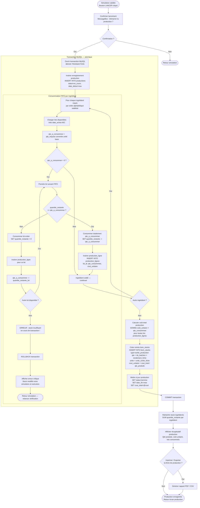

**Points clés :**
- Toute l'exécution est dans une transaction MySQL — en cas d'erreur, le `ROLLBACK` annule tout.
- La consommation FIFO lot par lot peut fractioner la quantité sur plusieurs lots successifs.
- Le stock peut avoir changé entre la simulation et l'exécution (autre session) — le ROLLBACK protège contre ce cas.
- `bom_stocks` centralise à la fois les entrées (achats) et les sorties (productions) — vision unifiée du stock.

---

## 9. Flux de gestion du catalogue web

> **Acteurs :** Utilisateur, UcCatalogue, FrmProduitEdit, Cloudinary (CDN images), DAL, MySQL partagé
> **Déclencheur :** Navigation vers l'écran Catalogue
> **Résultat attendu :** Produit web créé/modifié, image hébergée, configurateur activé si besoin

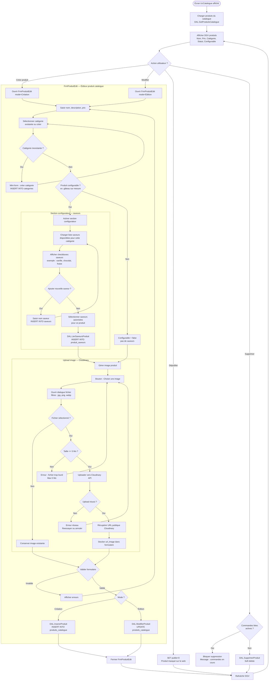

**Points clés :**
- Cloudinary est un CDN (Content Delivery Network) — les images ne sont pas stockées sur le serveur local.
- Le configurateur (saveurs) n'est affiché que si `configurable = true` — progressive disclosure.
- La suppression est bloquée si des commandes actives référencent le produit.
- L'URL Cloudinary est la seule référence stockée en base — pas de fichiers binaires en DB.

---

## 10. Flux de traitement des commandes web

> **Acteurs :** Utilisateur ERP, UcCommandes, DAL, MySQL partagé (commandes du portail web Laravel)
> **Déclencheur :** Navigation vers l'écran Commandes
> **Résultat attendu :** Statut des commandes mis à jour, workflow respecté

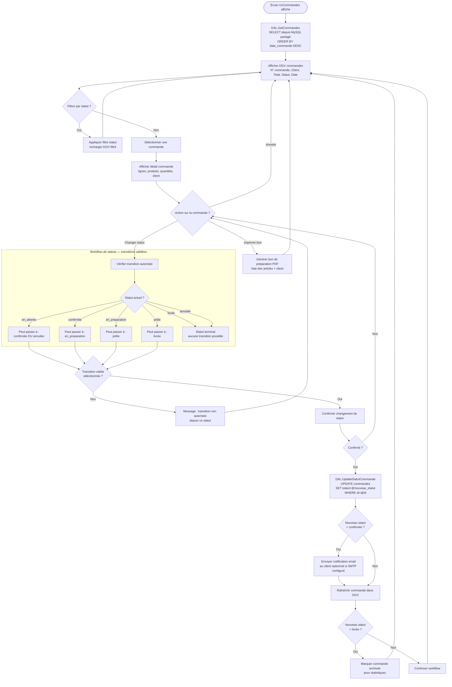

**Points clés :**
- ArtisaStock (C# WinForms) et le portail web (Laravel) partagent la même base MySQL — lecture/écriture directe.
- Le workflow de statuts est linéaire et contraint — pas de retour en arrière possible (sauf `en_attente → annulée`).
- La notification email est optionnelle et conditionnée à la configuration SMTP du serveur.
- Les commandes livrées sont archivées pour les statistiques de vente.

---

## 11. Flux de conversion d'unités (transversal)

> **Acteurs :** UnitConvertisseur (service transversal), appelé par BomExploseur, UcProduction, UcIngredients
> **Déclencheur :** Toute opération nécessitant une comparaison ou conversion de quantités
> **Résultat attendu :** Quantité exprimée dans l'unité cible, ou erreur si conversion impossible

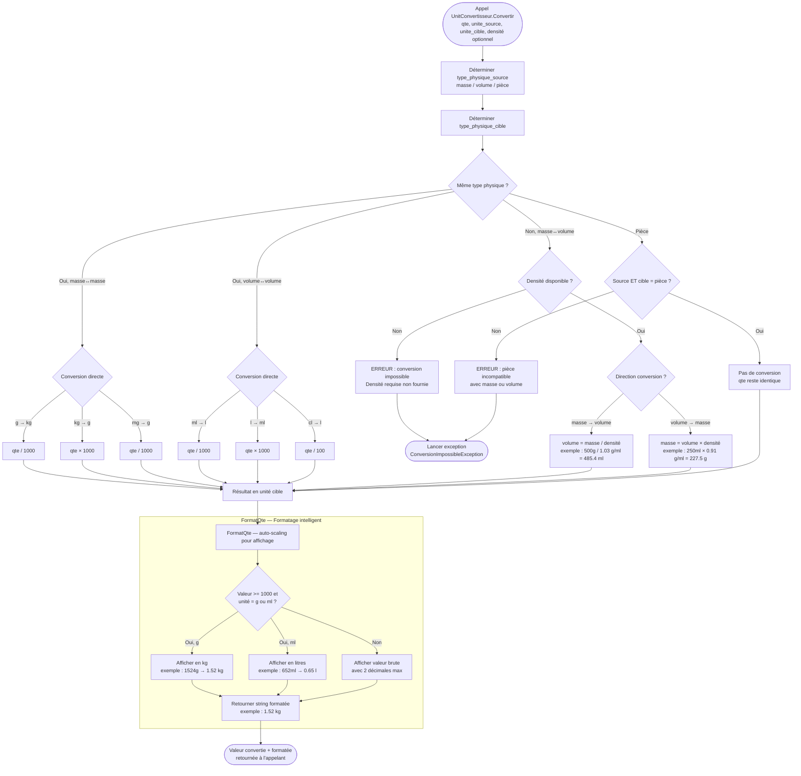

**Points clés :**
- `UnitConvertisseur` est un service statique transversal — appelé par tous les modules nécessitant des conversions.
- La densité est stockée sur l'ingrédient — essentielle pour les conversions masse ↔ volume (ex : huile, lait).
- Les pièces (unités de comptage) ne peuvent pas être converties en masse ou volume — exception explicite.
- `FormatQte` assure un affichage lisible (6520 ml → 6.52 l) sans changer la valeur en base.

---

## 12. Vue d'ensemble — Flux métier global

> **Macro-vision :** comment tous les flux s'articulent, du premier démarrage à la livraison d'une commande web.
> **Lecture :** de gauche à droite, par phase métier.

```mermaid
flowchart LR
    subgraph ONBOARDING [Phase 1 — Onboarding]
        A([Démarrage]) --> B[Authentification\nBCrypt + Rôle admin]
        B --> C[FrmPrincipal\nShell SFA]
        C --> D[Créer activité\nChocolaterie / Pâtisserie]
        D --> E[Configurer sidebar\npar activité]
    end

    subgraph CONFIG [Phase 2 — Configuration]
        E --> F[Créer ingrédients\nUnités, Densités, Seuils]
        F --> G[Configurer BOM\nContextes → Niveaux → Fiches]
        G --> H[Définir lignes fiches\nIngrédients + Sous-fiches]
        H --> I[Calculer coûts estimés\ncascade BOM]
    end

    subgraph APPROVISIONNEMENT [Phase 3 — Approvisionnement]
        F --> J[Créer lots d'achat\nHT/TTC + DLC]
        J --> K[Stock ingrédients\nFIFO ordonné]
        K --> L{Seuil alerte ?}
        L -- Oui --> M[Alerte stock faible\nJauge rouge]
        L -- Non --> N[Jauge verte/orange]
        M & N --> O[Stock prêt]
    end

    subgraph PRODUCTION [Phase 4 — Production]
        O --> P[Sélectionner fiche\n+ nb batches]
        P --> Q[Simulation BOM\nExplosion récursive]
        Q --> R{Tous stocks OK ?}
        R -- Non --> S[Afficher manques\nAjuster batches]
        S --> P
        R -- Oui --> T[Exécuter production\nTransaction FIFO]
        T --> U[Consommer lots\nproduction_lignes]
        U --> V[Créer bom_stocks sortie\nProduit fini stocké]
        V --> W[Calculer coût réel\npar unité produite]
    end

    subgraph CATALOGUE [Phase 5 — Catalogue Web]
        V --> X[Créer produit catalogue\nNom, Prix, Image Cloudinary]
        X --> Y{Configurable ?}
        Y -- Oui --> Z[Lier saveurs\nconfigurator web]
        Y -- Non --> AA[Produit simple]
        Z & AA --> AB[Publier produit\nvisible sur portail Laravel]
    end

    subgraph COMMANDES [Phase 6 — Commandes Web]
        AB --> AC[Client commande\nvia portail web Laravel]
        AC --> AD[Commande visible dans ERP\nMySQL partagé]
        AD --> AE[Workflow statuts\nen attente → confirmée]
        AE --> AF[en préparation\nBon de préparation]
        AF --> AG[prête → livrée]
        AG --> AH([Commande archivée\nStatistiques])
    end

    subgraph TRANSVERSAL [Services transversaux]
        TC[UnitConvertisseur\nConversion + FormatQte]
        TR[ScreenRouter\nNavigation SFA]
        TA[AppState\nÉtat global session]
    end

    Q -.appelle.-> TC
    T -.appelle.-> TC
    C -.utilise.-> TR
    C -.utilise.-> TA
```

**Lecture du diagramme global :**

| Phase | Entrée | Sortie |
|-------|--------|--------|
| **Onboarding** | Démarrage application | Shell configuré par activité |
| **Configuration** | Activité créée | BOM complet + coûts estimés |
| **Approvisionnement** | Ingrédients définis | Lots en stock FIFO |
| **Production** | Stock disponible + BOM | Produit fini en bom_stocks |
| **Catalogue** | Produit fini | Fiche produit publiée web |
| **Commandes** | Commande client web | Livraison archivée |

---

## Annexe — Glossaire des termes techniques

| Terme | Définition |
|-------|------------|
| **SFA** (Single-Form Architecture) | Architecture WinForms où une seule fenêtre principale charge dynamiquement des UserControls dans un panneau droit |
| **BOM** (Bill of Materials) | Nomenclature — liste hiérarchique des composants nécessaires à la fabrication d'un produit |
| **DAL** (Data Access Layer) | Couche d'accès aux données — centralise toutes les requêtes SQL paramétrées |
| **FIFO** (First In, First Out) | Stratégie de consommation des lots : le plus ancien est consommé en premier |
| **DLC** | Date Limite de Consommation — expiration d'un lot d'ingrédient |
| **HT / TTC** | Hors Taxes / Toutes Taxes Comprises — modes de calcul du prix d'achat |
| **CDN** (Content Delivery Network) | Réseau de distribution de contenu — Cloudinary héberge les images produits |
| **Soft delete** | Suppression logique : l'enregistrement reste en base avec un flag `actif = 0` |
| **AppState** | Singleton C# centralisant l'état de navigation : utilisateur connecté, activité sélectionnée, écran courant |
| **BCrypt** | Algorithme de hachage adaptatif pour les mots de passe — résistant aux attaques par force brute |
| **CTA** (Call To Action) | Bouton d'action principal — unique par écran, clairement identifiable |
| **DGV** (DataGridView) | Composant WinForms de grille de données — affiche les listes paginées |
| **N-1** | Contrainte BOM : un niveau ne peut être enfant que du niveau immédiatement supérieur |
| **ROLLBACK** | Annulation d'une transaction MySQL — restaure l'état précédent si une erreur survient |
| **SMTP** | Simple Mail Transfer Protocol — protocole d'envoi d'emails pour les notifications commandes |

---

*Document généré dans le cadre du projet ArtisaStock — Double examen PDSGBD (C# WinForms) et PDWEB (Laravel).*
*Livrable BA/FA — Diagrammes d'activité conformes à la notation UML 2.x adaptée Mermaid.*
