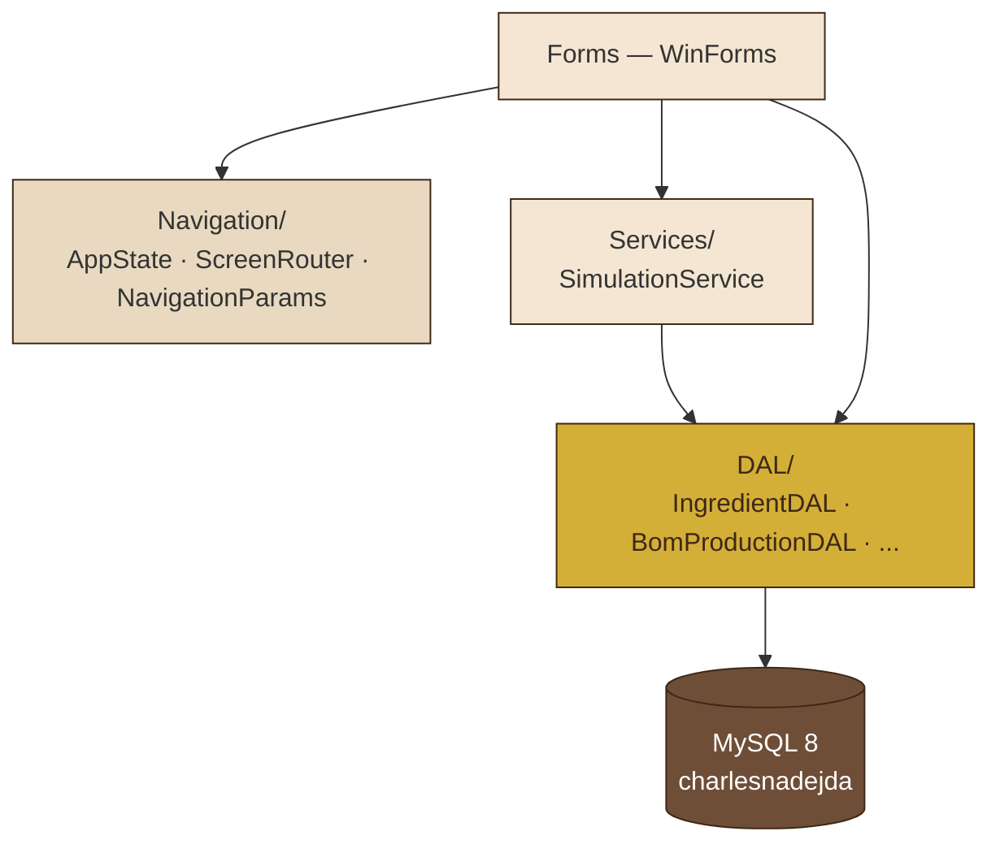
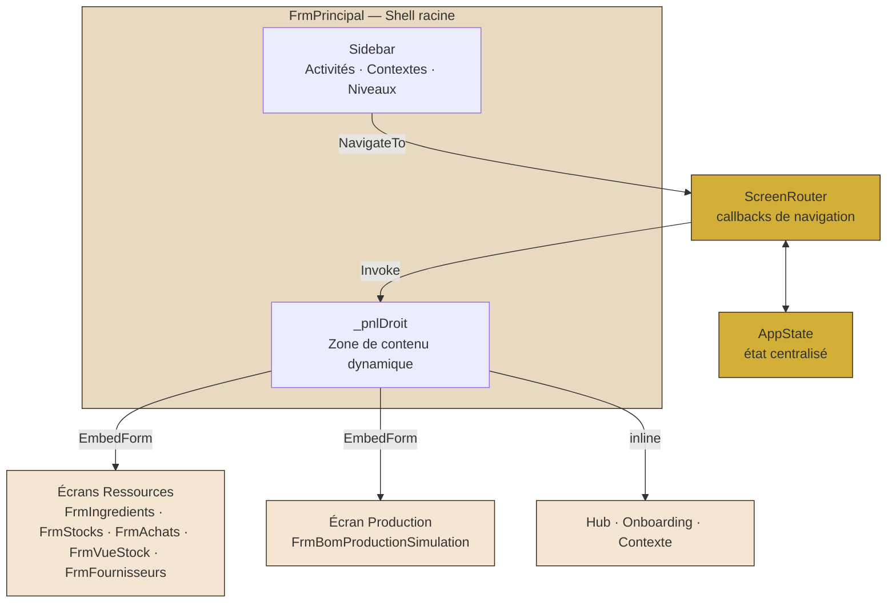
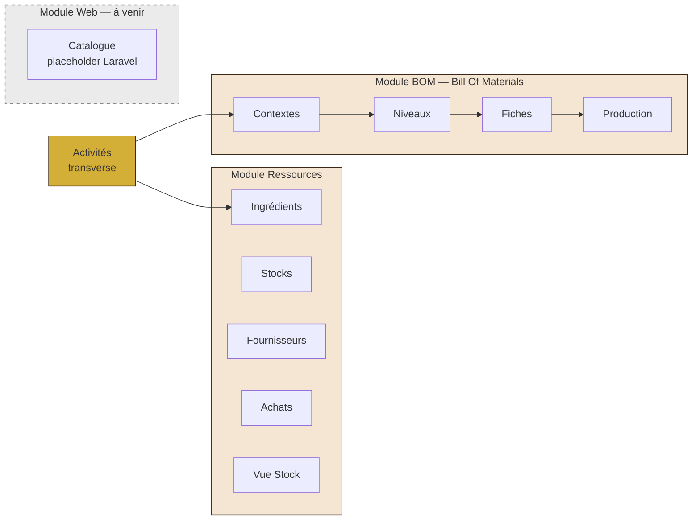

# Architecture ArtisaStock
> Documentation d'architecture du projet · C# WinForms .NET 4.8 + MySQL 8 (Docker)
> Dernière mise à jour : 2026-05-14

---

## Vue d'ensemble

ArtisaStock est un **ERP artisanal** destiné à la gestion de production pour une pâtisserie. L'application suit une **Single-Form Architecture (SFA)** : une seule fenêtre racine `FrmPrincipal` héberge tous les écrans métier via un `ScreenRouter` et un `AppState` centralisé.

**Le pitch en 3 phrases :**
> ArtisaStock utilise une **Single-Form Architecture** : un shell `FrmPrincipal` orchestre la navigation via un `ScreenRouter` et un `AppState`. Les écrans CRUD héritent de deux classes génériques — `FrmListeBase<T>` et `FrmEditBase` — qui appliquent le **Template Method pattern** pour factoriser 80% du code commun. La DAL (Data Access Layer) parle directement à MySQL sans ORM pour garder un contrôle explicite sur les requêtes paramétrées.

---

## Architecture en couches



**Règle de dépendance :** chaque couche ne connaît que celle immédiatement en dessous. Aucune requête SQL n'existe hors DAL.

---

## Single-Form Architecture (SFA)



### Composants clés

| Composant | Rôle | Fichier |
|---|---|---|
| `FrmPrincipal` | Shell racine SFA, sidebar + zone contenu | `Forms/FrmPrincipal.cs` |
| `AppState` | État centralisé (Activité, Contexte, Niveau actifs) | `Navigation/AppState.cs` |
| `ScreenRouter` | Callbacks de navigation avec guard anti-double-render | `Navigation/ScreenRouter.cs` |
| `NavigationParams` | DTO de transport entre screens | `Navigation/NavigationParams.cs` |
| `EmbedForm()` | Intègre un Form dans `_pnlDroit` sans `TopLevel` | `FrmPrincipal.cs:1805` |
| `ClearAndDisposePanel()` | Libère les Forms embarquées précédentes pour éviter les fuites mémoire | `FrmPrincipal.cs:1832` |

---

## Classes de base — Template Method Pattern

### `FrmListeBase<T>` — Écrans liste CRUD

Classe générique abstraite qui factorise :
- `DataGridView` avec template uniforme (alternance de lignes, sélection pleine ligne, anti-édition)
- Boutons Ajouter / Modifier / Supprimer / Fermer (palette chocolat)
- Cycle : `ChargerDonnees()` → binding → clics boutons → refresh

**Sous-classes à implémenter :**

```csharp
protected abstract List<T> ChargerDonnees();
protected abstract void    ConfigurerColonnes();
protected abstract Form    OuvrirFormulaire(T element);
protected abstract void    Supprimer(T element);
protected abstract string  NomElement(T element);
```

**Forms héritières actuelles :**
- `FrmIngredients` (avec chip-panel filtre alertes en plus)
- `FrmAchats`
- `FrmBomContextes`
- `FrmBomNiveaux`
- `FrmBomFiches`

### `FrmEditBase` — Formulaires d'édition

Classe abstraite qui factorise :
- `ErrorProvider` pour affichage des erreurs de validation
- Boutons Enregistrer / Annuler avec palette + comportements standards
- Cycle : clic Enregistrer → `Valider()` → `Sauvegarder()` → `DialogResult.OK`

**Sous-classes à implémenter :**

```csharp
protected abstract bool Valider();
protected abstract void Sauvegarder();
```

**Forms héritières actuelles (migration Phase 2, 2026-04-22) :**
- `FrmBomNiveauEdit`
- `FrmFournisseurEdit`
- `FrmStockEdit`
- `FrmIngredientEdit`
- `FrmActiviteEdit`
- `FrmBomContexteEdit` (avec section niveaux dynamique en mode création)
- `FrmBomFicheEdit` (avec grille de lignes composites)
- `FrmAchatEdit` (avec calcul HTVA/TVAC live + gestion péremption)

---

## Organisation par module métier



### Tableau module → Forms → Base héritée

| Module | Liste | Édition | Héritage Liste | Héritage Edit |
|---|---|---|---|---|
| Activités | `FrmActivites` | `FrmActiviteEdit` | Form | `FrmEditBase` |
| Ingrédients | `FrmIngredients` | `FrmIngredientEdit` | `FrmListeBase<Ingredient>` | `FrmEditBase` |
| Fournisseurs | `FrmFournisseurs` | `FrmFournisseurEdit` | Form | `FrmEditBase` |
| Stocks | `FrmStocks` | `FrmStockEdit` | Form | `FrmEditBase` |
| Achats | `FrmAchats` | `FrmAchatEdit` | `FrmListeBase<Lot>` | `FrmEditBase` |
| Vue Stock | `FrmVueStock` | (lecture seule) | Form | — |
| BOM Contextes | `FrmBomContextes` | `FrmBomContexteEdit` | `FrmListeBase<BomContexte>` | `FrmEditBase` |
| BOM Niveaux | `FrmBomNiveaux` | `FrmBomNiveauEdit` | `FrmListeBase<BomNiveau>` | `FrmEditBase` |
| BOM Fiches | `FrmBomFiches` | `FrmBomFicheEdit` | `FrmListeBase<BomFiche>` | `FrmEditBase` |
| BOM Production | `FrmBomProductionSimulation` | — | Form | — |

---

## Écran Kanban — Niveaux & Contextes (2026-05-14)

L'écran principal du module BOM utilise un layout **Kanban à 4 colonnes** :

```
┌──────────┬───────────────┬───────────────┬──────────────┐
│ NIVEAUX  │    FICHES     │    STOCK      │   DÉTAIL     │
│  220px   │  auto-fit     │  auto-fit     │    Fill      │
│  Left    │  Left         │  Left         │   (reste)    │
├──────────┼───────────────┼───────────────┼──────────────┤
│ Cartes   │ Barre actions │ DGV Stock     │ Contextuel : │
│ custom-  │ DGV Fiches    │ + col Pièces  │ - Ingrédient │
│ drawn    │ (AllCells)    │ + col Jauge   │ - Fiche BOM  │
│ + menu   │               │ (CellPainting)│ - Produit    │
│ contexte │               │               │              │
└──────────┴───────────────┴───────────────┴──────────────┘
```

**Composants clés :**

| Composant | Rôle |
|---|---|
| `MakeNiveauCard()` | Carte niveau custom-drawn (cercle, nom, badge ★, menu contextuel) |
| `MakeKanbanHeader()` | En-tête colonne 32px avec accent coloré |
| `MakeColumnSeparator()` | Séparateur physique 3px (ombre/trait/reflet) |
| `ShowKanbanDetail()` | Dispatcher détail selon type sélection (Ingredient/BomFiche/BomStock) |
| `DgvStock_CellPainting` | Jauge stock cible custom-drawn (barre arrondie + seuil alerte + %) |

**Jauge stock cible :**
- Champ `stock_cible` (migration v14) paramétré par l'utilisateur en pièces (conditionnements)
- Propriétés calculées : `StockPieces`, `StockRatio` sur `Ingredient`
- Couleurs : rouge (< 20%) → orange (< 50%) → vert (≤ 100%) → bleu (surplus > 100%)
- Marque verticale rouge au niveau du seuil d'alerte

---

## Patterns appliqués

### Template Method (GoF)
`FrmListeBase<T>` et `FrmEditBase` définissent le squelette de l'algorithme CRUD. Les classes filles redéfinissent uniquement les étapes spécifiques à leur entité métier.

### Generics
`FrmListeBase<T>` est générique : le `T` permet un typage fort des entités manipulées (`BomFiche`, `Ingredient`, etc.) sans cast runtime.

### Single-Form Architecture (SFA)
Une seule Form racine héberge tous les écrans. Évite la prolifération de fenêtres filles, unifie l'état applicatif, navigation type SPA en desktop.

### DAL (Data Access Layer)
Chaque entité a son DAL statique (`IngredientDAL`, `BomFicheDAL`, etc.) qui centralise les requêtes paramétrées. Pas d'ORM : contrôle explicite sur les SQL.

### Active Record léger
Les Models (`BomFiche`, `Ingredient`, `Lot`, ...) sont des POCO (Plain Old C# Objects) avec éventuellement quelques propriétés calculées (ex. `BomFiche.CoutBatch`).

---

## Base de données

- **Serveur** : MySQL 8 dans Docker (service `mysql` du `docker-compose.yml`)
- **Port exposé** : `3306` (pour app C# native sur Windows)
- **Migrations versionnées** : `sql/migration_v04_*.sql` à `sql/migration_v13_*.sql`
- **Connexion app C#** : via `App.config` (⚠ fichier ignoré par git — voir `App.config.example`)
- **Utilisateur DB** : `cn_user` / `cn_password` (principe de moindre privilège)

Schéma principal : 15 tables ERP (Activités, Stocks, Ingrédients, Lots, Fournisseurs, BOM Contextes/Niveaux/Fiches/Lignes/Stocks/Réservations/Productions).

---

## Règles WinForms critiques

Ces règles ont été apprises dans la douleur — elles doivent être respectées en continu :

1. **Ordre `Controls.Add` pour DockStyle** : ajouter le `Fill` **en premier** (index 0), puis `Bottom`, puis `Top` en dernier. Sinon le Fill recouvre les autres.
2. **`SplitterDistance` uniquement dans un `LayoutEventHandler`** : défini avant que `Width > 0` → `InvalidOperationException`.
3. **`BringToFront()` après `DockStyle.Fill`** : un contrôle non-Dock ajouté après un Fill est invisible sans `BringToFront()`.
4. **`ClearAndDisposePanel()` plutôt que `Controls.Clear()`** : sinon les Forms embarquées restent en mémoire.
5. **CS0136 sur lambdas** : dans un gestionnaire `(sender, e) => ...`, un lambda interne ne peut pas réutiliser `e` — utiliser `ev` ou `_`.

Voir `docs/JOURNAL.md` section "Règles apprises" pour l'historique complet.

---

## Arborescence du projet

```
app-csharp/CharlesNadejda/CharlesNadejda/
├── Forms/              # Classes UI (Forms + bases)
│   ├── FrmPrincipal.cs         ← Shell SFA
│   ├── FrmLogin.cs
│   ├── FrmListeBase.cs         ← Template Method — listes
│   ├── FrmEditBase.cs          ← Template Method — éditions
│   ├── AppColors.cs            ← Palette centralisée
│   ├── FormHelper.cs           ← Helpers NumericUpDown
│   ├── StringExtensions.cs     ← .NullIfEmpty()
│   ├── UnitConvertisseur.cs    ← Conversions d'unités
│   └── Frm*.cs                 ← Forms métier (17 Forms)
├── DAL/                # Accès DB paramétré
│   ├── DbHelper.cs
│   └── *DAL.cs         (15 DALs)
├── Models/             # POCO
├── Navigation/         # SFA
│   ├── AppState.cs
│   ├── ScreenRouter.cs
│   ├── NavigationParams.cs
│   ├── ScreenId.cs
│   └── RessourceType.cs
├── Services/           # Couche applicative
│   └── SimulationService.cs
├── App.config          (⚠ ignoré par git)
├── App.config.example  (template à copier)
└── CharlesNadejda.csproj
```

---

## Évolutions futures

- **Module Web** : intégration avec le site Laravel (Catégories, Parfums, Produits, Commandes) — placeholders actuels dans le menu
- **Tests automatisés** : projet `CharlesNadejda.Tests` (NUnit) à créer, cibles prioritaires : `UnitConvertisseur`, `BomCoutDAL.CalculerCout`
- **Migration des listes restantes** : `FrmFournisseurs`, `FrmActivites`, `FrmStocks` vers `FrmListeBase<T>`
