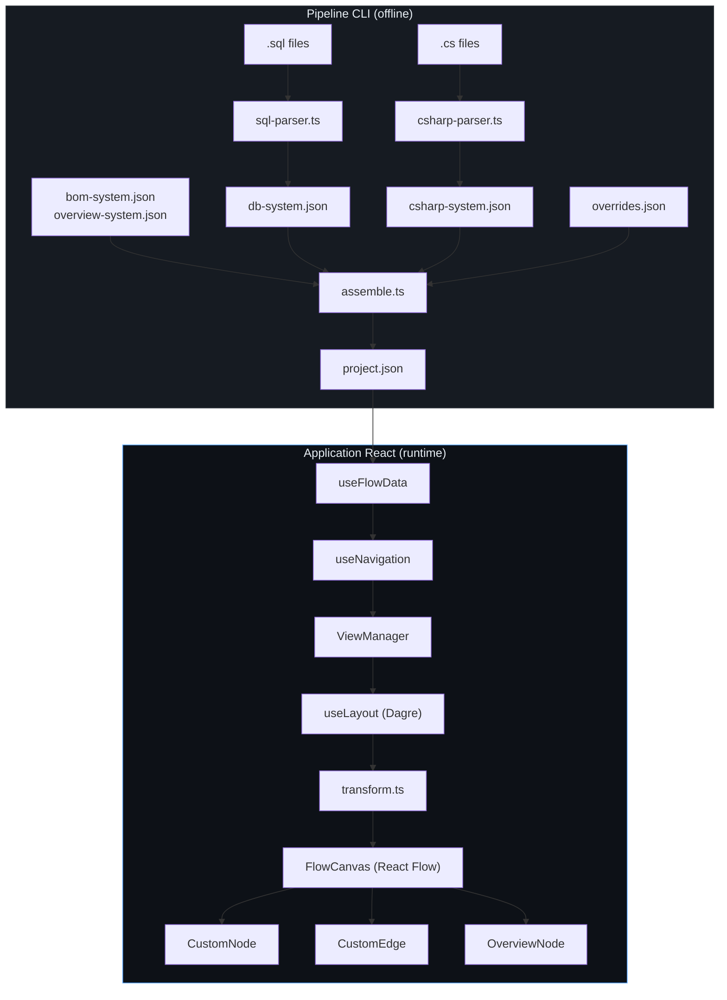

# Architecture Technique — FlowScope

> **Agent #2 — Software Architect**
> **Date :** 2026-05-14
> **Version :** 1.0 — MVP
> **Document source :** `docs/PO_FLOWSCOPE.md` v1.0
> **Destinataires :** Agent #3 (UI/UX), Agent #4 (Parsers), Agent #5 (Frontend)

---

## Table des matières

1. [Architecture globale](#1-architecture-globale)
2. [Schéma de données détaillé](#2-schéma-de-données-détaillé)
3. [Architecture des Parsers](#3-architecture-des-parsers)
4. [Architecture Frontend](#4-architecture-frontend)
5. [Conventions & Standards](#5-conventions--standards)
6. [Décisions techniques](#6-décisions-techniques)

---

## 1. Architecture globale

### 1.1 Pattern architectural

**Pattern retenu : Pipeline + Layered UI**

Le projet se découpe en deux mondes indépendants, connectés par un fichier JSON pivot :

```
┌──────────────────────────────────────────────────────────────────────┐
│                         OFFLINE (CLI)                                │
│                                                                      │
│   Source Files            Parsers              Output                 │
│   (.sql, .cs)    ──►   (TypeScript)    ──►   *-system.json          │
│                                                                      │
│                         Assembler              project.json           │
│                    *-system.json  ──►   + overrides.json merge       │
│                                         ──►  src/data/project.json   │
└──────────────────────────────────────────────────────────────────────┘
                              │
                              ▼
┌──────────────────────────────────────────────────────────────────────┐
│                        RUNTIME (Browser)                             │
│                                                                      │
│   project.json ──► DataProvider ──► ViewManager ──► React Flow       │
│                                                                      │
│   ┌─────────┐    ┌──────────────────────────────────┐                │
│   │ Sidebar │    │          Canvas Area              │  ┌──────────┐ │
│   │ 240px   │    │  ┌──────────────────────────┐    │  │Inspector │ │
│   │         │    │  │ Toolbar (overlay)         │    │  │ 320px    │ │
│   │ Systems │    │  ├──────────────────────────┤    │  │          │ │
│   │ Search  │    │  │ Breadcrumb               │    │  │ Node     │ │
│   │         │    │  ├──────────────────────────┤    │  │ details  │ │
│   │         │    │  │                          │    │  │          │ │
│   │         │    │  │   React Flow Canvas      │    │  │          │ │
│   │         │    │  │   (nodes + edges)         │    │  │          │ │
│   │         │    │  │                          │    │  │          │ │
│   │         │    │  │              [MiniMap]    │    │  │          │ │
│   │         │    │  └──────────────────────────┘    │  │          │ │
│   └─────────┘    └──────────────────────────────────┘  └──────────┘ │
└──────────────────────────────────────────────────────────────────────┘
```

**Pourquoi ce pattern :**
- Découplage total parsers/UI via le JSON pivot (conforme D4)
- Pas de backend runtime (conforme D1)
- Pipeline unidirectionnel : source → parse → assemble → render
- Chaque parser est un script autonome exécutable en CLI

### 1.2 Arborescence complète du projet

```
flowscope/
├── public/                          # Assets statiques Vite
├── output/                          # Sortie des parsers (gitignored sauf exemples)
│   ├── db-system.json               # Sortie parser SQL
│   ├── csharp-system.json           # Sortie parser C#
│   └── overrides.json               # Enrichissements manuels
├── src/
│   ├── components/                  # Composants React réutilisables
│   │   ├── canvas/                  # Composants liés au canvas React Flow
│   │   │   ├── FlowCanvas.tsx       # Wrapper ReactFlow + provider
│   │   │   ├── CustomNode.tsx       # Node custom richement typé
│   │   │   ├── CustomEdge.tsx       # Edge custom typé visuellement
│   │   │   ├── OverviewNode.tsx     # Node spécial pour la vue Overview
│   │   │   ├── Toolbar.tsx          # Barre d'outils overlay (zoom, layout, search)
│   │   │   ├── Breadcrumb.tsx       # Fil d'Ariane de navigation
│   │   │   └── MiniMap.tsx          # Wrapper MiniMap configuré
│   │   ├── inspector/               # Panneau inspecteur latéral
│   │   │   ├── InspectorPanel.tsx   # Conteneur principal du panneau
│   │   │   ├── MetadataSection.tsx  # Affichage des métadonnées
│   │   │   ├── ConnectionsList.tsx  # Liste des nodes connectés
│   │   │   └── TagBadge.tsx         # Badge de tag individuel
│   │   ├── search/                  # Recherche globale
│   │   │   ├── SearchModal.tsx      # Modale command palette (Ctrl+K)
│   │   │   └── SearchResult.tsx     # Ligne de résultat
│   │   ├── sidebar/                 # Sidebar gauche
│   │   │   ├── Sidebar.tsx          # Conteneur sidebar
│   │   │   ├── SystemItem.tsx       # Ligne de système dans la sidebar
│   │   │   └── SearchButton.tsx     # Bouton loupe dans sidebar
│   │   └── ui/                      # Composants UI atomiques
│   │       ├── Badge.tsx            # Badge générique (type, tag)
│   │       ├── IconButton.tsx       # Bouton icône avec tooltip
│   │       └── KeyboardShortcuts.tsx # Overlay aide raccourcis
│   ├── hooks/                       # Custom hooks React
│   │   ├── useFlowData.ts           # Chargement et transformation des données pour React Flow
│   │   ├── useNavigation.ts         # Navigation entre vues (state + breadcrumb)
│   │   ├── useSearch.ts             # Logique Fuse.js + index
│   │   ├── useLayout.ts            # Auto-layout Dagre
│   │   ├── useKeyboardShortcuts.ts  # Écouteurs clavier
│   │   └── useInspector.ts          # État ouvert/fermé + node sélectionné
│   ├── layouts/                     # Layout principal
│   │   └── AppLayout.tsx            # Shell : sidebar + canvas + inspector
│   ├── views/                       # Vues par système (logique de mapping)
│   │   └── ViewManager.tsx          # Sélecteur de vue active + config par système
│   ├── types/                       # Interfaces TypeScript
│   │   ├── schema.ts               # Schéma JSON universel (interfaces données)
│   │   ├── ui.ts                    # Types UI (navigation, inspector state)
│   │   └── index.ts                 # Réexport centralisé
│   ├── utils/                       # Fonctions utilitaires
│   │   ├── layout.ts               # Fonctions Dagre (calcul positions)
│   │   ├── colors.ts               # Palette de couleurs par NodeType
│   │   ├── icons.ts                # Mapping NodeType → icône Lucide
│   │   └── transform.ts            # FlowNode/FlowEdge → React Flow Node/Edge
│   ├── data/                        # Fichiers JSON de données
│   │   ├── project.json             # Données assemblées (généré par assemble.ts)
│   │   └── example-project.json     # Données d'exemple pour développement
│   ├── parsers/                     # Scripts de parsing (Node.js, exécution CLI)
│   │   ├── types.ts                 # Réexport des types schema pour les parsers
│   │   ├── sql-parser.ts           # Parser SQL (CREATE TABLE)
│   │   ├── csharp-parser.ts        # Parser C# (Forms, DAL, Models)
│   │   └── assemble.ts             # Assembleur de systèmes → project.json
│   ├── App.tsx                      # Point d'entrée React
│   ├── main.tsx                     # Montage React DOM
│   └── index.css                    # Styles globaux Tailwind (@tailwind directives)
├── index.html                       # Point d'entrée HTML Vite
├── package.json                     # Dépendances + scripts npm
├── tsconfig.json                    # Config TypeScript (strict, paths)
├── tsconfig.node.json               # Config TS pour scripts Node (parsers)
├── tailwind.config.ts               # Tokens couleurs, thème dark
├── postcss.config.js                # Config PostCSS (Tailwind plugin)
├── vite.config.ts                   # Config Vite (alias @/)
└── .gitignore
```

---

## 2. Schéma de données détaillé

### 2.1 Interfaces TypeScript — `src/types/schema.ts`

```typescript
// ─── Types de base ────────────────────────────────────────────

/** Types de nodes reconnus par FlowScope */
export type NodeType =
  | "table"
  | "form"
  | "dal"
  | "model"
  | "controller"
  | "route"
  | "view"
  | "process"
  | "stock"
  | "custom";

/** Types d'edges (relations entre nodes) */
export type EdgeType =
  | "dependency"
  | "inheritance"
  | "fk"
  | "flow"
  | "data";

/** Direction de layout pour un système */
export type LayoutDirection = "TB" | "LR";

// ─── Structures de données ────────────────────────────────────

/** Métadonnées d'un node — structure libre, clés connues documentées */
export interface NodeMetadata {
  /** Colonnes SQL (tables) — format "nom: TYPE" */
  columns?: string[];
  /** Clés primaires (tables) */
  primaryKeys?: string[];
  /** Méthodes publiques (classes C#) — signature simplifiée */
  methods?: string[];
  /** Propriétés publiques (classes C#) */
  properties?: string[];
  /** Description d'une étape de pipeline (BOM) */
  role?: string;
  /** Clé générique pour extensions futures */
  [key: string]: unknown;
}

/** Position XY d'un node sur le canvas */
export interface NodePosition {
  x: number;
  y: number;
}

/** Un node dans le graphe FlowScope */
export interface FlowNode {
  /** Identifiant unique projet-wide. Format: "{system-prefix}:{entity-name}" */
  id: string;
  /** Type déterminant l'icône, la couleur et le rendu */
  type: NodeType;
  /** Nom affiché sur le node */
  label: string;
  /** Description longue (visible dans l'inspecteur) */
  description?: string;
  /** Chemin relatif du fichier source */
  filePath?: string;
  /** Métadonnées structurées */
  metadata: NodeMetadata;
  /** Tags libres pour filtrage/recherche */
  tags?: string[];
  /** Groupe logique pour regroupement visuel (ex: "BOM", "Catalogue") */
  group?: string;
  /** Position manuelle (override). Si absente, l'auto-layout calcule. */
  position?: NodePosition;
}

/** Un edge (relation) entre deux nodes */
export interface FlowEdge {
  /** Identifiant unique. Format: "{source-id}--{type}--{target-id}" */
  id: string;
  /** ID du node source */
  source: string;
  /** ID du node cible */
  target: string;
  /** Label affiché sur l'edge (ex: nom du champ FK) */
  label?: string;
  /** Type déterminant le rendu visuel */
  type?: EdgeType;
  /** Edge animé (pointillés mouvants) — utilisé pour les flux */
  animated?: boolean;
}

/** Définition d'un système (sous-graphe cohérent) */
export interface SystemDefinition {
  /** Identifiant unique du système (ex: "db", "csharp", "bom") */
  id: string;
  /** Nom affiché dans la sidebar et l'overview */
  label: string;
  /** Nom de l'icône Lucide (ex: "Database", "Code2", "GitBranch") */
  icon: string;
  /** Description courte du système */
  description: string;
  /** Direction de layout préférée. TB (Top-Bottom) par défaut. */
  layoutDirection?: LayoutDirection;
  /** Tous les nodes de ce système */
  nodes: FlowNode[];
  /** Toutes les relations de ce système */
  edges: FlowEdge[];
}

/** Projet FlowScope complet — format pivot JSON */
export interface FlowScopeProject {
  /** Nom du projet cartographié */
  name: string;
  /** Version du projet (depuis package.json) */
  version: string;
  /** Date/heure ISO du dernier parsing */
  lastParsed: string;
  /** Systèmes constituant le projet */
  systems: SystemDefinition[];
}
```

### 2.2 Types UI — `src/types/ui.ts`

```typescript
import type { FlowNode, SystemDefinition } from "./schema";

/** Vue active dans l'application */
export interface NavigationState {
  /** ID du système actif, ou "overview" pour la vue d'ensemble */
  activeSystemId: string;
  /** Historique de navigation pour le retour arrière */
  history: string[];
}

/** État du panneau inspecteur */
export interface InspectorState {
  /** Panneau ouvert ou fermé */
  isOpen: boolean;
  /** Node actuellement inspecté */
  selectedNode: FlowNode | null;
  /** Système contenant le node inspecté */
  systemId: string | null;
}

/** Résultat de recherche Fuse.js enrichi */
export interface SearchResult {
  /** Le node trouvé */
  node: FlowNode;
  /** ID du système contenant ce node */
  systemId: string;
  /** Label du système (pour affichage) */
  systemLabel: string;
  /** Score Fuse.js (0 = parfait) */
  score: number;
}
```

### 2.3 Format JSON universel — Exemple concret

Fichier `src/data/example-project.json` :

```json
{
  "name": "Charles & Nadejda",
  "version": "1.0.0",
  "lastParsed": "2026-05-14T10:30:00Z",
  "systems": [
    {
      "id": "overview",
      "label": "Overview",
      "icon": "LayoutDashboard",
      "description": "Vue d'ensemble de l'architecture du projet",
      "nodes": [
        {
          "id": "overview:db",
          "type": "custom",
          "label": "Base de données MySQL",
          "description": "50 tables — schéma relationnel complet",
          "metadata": { "nodeCount": 50, "systemRef": "db" }
        },
        {
          "id": "overview:csharp",
          "type": "custom",
          "label": "Application C# WinForms",
          "description": "42 classes — Forms, DAL, Models",
          "metadata": { "nodeCount": 42, "systemRef": "csharp" }
        },
        {
          "id": "overview:bom",
          "type": "custom",
          "label": "Pipeline BOM",
          "description": "Flux de production multi-niveaux",
          "metadata": { "nodeCount": 7, "systemRef": "bom" }
        },
        {
          "id": "overview:laravel",
          "type": "custom",
          "label": "Laravel (placeholder)",
          "description": "Scaffold web — à développer",
          "metadata": { "nodeCount": 0, "systemRef": "laravel" }
        }
      ],
      "edges": []
    },
    {
      "id": "db",
      "label": "Base de données MySQL",
      "icon": "Database",
      "description": "Schéma relationnel — tables, colonnes, clés étrangères",
      "layoutDirection": "TB",
      "nodes": [
        {
          "id": "db:ingredients",
          "type": "table",
          "label": "ingredients",
          "metadata": {
            "columns": [
              "id: INT",
              "nom: VARCHAR(100)",
              "unite_id: INT",
              "prix_unitaire: DECIMAL(10,2)",
              "stock_actuel: DECIMAL(10,3)"
            ],
            "primaryKeys": ["id"]
          },
          "group": "BOM",
          "tags": ["bom", "stock"]
        },
        {
          "id": "db:unites",
          "type": "table",
          "label": "unites",
          "metadata": {
            "columns": ["id: INT", "nom: VARCHAR(50)", "abreviation: VARCHAR(10)"],
            "primaryKeys": ["id"]
          },
          "group": "Référentiel"
        },
        {
          "id": "db:recettes",
          "type": "table",
          "label": "recettes",
          "metadata": {
            "columns": [
              "id: INT",
              "nom: VARCHAR(150)",
              "description: TEXT",
              "categorie_id: INT"
            ],
            "primaryKeys": ["id"]
          },
          "group": "BOM"
        }
      ],
      "edges": [
        {
          "id": "db:ingredients--fk--db:unites",
          "source": "db:ingredients",
          "target": "db:unites",
          "label": "unite_id",
          "type": "fk"
        },
        {
          "id": "db:recettes--fk--db:ingredients",
          "source": "db:recettes",
          "target": "db:ingredients",
          "label": "via recette_ingredients",
          "type": "fk"
        }
      ]
    },
    {
      "id": "bom",
      "label": "Pipeline BOM",
      "icon": "GitBranch",
      "description": "Flux de production : Ingrédients → Niveaux → Productions → Stocks",
      "layoutDirection": "LR",
      "nodes": [
        {
          "id": "bom:ingredients",
          "type": "stock",
          "label": "Ingrédients",
          "description": "Matières premières avec stock et prix unitaire",
          "metadata": { "role": "Point d'entrée du flux de production" }
        },
        {
          "id": "bom:niveaux",
          "type": "process",
          "label": "Niveaux BOM",
          "description": "Décomposition hiérarchique multi-niveaux",
          "metadata": { "role": "Structure de la nomenclature" }
        },
        {
          "id": "bom:fiches",
          "type": "process",
          "label": "Fiches Recettes",
          "description": "Recettes avec quantités et étapes",
          "metadata": { "role": "Définition du produit fini" }
        }
      ],
      "edges": [
        {
          "id": "bom:ingredients--flow--bom:niveaux",
          "source": "bom:ingredients",
          "target": "bom:niveaux",
          "type": "flow",
          "animated": true
        },
        {
          "id": "bom:niveaux--flow--bom:fiches",
          "source": "bom:niveaux",
          "target": "bom:fiches",
          "type": "flow",
          "animated": true
        }
      ]
    }
  ]
}
```

### 2.4 Format `overrides.json`

Le fichier `output/overrides.json` permet d'enrichir ou corriger les données auto-parsées sans modifier les parsers. Le merge est effectué par `assemble.ts` (deep merge par `id`).

```json
{
  "nodes": {
    "db:ingredients": {
      "description": "Table centrale du module stock — liée à la production BOM",
      "group": "BOM",
      "tags": ["critique", "bom", "stock"]
    },
    "csharp:FrmIngredients": {
      "description": "Formulaire de gestion des ingrédients avec DGV et CRUD complet",
      "tags": ["crud", "bom"]
    }
  },
  "edges": {
    "csharp:FrmIngredients--dependency--csharp:IngredientDAL": {
      "label": "CRUD operations"
    }
  }
}
```

**Champs overridables sur les nodes :** `description`, `tags`, `group`, `position`.
**Champs overridables sur les edges :** `label`.

Le merge est **additif** : les champs non mentionnés dans l'override sont conservés tels quels. Les arrays (`tags`) sont **remplacés** (pas concaténés) pour éviter les doublons.

### 2.5 Conventions de nommage des IDs

| Entité | Pattern | Exemples |
|--------|---------|----------|
| Node ID | `{system-id}:{entity-name}` | `db:ingredients`, `csharp:FrmIngredients`, `bom:niveaux` |
| Edge ID | `{source-id}--{edge-type}--{target-id}` | `db:ingredients--fk--db:unites` |
| System ID | mot-clé court, kebab-case | `db`, `csharp`, `bom`, `laravel`, `overview` |
| Entity name | Nom original de l'entité (PascalCase pour C#, snake_case pour SQL) | `FrmIngredients`, `ingredients` |

Le préfixe système dans l'ID garantit l'unicité projet-wide (conforme D9). Un node `ingredients` dans le système `db` et un node `ingredients` dans le système `bom` ont des IDs distincts : `db:ingredients` vs `bom:ingredients`.

---

## 3. Architecture des Parsers

### 3.1 Interface commune

Tous les parsers respectent le même contrat. Pas d'interface formelle (ce sont des scripts CLI), mais une convention stricte :

```typescript
// Convention de sortie — chaque parser produit un SystemDefinition
// Fichier: src/parsers/types.ts (réexport)

export type { SystemDefinition, FlowNode, FlowEdge, NodeMetadata } from "../types/schema";

/** Configuration minimale pour un parser */
export interface ParserConfig {
  /** Chemin du dossier source à scanner */
  inputDir: string;
  /** Chemin du fichier JSON de sortie */
  outputPath: string;
}
```

**Contrat de chaque parser :**

1. Accepte un chemin de dossier en argument CLI
2. Scanne les fichiers pertinents (`.sql`, `.cs`, etc.)
3. Produit un fichier JSON conforme à `SystemDefinition`
4. Log en console un résumé (nombre d'entités parsées)
5. Termine avec exit code 0 (succès) ou 1 (erreur)

### 3.2 Pipeline complet

```
┌─────────────────────────────────────────────────────────────────────┐
│  Étape 1 — Parsing (indépendant par système)                       │
│                                                                     │
│  npx tsx src/parsers/sql-parser.ts ./path/to/sql/                   │
│    └──► output/db-system.json                                       │
│                                                                     │
│  npx tsx src/parsers/csharp-parser.ts ./path/to/csharp/             │
│    └──► output/csharp-system.json                                   │
│                                                                     │
│  (bom-system.json et overview-system.json créés manuellement)       │
│                                                                     │
├─────────────────────────────────────────────────────────────────────┤
│  Étape 2 — Assemblage                                               │
│                                                                     │
│  npx tsx src/parsers/assemble.ts                                    │
│    ├── Lit output/*-system.json                                     │
│    ├── Lit output/overrides.json (si présent)                       │
│    ├── Deep merge overrides sur nodes/edges par ID                  │
│    ├── Lit version depuis package.json                              │
│    ├── Génère lastParsed (timestamp ISO)                            │
│    └──► src/data/project.json                                       │
│                                                                     │
├─────────────────────────────────────────────────────────────────────┤
│  Étape 3 — Runtime                                                  │
│                                                                     │
│  npm run dev                                                        │
│    └── App charge src/data/project.json via import statique         │
└─────────────────────────────────────────────────────────────────────┘
```

### 3.3 Scripts npm

```json
{
  "scripts": {
    "dev": "vite",
    "build": "tsc -b && vite build",
    "preview": "vite preview",
    "parse:sql": "tsx src/parsers/sql-parser.ts",
    "parse:csharp": "tsx src/parsers/csharp-parser.ts",
    "parse:assemble": "tsx src/parsers/assemble.ts",
    "parse:all": "npm run parse:sql -- ../sql && npm run parse:csharp -- ../app-csharp/CharlesNadejda/CharlesNadejda && npm run parse:assemble"
  }
}
```

Note : `parse:all` est un raccourci. Les chemins des sources doivent être passés en argument ou définis dans un fichier de config. Pour le MVP, on passe les chemins en dur dans `parse:all`.

### 3.4 Gestion des erreurs de parsing

Chaque parser gère ses erreurs localement, sans interrompre le pipeline global :

| Situation | Comportement |
|-----------|-------------|
| Fichier source illisible | Log warning, skip le fichier, continue |
| Syntaxe non reconnue (ex: `ALTER TABLE`) | Ignore silencieusement, traite uniquement les patterns connus |
| Aucune entité trouvée dans un fichier | Log info, fichier ignoré |
| Zéro fichier pertinent trouvé | Log erreur, génère un JSON vide (nodes: [], edges: []) avec exit code 0 |
| Dossier source inexistant | Log erreur, exit code 1 |
| Erreur d'écriture du JSON | Log erreur, exit code 1 |

Les parsers utilisent des regex pragmatiques, pas un AST (Abstract Syntax Tree — arbre syntaxique abstrait) complet. C'est suffisant pour le MVP et les patterns de code du projet Charles & Nadejda.

### 3.5 Ajouter un nouveau parser (plugin pattern)

Pour ajouter un parser (ex: Laravel) :

1. Créer `src/parsers/laravel-parser.ts`
2. Respecter le contrat : accepter un chemin CLI, produire un `SystemDefinition` JSON dans `output/laravel-system.json`
3. Ajouter le script npm : `"parse:laravel": "tsx src/parsers/laravel-parser.ts"`
4. L'assembleur détecte automatiquement les fichiers `output/*-system.json` — aucune modification nécessaire
5. Ajouter le système dans la vue Overview (node dans `overview-system.json`)

### 3.6 Parser SQL — Détail technique

**Entrée :** fichiers `.sql` contenant des `CREATE TABLE`.

**Patterns regex à extraire :**

```
CREATE TABLE [IF NOT EXISTS] `nom_table` (
  → Déclenche un nouveau FlowNode de type "table"

`nom_colonne` TYPE [NOT NULL] [DEFAULT ...] [AUTO_INCREMENT]
  → Ajouté à metadata.columns sous forme "nom: TYPE"

PRIMARY KEY (`col1` [, `col2`])
  → metadata.primaryKeys

FOREIGN KEY (`col_locale`) REFERENCES `table_cible` (`col_cible`)
  → Génère un FlowEdge { source: node actuel, target: table_cible, type: "fk", label: col_locale }
```

**Ignore :** `INSERT INTO`, `ALTER TABLE`, `DROP TABLE`, commentaires (`--`, `/* */`), `SET`, `USE`.

### 3.7 Parser C# — Détail technique

**Entrée :** fichiers `.cs` dans un dossier (scan récursif).

**Classification par heuristique :**

| Critère | Type assigné |
|---------|-------------|
| Chemin contient `/Forms/` OU classe hérite de `Form` | `"form"` |
| Chemin contient `/DAL/` OU nom de classe finit par `DAL` | `"dal"` |
| Chemin contient `/Models/` | `"model"` |
| Aucun critère matché | `"custom"` |

**Patterns regex :**

```
class NomClasse [: ClasseParente [, IInterface]]
  → FlowNode avec label = NomClasse, type selon heuristique
  → Si ClasseParente détectée et présente dans les nodes : FlowEdge type "inheritance"

public ReturnType NomMethode(params)
  → metadata.methods[]

public Type NomPropriete { get; set; }
  → metadata.properties[]

new XxxDAL()  ou  = new XxxDAL(
  → FlowEdge type "dependency" vers le node XxxDAL
```

---

## 4. Architecture Frontend

### 4.1 Arbre des composants React

```
App
└── AppLayout
    ├── Sidebar
    │   ├── ProjectTitle          (nom du projet)
    │   ├── SearchButton          (ouvre la modale Ctrl+K)
    │   └── SystemItem[]          (un par système, cliquable)
    │
    ├── CanvasArea                (zone flex-grow)
    │   ├── Breadcrumb            (overlay en haut)
    │   ├── Toolbar               (overlay en haut à droite)
    │   └── FlowCanvas            (React Flow)
    │       ├── CustomNode[]      (nodes typés)
    │       ├── OverviewNode[]    (nodes vue Overview uniquement)
    │       ├── CustomEdge[]      (edges typés)
    │       └── MiniMap
    │
    ├── InspectorPanel            (conditionnel, slide-in à droite)
    │   ├── NodeHeader            (nom, type badge)
    │   ├── MetadataSection       (colonnes, méthodes, etc.)
    │   ├── TagBadge[]            (tags)
    │   └── ConnectionsList       (nodes connectés)
    │
    ├── SearchModal               (conditionnel, overlay centré)
    │   └── SearchResult[]
    │
    └── KeyboardShortcuts         (conditionnel, overlay "?")
```

### 4.2 State management

Le state est géré par des **hooks React** avec `useState`/`useReducer` dans le composant racine `AppLayout`. Pas de state manager externe (Zustand, Redux) — le projet est assez petit pour que le lifting de state soit suffisant.

#### Blocs de state

| State | Géré par | Contenu | Consommateurs |
|-------|----------|---------|---------------|
| **project** | `useFlowData` | `FlowScopeProject` chargé depuis JSON | Tous les composants |
| **navigation** | `useNavigation` | `{ activeSystemId, history }` | Sidebar, Breadcrumb, ViewManager, FlowCanvas |
| **inspector** | `useInspector` | `{ isOpen, selectedNode, systemId }` | InspectorPanel, FlowCanvas (sélection) |
| **search** | `useSearch` | `{ isOpen, query, results }` | SearchModal |
| **layout** | `useLayout` | Fonction `applyLayout(nodes, edges, direction)` | FlowCanvas, Toolbar |

#### Flux de données

```
project.json
    │
    ▼
useFlowData ── charge le JSON, expose systems[], getSystem(id)
    │
    ▼
useNavigation ── activeSystemId → détermine quel système afficher
    │
    ▼
ViewManager ── récupère le SystemDefinition actif
    │
    ▼
useLayout ── calcule positions Dagre si pas de positions manuelles
    │
    ▼
transform.ts ── convertit FlowNode[] → React Flow Node[] (avec nodeTypes, positions)
             ── convertit FlowEdge[] → React Flow Edge[] (avec edgeTypes, styles)
    │
    ▼
FlowCanvas ── <ReactFlow nodes={rfNodes} edges={rfEdges} nodeTypes={...} edgeTypes={...} />
```

### 4.3 Navigation entre vues

**Pas de react-router.** La navigation est gérée par un state interne (`activeSystemId`). Justification : application single-page sans routes réelles, pas de deep linking nécessaire dans le MVP.

```typescript
// Hook useNavigation — logique simplifiée
function useNavigation(systems: SystemDefinition[]) {
  const [state, setState] = useState<NavigationState>({
    activeSystemId: "overview",
    history: [],
  });

  const navigateTo = (systemId: string) => {
    setState((prev) => ({
      activeSystemId: systemId,
      history: [...prev.history, prev.activeSystemId],
    }));
    // Ferme l'inspecteur et désélectionne le node au changement de vue
    closeInspector();
  };

  const goBack = () => {
    setState((prev) => {
      const newHistory = [...prev.history];
      const previousId = newHistory.pop() ?? "overview";
      return { activeSystemId: previousId, history: newHistory };
    });
  };

  const breadcrumbs = buildBreadcrumbs(state); // ["Overview"] ou ["Overview", "Base de données MySQL"]

  return { activeSystemId: state.activeSystemId, navigateTo, goBack, breadcrumbs };
}
```

### 4.4 Intégration React Flow

**Provider :** `<ReactFlowProvider>` enveloppe `FlowCanvas` (pas l'app entière — une seule instance de graphe).

**Custom nodes :**

```typescript
// Enregistrement des types de nodes
const nodeTypes = {
  custom: CustomNode,     // Node standard (table, form, dal, etc.)
  overview: OverviewNode, // Node gros bloc pour la vue Overview
};

// Enregistrement des types d'edges
const edgeTypes = {
  custom: CustomEdge,     // Edge avec rendu typé (fk, inheritance, etc.)
};
```

Tous les nodes de données utilisent le type `"custom"` côté React Flow. Le `CustomNode` lit le `type` du `FlowNode` dans `data` pour déterminer l'icône et la couleur. Cela évite d'enregistrer un nodeType React Flow par NodeType métier.

**Interaction events :**

| Event React Flow | Action |
|------------------|--------|
| `onNodeClick` | Ouvre l'inspecteur avec le node cliqué |
| `onNodeDoubleClick` | Si vue Overview : navigue vers le système référencé (`metadata.systemRef`) |
| `onPaneClick` | Ferme l'inspecteur |
| `onInit` | Stocke l'instance `ReactFlowInstance` pour `fitView()` programmatique |

### 4.5 Performance

| Technique | Quand | Comment |
|-----------|-------|---------|
| `useMemo` sur nodes/edges transformés | Toujours | Recalcul uniquement si `activeSystemId` change |
| `memo()` sur `CustomNode` et `CustomEdge` | Toujours | React Flow re-render tous les nodes sur interaction sans `memo` |
| Import statique du JSON | Build time | `import project from "./data/project.json"` — pas de fetch réseau |
| Dagre layout en `useMemo` | Changement de vue | Layout calculé une fois, mis en cache |
| `fitView()` sur changement de vue | Navigation | Transition immédiate, pas de lag |

Pas de lazy loading de vues — avec < 100 nodes par système, le rendu est instantané. Si les données atteignent > 500 nodes, envisager `React.lazy` pour les composants inspecteur/search (v2+).

---

## 5. Conventions & Standards

### 5.1 Nommage

| Élément | Convention | Exemples |
|---------|-----------|----------|
| Fichiers composants | PascalCase.tsx | `CustomNode.tsx`, `InspectorPanel.tsx` |
| Fichiers hooks | camelCase.ts (préfixe `use`) | `useNavigation.ts`, `useFlowData.ts` |
| Fichiers utilitaires | camelCase.ts | `transform.ts`, `colors.ts` |
| Fichiers types | camelCase.ts | `schema.ts`, `ui.ts` |
| Composants React | PascalCase | `function CustomNode()`, `function Sidebar()` |
| Props interfaces | PascalCase + `Props` suffix | `CustomNodeProps`, `SidebarProps` |
| Hooks | camelCase, préfixe `use` | `useNavigation()`, `useSearch()` |
| Constantes | UPPER_SNAKE_CASE | `NODE_COLORS`, `LAYOUT_CONFIG` |
| Variables locales | camelCase | `activeSystem`, `nodeCount` |

### 5.2 Structure d'un composant type

```typescript
// src/components/example/ExampleComponent.tsx

import { memo } from "react";
import { SomeIcon } from "lucide-react";
import type { SomeType } from "@/types";

// ─── Types ──────────────────────────────────
interface ExampleComponentProps {
  data: SomeType;
  onAction: (id: string) => void;
}

// ─── Component ──────────────────────────────
function ExampleComponent({ data, onAction }: ExampleComponentProps) {
  // hooks en premier
  // handlers ensuite
  // rendu en dernier

  const handleClick = () => {
    onAction(data.id);
  };

  return (
    <div className="rounded-lg border border-fs-border bg-fs-surface p-4">
      <SomeIcon className="h-4 w-4 text-fs-text-secondary" />
      <span className="text-sm font-medium text-fs-text">{data.label}</span>
    </div>
  );
}

export default memo(ExampleComponent);
```

### 5.3 Imports — Path aliases

```json
// tsconfig.json (extrait)
{
  "compilerOptions": {
    "baseUrl": ".",
    "paths": {
      "@/*": ["src/*"]
    }
  }
}
```

```typescript
// vite.config.ts (extrait)
import { resolve } from "path";

export default defineConfig({
  resolve: {
    alias: {
      "@": resolve(__dirname, "src"),
    },
  },
});
```

**Règle d'import :** utiliser `@/` pour tous les imports absolus depuis `src/`. Jamais de `../../..` au-delà de 2 niveaux.

```typescript
// Bon
import type { FlowNode } from "@/types";
import { NODE_COLORS } from "@/utils/colors";

// Mauvais
import type { FlowNode } from "../../../types";
```

### 5.4 Tailwind — Tokens & Palette

#### Configuration — `tailwind.config.ts`

```typescript
import type { Config } from "tailwindcss";

const config: Config = {
  content: ["./index.html", "./src/**/*.{ts,tsx}"],
  theme: {
    extend: {
      colors: {
        fs: {
          bg: "#0d1117",              // Background principal
          surface: "#161b22",          // Sidebar, panels, cards
          "surface-hover": "#1c2129",  // Hover sur surface
          border: "#30363d",           // Bordures
          text: "#e6edf3",            // Texte principal
          "text-secondary": "#8b949e", // Texte secondaire
          accent: "#58a6ff",           // Accent bleu (interactions)
          "accent-hover": "#79c0ff",   // Accent hover
          // Couleurs par NodeType
          "node-table": "#58a6ff",     // Bleu
          "node-form": "#bc8cff",      // Violet
          "node-dal": "#f0883e",       // Orange
          "node-model": "#3fb950",     // Vert
          "node-controller": "#f85149",// Rouge
          "node-route": "#79c0ff",     // Cyan
          "node-view": "#f778ba",      // Rose
          "node-process": "#d29922",   // Jaune
          "node-stock": "#2ea043",     // Émeraude
          "node-custom": "#8b949e",    // Gris
          // Couleurs par EdgeType
          "edge-fk": "#58a6ff",        // Bleu
          "edge-inheritance": "#bc8cff",// Violet
          "edge-dependency": "#8b949e", // Gris
          "edge-flow": "#3fb950",       // Vert
          "edge-data": "#f0883e",       // Orange
          // Surfaces & textes additionnels
          "surface-active": "#282e36",   // Surface active (sélection)
          "text-muted": "#6e7681",       // Texte atténué
          // Sémantiques
          danger: "#f85149",             // Erreur / destructif
          success: "#3fb950",            // Succès / confirmation
        },
      },
      width: {
        sidebar: "240px",
        inspector: "320px",
      },
      spacing: {
        sidebar: "240px",
        inspector: "320px",
      },
      animation: {
        "slide-in": "slideIn 250ms ease-out",
        "slide-out": "slideOut 200ms ease-in",
        "fade-in": "fadeIn 150ms ease-out",
      },
      keyframes: {
        slideIn: {
          from: { transform: "translateX(100%)" },
          to: { transform: "translateX(0)" },
        },
        slideOut: {
          from: { transform: "translateX(0)" },
          to: { transform: "translateX(100%)" },
        },
        fadeIn: {
          from: { opacity: "0" },
          to: { opacity: "1" },
        },
      },
    },
  },
  plugins: [],
};

export default config;
```

**Prefixe `fs-`** (FlowScope) pour tous les tokens custom. Evite les collisions avec les couleurs Tailwind par défaut et rend l'usage explicite.

### 5.5 Mapping NodeType → Icône Lucide

```typescript
// src/utils/icons.ts
import {
  Database, Monitor, Layers, Box, Globe,
  Route, Layout, GitBranch, Package, HelpCircle
} from "lucide-react";
import type { NodeType } from "@/types";
import type { LucideIcon } from "lucide-react";

export const NODE_ICONS: Record<NodeType, LucideIcon> = {
  table:      Database,
  form:       Monitor,
  dal:        Layers,
  model:      Box,
  controller: Globe,
  route:      Route,
  view:       Layout,
  process:    GitBranch,
  stock:      Package,
  custom:     HelpCircle,
};
```

### 5.6 Mapping NodeType → Couleur Tailwind

```typescript
// src/utils/colors.ts
import type { NodeType, EdgeType } from "@/types";

/** Classes Tailwind pour le fond du badge de chaque type de node */
export const NODE_BG_CLASSES: Record<NodeType, string> = {
  table:      "bg-fs-node-table/20 text-fs-node-table",
  form:       "bg-fs-node-form/20 text-fs-node-form",
  dal:        "bg-fs-node-dal/20 text-fs-node-dal",
  model:      "bg-fs-node-model/20 text-fs-node-model",
  controller: "bg-fs-node-controller/20 text-fs-node-controller",
  route:      "bg-fs-node-route/20 text-fs-node-route",
  view:       "bg-fs-node-view/20 text-fs-node-view",
  process:    "bg-fs-node-process/20 text-fs-node-process",
  stock:      "bg-fs-node-stock/20 text-fs-node-stock",
  custom:     "bg-fs-node-custom/20 text-fs-node-custom",
};

/** Couleur hex de bordure pour chaque type de node (utilisé dans React Flow) */
export const NODE_BORDER_COLORS: Record<NodeType, string> = {
  table:      "#58a6ff",
  form:       "#bc8cff",
  dal:        "#f0883e",
  model:      "#3fb950",
  controller: "#f85149",
  route:      "#79c0ff",
  view:       "#f778ba",
  process:    "#d29922",
  stock:      "#2ea043",
  custom:     "#8b949e",
};

/** Couleur hex de chaque type d'edge */
export const EDGE_COLORS: Record<EdgeType, string> = {
  fk:          "#58a6ff",
  inheritance: "#bc8cff",
  dependency:  "#8b949e",
  flow:        "#3fb950",
  data:        "#f0883e",
};
```

---

## 6. Décisions techniques

### 6.1 Tableau des décisions architecturales

| # | Décision | Alternatives considérées | Justification |
|---|----------|-------------------------|---------------|
| A1 | **Hooks React pour le state** (pas de Zustand/Redux) | Zustand (listé dans la stack PO), Context API | Le projet a < 10 blocs de state, tous localisés. Le lifting de state dans `AppLayout` est suffisant. Zustand ajouterait une dépendance sans bénéfice. Si la complexité augmente (v2+), migration vers Zustand simple. |
| A2 | **Import statique du JSON** (`import data from "./data/project.json"`) | `fetch()` au runtime, IndexedDB | Pas de backend, pas d'API. L'import statique est bundled par Vite, instantané au chargement. Le fichier JSON est regénéré avant le build. |
| A3 | **Un seul type React Flow pour tous les nodes** (`"custom"`) | Un nodeType par NodeType métier (10 types) | Réduit le code dupliqué. Le `CustomNode` délègue l'apparence au `type` dans `data`. Un seul composant à maintenir. |
| A4 | **Regex pour les parsers** (pas d'AST parser) | TypeScript Compiler API pour C#, sql-parser-cst pour SQL | Les patterns du projet Charles & Nadejda sont réguliers et prévisibles. Un parser AST complet serait surdimensionné pour le MVP. Si les regex montrent leurs limites, migration vers un parser AST pour la v2. |
| A5 | **Pas de react-router** | react-router-dom v6 | Pas de routes réelles. Navigation = changement de `activeSystemId`. Ajouter un router complexifie sans bénéfice. Le F5 revient à l'Overview, ce qui est acceptable. |
| A6 | **Dagre pour l'auto-layout** (pas ELK) | ELK (Eclipse Layout Kernel), cola.js | Dagre est plus léger (~20kb), plus simple à intégrer, suffisant pour < 100 nodes. ELK est plus puissant mais plus lourd et complexe. Migration possible si besoin. |
| A7 | **Prefixe `fs-` pour les tokens Tailwind** | Pas de préfixe, namespace Tailwind `theme.extend` brut | Clarifie l'intention. `text-fs-accent` dit "couleur FlowScope" vs une couleur Tailwind stock. Pas de risque de collision. |
| A8 | **`memo()` sur CustomNode et CustomEdge** | Pas de mémoisation | React Flow re-render tous les nodes sur chaque interaction (drag, zoom). `memo()` empêche les re-renders inutiles. Critique pour la fluidité au-delà de ~30 nodes. |
| A9 | **Dossier `output/` à la racine** (pas dans `src/`) | `src/parsers/output/`, `dist/parsers/` | Séparation claire : `output/` = artefacts générés, `src/` = code source. Le `output/` n'est pas importé par Vite. Seul `src/data/project.json` est le pont. |
| A10 | **Deep merge additif pour overrides** (pas de remplacement complet) | Remplacement total du node, JSON Patch (RFC 6902) | Le merge additif est intuitif : "je ne spécifie que ce que je veux changer". Remplacement complet obligerait à copier toutes les propriétés. JSON Patch est trop verbeux pour ce cas. |

### 6.2 Points de vigilance

| # | Piège | Impact | Prévention |
|---|-------|--------|------------|
| V1 | **IDs dupliqués entre systèmes** | Nodes mélangés, edges cassés | Convention `{system}:{entity}` stricte. L'assembleur vérifie l'unicité. |
| V2 | **Regex parser trop gourmande** | Faux positifs (commentaires parsés comme du code) | Retirer les commentaires (SQL `--`, C# `//`, `/* */`) AVANT d'appliquer les regex d'extraction. |
| V3 | **React Flow `nodeTypes` redéfini à chaque render** | Crash/warning React Flow "nodeTypes changed" | Définir `nodeTypes` et `edgeTypes` en **constante hors du composant** ou dans un `useMemo([], [])`. |
| V4 | **Positions Dagre écrasent les positions manuelles** | L'override `position` ignoré | Vérifier `node.position` avant d'appliquer le layout Dagre. Si présent, utiliser la position manuelle. |
| V5 | **MiniMap blanche sur fond sombre** | Incohérence visuelle | Configurer `nodeColor` et `maskColor` du `<MiniMap>` avec les tokens `fs-`. |
| V6 | **Fichier project.json absent au premier `npm run dev`** | Erreur d'import au build | Fournir un `example-project.json` par défaut. L'import dans `App.tsx` utilise un try/catch ou un fallback. |
| V7 | **Raccourcis clavier actifs pendant la saisie dans le champ de recherche** | Caractères interceptés | Le hook `useKeyboardShortcuts` vérifie `document.activeElement?.tagName !== "INPUT"` avant de traiter les raccourcis. |

### 6.3 Dépendances — Versions cibles

| Package | Version | Rôle |
|---------|---------|------|
| `react` | ^18.3 | Framework UI |
| `react-dom` | ^18.3 | Rendu DOM |
| `@xyflow/react` | ^12 | Moteur de graphe interactif |
| `tailwindcss` | ^3.4 | Framework CSS utility-first |
| `lucide-react` | ^0.400 | Icônes SVG |
| `fuse.js` | ^7 | Recherche fuzzy client-side |
| `@dagrejs/dagre` | ^1 | Auto-layout de graphes dirigés |
| `typescript` | ^5.5 | Typage statique |
| `vite` | ^5 | Bundler + dev server |
| `tsx` | ^4 | Exécution TypeScript en CLI (parsers) |
| `@types/react` | ^18 | Types React |

---

## Annexe A — Diagramme Mermaid (Architecture)



---

## Annexe B — Checklist pré-implémentation

Avant de commencer le code, l'Agent #5 (Frontend) et l'Agent #4 (Parsers) doivent :

- [ ] Installer les dépendances listees en section 6.3
- [ ] Configurer `tsconfig.json` avec `strict: true` et path alias `@/`
- [ ] Configurer `tailwind.config.ts` avec les tokens `fs-`
- [ ] Créer la structure de dossiers (section 1.2)
- [ ] Copier les interfaces TypeScript de la section 2.1 dans `src/types/schema.ts`
- [ ] Copier les types UI de la section 2.2 dans `src/types/ui.ts`
- [ ] Créer `src/types/index.ts` avec les réexports
- [ ] Créer le fichier `example-project.json` (section 2.3) comme donnée de développement
- [ ] Vérifier que `npm run dev` et `npm run build` passent sans erreur

---

*Document produit par Agent #2 — Software Architect. Prêt pour consommation par les agents #3, #4, #5.*
