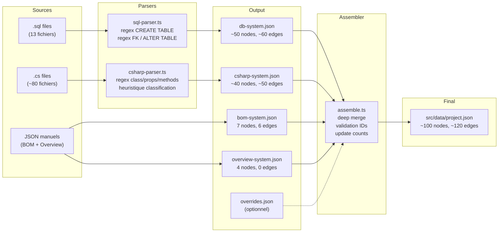

# Backend / Parsers — FlowScope

> **Agent #4 — Backend Developer (Parsers)**
> **Date :** 2026-05-14
> **Version :** 1.0 — MVP
> **Documents sources :** `docs/PO_FLOWSCOPE.md` v1.0, `docs/ARCH_FLOWSCOPE.md` v1.0, `docs/UIUX_FLOWSCOPE.md` v1.0
> **Destinataires :** Agent #5 (Frontend), mentalyas (implementation)

---

## Table des matieres

1. [Architecture des Parsers](#1-architecture-des-parsers)
2. [Parser SQL — Specification technique](#2-parser-sql--specification-technique)
3. [Parser C# — Specification technique](#3-parser-c--specification-technique)
4. [Assembleur (assemble.ts)](#4-assembleur-assemblets)
5. [CLI & Scripts npm](#5-cli--scripts-npm)
6. [Donnees manuelles](#6-donnees-manuelles)
7. [Tests & Validation](#7-tests--validation)

---

## 1. Architecture des Parsers

### 1.1 Pipeline complet

```
                         SOURCES                       PARSERS                         OUTPUT
    ┌──────────────────────────┐    ┌──────────────────────────┐    ┌────────────────────────┐
    │  sql/                    │    │  sql-parser.ts           │    │  output/               │
    │   create_database.sql    │───>│   lire .sql              │───>│   db-system.json       │
    │   migration_v04_bom.sql  │    │   regex CREATE TABLE     │    │                        │
    │   migration_v10_stocks…  │    │   regex FOREIGN KEY      │    │                        │
    │   ...                    │    │   regex ALTER TABLE ADD   │    │                        │
    └──────────────────────────┘    └──────────────────────────┘    │                        │
                                                                    │                        │
    ┌──────────────────────────┐    ┌──────────────────────────┐    │                        │
    │  app-csharp/             │    │  csharp-parser.ts        │    │   csharp-system.json   │
    │   Models/*.cs            │───>│   lire .cs recursif      │───>│                        │
    │   DAL/*.cs               │    │   regex class/props/meth │    │                        │
    │   Forms/*.cs             │    │   heuristique type       │    │                        │
    │   Services/*.cs          │    │   detection relations    │    │                        │
    │   Navigation/*.cs        │    │                          │    │                        │
    └──────────────────────────┘    └──────────────────────────┘    │                        │
                                                                    │                        │
    ┌──────────────────────────┐    ┌──────────────────────────┐    │   bom-system.json      │
    │  (creation manuelle)     │───>│  (pas de parser)         │───>│   overview-system.json │
    └──────────────────────────┘    └──────────────────────────┘    │                        │
                                                                    │   overrides.json       │
                                                                    └────────────┬───────────┘
                                                                                 │
                                    ┌──────────────────────────┐                 │
                                    │  assemble.ts             │<────────────────┘
                                    │   lire output/*-system   │
                                    │   deep merge overrides   │
                                    │   generer project.json   │
                                    └────────────┬─────────────┘
                                                 │
                                                 ▼
                                    ┌──────────────────────────┐
                                    │  src/data/project.json   │
                                    │  (consomme par le front) │
                                    └──────────────────────────┘
```

### 1.2 Interface commune — `src/parsers/types.ts`

Les parsers sont des scripts CLI autonomes, pas des modules importes a l'execution. Neanmoins, ils partagent des types et un contrat de sortie commun.

```typescript
// src/parsers/types.ts

// Re-export des types du schema universel (utilises par tous les parsers)
export type {
  SystemDefinition,
  FlowNode,
  FlowEdge,
  NodeMetadata,
  NodeType,
  EdgeType,
  LayoutDirection,
  FlowScopeProject,
} from "../types/schema";

/** Configuration minimale pour un parser CLI */
export interface ParserConfig {
  /** Chemin du dossier source a scanner */
  inputDir: string;
  /** Chemin du fichier JSON de sortie */
  outputPath: string;
}

/** Resultat d'execution d'un parser */
export interface ParserResult {
  /** Nombre d'entites parsees (tables, classes, etc.) */
  entityCount: number;
  /** Nombre de relations detectees (FK, heritage, dependance) */
  relationCount: number;
  /** Avertissements non bloquants */
  warnings: string[];
}

/** Fonction utilitaire de log coloree */
export interface Logger {
  info(message: string): void;
  warn(message: string): void;
  error(message: string): void;
  success(message: string): void;
}
```

**Contrat obligatoire de chaque parser :**

| # | Regle | Detail |
|---|-------|--------|
| 1 | Argument CLI | Accepte un chemin de dossier en premier argument (`process.argv[2]`) |
| 2 | Scan | Parcourt recursivement les fichiers pertinents (`.sql`, `.cs`) |
| 3 | Nettoyage | Retire les commentaires AVANT d'appliquer les regex d'extraction |
| 4 | Sortie | Produit un fichier JSON conforme a `SystemDefinition` |
| 5 | IDs prefixes | Tous les IDs de nodes suivent `{system}:{entity-name}` |
| 6 | IDs edges | Format `{source-id}--{edge-type}--{target-id}` |
| 7 | Log console | Resume en fin d'execution (nombre d'entites, relations, warnings) |
| 8 | Exit code | `0` = succes, `1` = erreur fatale (dossier inexistant, ecriture echouee) |
| 9 | Pas d'exception silencieuse | Fichier illisible = warning + skip, jamais un crash |
| 10 | TypeScript strict | `strict: true`, pas de `any`, pas de `console.log` de debug |

### 1.3 Structure de dossiers

```
src/parsers/
├── types.ts              # Types partages + interfaces de contrat
├── utils.ts              # Logger, readFilesRecursive, writeJsonOutput, stripComments
├── sql-parser.ts         # Parser SQL (CREATE TABLE, FK, ALTER TABLE)
├── csharp-parser.ts      # Parser C# (classes, proprietes, methodes, relations)
└── assemble.ts           # Assembleur de systemes → project.json
```

### 1.4 Utilitaires partages — `src/parsers/utils.ts`

```typescript
// src/parsers/utils.ts

import { readFileSync, writeFileSync, readdirSync, statSync, mkdirSync, existsSync } from "fs";
import { join, relative, extname } from "path";

// ─── Logger colore ────────────────────────────────────────────────

const RESET = "\x1b[0m";
const BLUE  = "\x1b[34m";
const YELLOW = "\x1b[33m";
const RED   = "\x1b[31m";
const GREEN = "\x1b[32m";
const BOLD  = "\x1b[1m";

export const logger = {
  info:    (msg: string) => console.log(`${BLUE}[INFO]${RESET}  ${msg}`),
  warn:    (msg: string) => console.log(`${YELLOW}[WARN]${RESET}  ${msg}`),
  error:   (msg: string) => console.error(`${RED}[ERROR]${RESET} ${msg}`),
  success: (msg: string) => console.log(`${GREEN}[OK]${RESET}    ${msg}`),
  header:  (msg: string) => console.log(`\n${BOLD}${BLUE}═══ ${msg} ═══${RESET}\n`),
};

// ─── Scan recursif de fichiers ────────────────────────────────────

export function readFilesRecursive(dir: string, extension: string): string[] {
  const results: string[] = [];
  const entries = readdirSync(dir);
  for (const entry of entries) {
    const fullPath = join(dir, entry);
    const stat = statSync(fullPath);
    if (stat.isDirectory()) {
      // Ignorer obj/, bin/, node_modules/, .git/
      if (["obj", "bin", "node_modules", ".git"].includes(entry)) continue;
      results.push(...readFilesRecursive(fullPath, extension));
    } else if (extname(entry).toLowerCase() === extension) {
      results.push(fullPath);
    }
  }
  return results;
}

// ─── Ecriture JSON ────────────────────────────────────────────────

export function writeJsonOutput(outputPath: string, data: unknown): void {
  const dir = outputPath.substring(0, outputPath.lastIndexOf("/"));
  if (dir && !existsSync(dir)) {
    mkdirSync(dir, { recursive: true });
  }
  writeFileSync(outputPath, JSON.stringify(data, null, 2), "utf-8");
}

// ─── Nettoyage commentaires SQL ───────────────────────────────────

/** Retire les commentaires SQL (-- et /* ... * /) du contenu */
export function stripSqlComments(content: string): string {
  // Retirer les blocs /* ... */
  let cleaned = content.replace(/\/\*[\s\S]*?\*\//g, "");
  // Retirer les lignes -- (commentaires inline)
  cleaned = cleaned.replace(/--.*$/gm, "");
  return cleaned;
}

// ─── Nettoyage commentaires C# ───────────────────────────────────

/** Retire les commentaires C# (// , /* ... * /, /// ) du contenu */
export function stripCSharpComments(content: string): string {
  // Retirer les blocs /* ... */
  let cleaned = content.replace(/\/\*[\s\S]*?\*\//g, "");
  // Retirer les lignes //  et ///
  cleaned = cleaned.replace(/\/\/.*$/gm, "");
  return cleaned;
}

// ─── Validation argument CLI ─────────────────────────────────────

export function parseCliArgs(parserName: string): string {
  const inputDir = process.argv[2];
  if (!inputDir) {
    logger.error(`Usage: npx tsx src/parsers/${parserName} <chemin-dossier>`);
    process.exit(1);
  }
  if (!existsSync(inputDir)) {
    logger.error(`Dossier introuvable: ${inputDir}`);
    process.exit(1);
  }
  return inputDir;
}

// ─── Chemin relatif normalise ────────────────────────────────────

/** Retourne un chemin relatif avec des / (pas de \\) pour la portabilite */
export function toRelativePath(filePath: string, baseDir: string): string {
  return relative(baseDir, filePath).replace(/\\/g, "/");
}
```

---

## 2. Parser SQL — Specification technique

### 2.1 Vue d'ensemble

**Fichier :** `src/parsers/sql-parser.ts`
**Entree :** Dossier contenant des fichiers `.sql` (migrations v01-v13 + `create_database.sql`)
**Sortie :** `output/db-system.json` (conforme a `SystemDefinition`)
**Commande :** `npx tsx src/parsers/sql-parser.ts ./sql/`

### 2.2 Patterns SQL du projet Charles & Nadejda

L'analyse du code source revele les patterns suivants :

#### Pattern 1 — CREATE TABLE standard

```sql
CREATE TABLE IF NOT EXISTS fournisseurs (
    id        INT AUTO_INCREMENT PRIMARY KEY,
    nom       VARCHAR(200) NOT NULL,
    contact   VARCHAR(200),
    email     VARCHAR(255),
    telephone VARCHAR(20),
    adresse   VARCHAR(255),
    notes     TEXT
) ENGINE=InnoDB;
```

#### Pattern 2 — CREATE TABLE avec FK inline (CONSTRAINT)

```sql
CREATE TABLE IF NOT EXISTS fiches_ingredients (
    id                    INT AUTO_INCREMENT PRIMARY KEY,
    nom                   VARCHAR(200) NOT NULL UNIQUE,
    ...
    id_fournisseur_defaut INT DEFAULT NULL,
    CONSTRAINT fk_fi_fournisseur
        FOREIGN KEY (id_fournisseur_defaut) REFERENCES fournisseurs(id)
        ON DELETE SET NULL ON UPDATE CASCADE
) ENGINE=InnoDB;
```

#### Pattern 3 — PK composite

```sql
CREATE TABLE IF NOT EXISTS recettes_ingredients (
    id_recette          INT NOT NULL,
    id_fiche_ingredient INT NOT NULL,
    quantite            DECIMAL(10,4) NOT NULL,
    PRIMARY KEY (id_recette, id_fiche_ingredient),
    CONSTRAINT fk_ri_recette
        FOREIGN KEY (id_recette) REFERENCES fiches_recettes(id)
        ...
) ENGINE=InnoDB;
```

#### Pattern 4 — ALTER TABLE ADD CONSTRAINT (dans les migrations)

```sql
ALTER TABLE fiches_ingredients
    ADD CONSTRAINT fk_fi_stock
        FOREIGN KEY (id_stock) REFERENCES stocks(id)
        ON DELETE CASCADE ON UPDATE CASCADE;
```

#### Pattern 5 — Colonne avec GENERATED ALWAYS AS

```sql
prix_htva DECIMAL(10,2) GENERATED ALWAYS AS (ROUND(prix_ttc / 1.21, 2)) STORED,
```

#### Pattern 6 — PK inline (colonne AUTO_INCREMENT PRIMARY KEY)

```sql
id INT AUTO_INCREMENT PRIMARY KEY,
```

### 2.3 Regex d'extraction

Chaque regex est appliquee **apres** le nettoyage des commentaires (`stripSqlComments`).

#### R1 — Extraction des blocs CREATE TABLE

```typescript
/**
 * Capture le nom de table et le contenu entre parentheses.
 * group(1) = nom de la table (avec ou sans backticks)
 * group(2) = contenu complet des colonnes/contraintes
 *
 * Flags: g (global), i (insensible a la casse), s (dotAll pour le contenu multi-lignes)
 */
const RE_CREATE_TABLE = /CREATE\s+TABLE\s+(?:IF\s+NOT\s+EXISTS\s+)?`?(\w+)`?\s*\(([\s\S]*?)\)\s*(?:ENGINE\s*=\s*\w+)?;/gi;
```

#### R2 — Extraction des colonnes

```typescript
/**
 * Capture une definition de colonne (hors CONSTRAINT, PRIMARY KEY, UNIQUE KEY, etc.).
 * group(1) = nom de colonne (avec ou sans backticks)
 * group(2) = type + modifiers (tout le reste de la ligne)
 *
 * Applique sur chaque ligne du contenu CREATE TABLE, apres split par virgule.
 */
const RE_COLUMN = /^\s*`?(\w+)`?\s+((?:INT|BIGINT|SMALLINT|TINYINT|DECIMAL|FLOAT|DOUBLE|VARCHAR|CHAR|TEXT|MEDIUMTEXT|LONGTEXT|BLOB|DATE|DATETIME|TIMESTAMP|TIME|YEAR|ENUM|BOOLEAN|TINYINT\(1\)|JSON)(?:\([^)]*\))?(?:\s+UNSIGNED)?)/i;
```

**Logique :** chaque ligne du bloc CREATE TABLE est testee. Les lignes commencant par `CONSTRAINT`, `PRIMARY KEY`, `UNIQUE KEY`, `KEY`, `INDEX`, `CHECK` sont ignorees par cette regex (traitees separement).

#### R3 — PRIMARY KEY inline (dans la definition de colonne)

```typescript
/** Detecte PRIMARY KEY dans la definition d'une colonne */
const RE_PK_INLINE = /\bPRIMARY\s+KEY\b/i;
```

#### R4 — PRIMARY KEY constraint

```typescript
/** Capture les colonnes d'une PK declaree comme contrainte */
const RE_PK_CONSTRAINT = /PRIMARY\s+KEY\s*\(([^)]+)\)/i;
```

**Extraction des colonnes :** `match[1].split(",").map(c => c.trim().replace(/`/g, ""))`

#### R5 — FOREIGN KEY constraint (dans CREATE TABLE)

```typescript
/**
 * group(1) = nom du champ local
 * group(2) = nom de la table referencee
 * group(3) = nom du champ reference (optionnel, souvent "id")
 */
const RE_FK_CONSTRAINT = /FOREIGN\s+KEY\s*\(`?(\w+)`?\)\s*REFERENCES\s+`?(\w+)`?\s*\(`?(\w+)`?\)/gi;
```

#### R6 — ALTER TABLE ADD FOREIGN KEY

```typescript
/**
 * Capture les FK ajoutees par ALTER TABLE dans les migrations.
 * group(1) = table source (celle qui est alteree)
 * group(2) = champ local
 * group(3) = table referencee
 * group(4) = champ reference
 */
const RE_ALTER_ADD_FK = /ALTER\s+TABLE\s+`?(\w+)`?\s+ADD\s+CONSTRAINT\s+\w+\s+FOREIGN\s+KEY\s*\(`?(\w+)`?\)\s*REFERENCES\s+`?(\w+)`?\s*\(`?(\w+)`?\)/gi;
```

### 2.4 Algorithme de parsing

```
ENTREE: dossier contenant N fichiers .sql
SORTIE: SystemDefinition { id: "db", nodes: FlowNode[], edges: FlowEdge[] }

1.  TABLES = Map<string, TableInfo>  // cle = nom_table
2.  EDGES  = FlowEdge[]

3.  Pour chaque fichier .sql dans le dossier (ordre alphabetique) :
      a. Lire le contenu du fichier
      b. Retirer les commentaires (stripSqlComments)
      c. Appliquer RE_CREATE_TABLE (global) — pour chaque match :
           i.   tableName = match[1]
           ii.  Si TABLES.has(tableName) → skip (premiere definition gagne)
           iii. Extraire colonnes via RE_COLUMN sur chaque ligne
           iv.  Extraire PK inline (RE_PK_INLINE sur chaque colonne)
           v.   Extraire PK constraint (RE_PK_CONSTRAINT)
           vi.  Extraire FK constraints (RE_FK_CONSTRAINT, global) → creer FlowEdge
           vii. Stocker dans TABLES[tableName]
      d. Appliquer RE_ALTER_ADD_FK (global) sur tout le fichier — pour chaque match :
           i.   sourceTable = match[1]
           ii.  localField  = match[2]
           iii. targetTable = match[3]
           iv.  Creer FlowEdge (si sourceTable et targetTable connues)

4.  Convertir TABLES en FlowNode[] :
      - id: "db:{tableName}"
      - type: "table"
      - label: tableName
      - metadata.columns: ["nom: TYPE", ...] (format lisible)
      - metadata.primaryKeys: ["col1", "col2"]
      - group: determiner via le prefixe de table (voir section 2.5)

5.  Deduplication des edges par id
6.  Generer SystemDefinition et ecrire dans output/db-system.json
```

### 2.5 Classification automatique en groupes

Le nom de table determine le groupe logique pour le regroupement visuel :

| Prefixe ou pattern | Groupe | Exemples |
|---------------------|--------|----------|
| `bom_*` | BOM | `bom_contextes`, `bom_niveaux`, `bom_fiches` |
| `pat_*` | Patisserie | `pat_formes`, `pat_gabarits`, `pat_devis` |
| `fiches_ingredients`, `lots_ingredients`, `recettes_ingredients` | Production | |
| `fiches_recettes`, `fiches_compositions`, `compositions_recettes` | Production | |
| `productions_*`, `mouvements_*`, `stock_*` | Production | |
| `produits*`, `parfums`, `categories` | Catalogue | |
| `commandes`, `lignes_commandes`, `selections_parfums`, `factures` | Vente | |
| `utilisateurs`, `contacts` | Utilisateurs | |
| `fournisseurs` | Referentiel | |
| `zones_livraison` | Referentiel | |
| `frais_*` | Referentiel | |
| Autre | Autre | |

**Implementation :**

```typescript
function classifyTableGroup(tableName: string): string {
  if (tableName.startsWith("bom_")) return "BOM";
  if (tableName.startsWith("pat_")) return "Patisserie";
  if (
    tableName.startsWith("fiches_") ||
    tableName.startsWith("lots_") ||
    tableName.startsWith("recettes_") ||
    tableName.startsWith("productions_") ||
    tableName.startsWith("mouvements_") ||
    tableName.startsWith("stock_") ||
    tableName === "compositions_recettes"
  ) return "Production";
  if (
    tableName.startsWith("produits") ||
    tableName === "parfums" ||
    tableName === "categories"
  ) return "Catalogue";
  if (
    tableName === "commandes" ||
    tableName === "lignes_commandes" ||
    tableName === "selections_parfums" ||
    tableName === "factures"
  ) return "Vente";
  if (tableName === "utilisateurs" || tableName === "contacts") return "Utilisateurs";
  if (
    tableName === "fournisseurs" ||
    tableName === "zones_livraison" ||
    tableName.startsWith("frais_") ||
    tableName === "activites" ||
    tableName === "stocks" ||
    tableName === "activites_stocks"
  ) return "Referentiel";
  return "Autre";
}
```

### 2.6 Mapping vers FlowNode / FlowEdge — Exemples concrets

#### Exemple 1 — Table simple

**Input SQL :**
```sql
CREATE TABLE IF NOT EXISTS fournisseurs (
    id        INT AUTO_INCREMENT PRIMARY KEY,
    nom       VARCHAR(200) NOT NULL,
    contact   VARCHAR(200),
    email     VARCHAR(255),
    telephone VARCHAR(20),
    adresse   VARCHAR(255),
    notes     TEXT
) ENGINE=InnoDB;
```

**Output FlowNode :**
```json
{
  "id": "db:fournisseurs",
  "type": "table",
  "label": "fournisseurs",
  "metadata": {
    "columns": [
      "id: INT",
      "nom: VARCHAR(200)",
      "contact: VARCHAR(200)",
      "email: VARCHAR(255)",
      "telephone: VARCHAR(20)",
      "adresse: VARCHAR(255)",
      "notes: TEXT"
    ],
    "primaryKeys": ["id"]
  },
  "group": "Referentiel",
  "tags": ["referentiel"]
}
```

**Edges :** aucun (pas de FK)

#### Exemple 2 — Table avec FK et PK composite

**Input SQL :**
```sql
CREATE TABLE IF NOT EXISTS recettes_ingredients (
    id_recette          INT NOT NULL,
    id_fiche_ingredient INT NOT NULL,
    quantite            DECIMAL(10,4) NOT NULL,
    PRIMARY KEY (id_recette, id_fiche_ingredient),
    CONSTRAINT fk_ri_recette
        FOREIGN KEY (id_recette) REFERENCES fiches_recettes(id)
        ON DELETE CASCADE ON UPDATE CASCADE,
    CONSTRAINT fk_ri_ingredient
        FOREIGN KEY (id_fiche_ingredient) REFERENCES fiches_ingredients(id)
        ON DELETE RESTRICT ON UPDATE CASCADE
) ENGINE=InnoDB;
```

**Output FlowNode :**
```json
{
  "id": "db:recettes_ingredients",
  "type": "table",
  "label": "recettes_ingredients",
  "metadata": {
    "columns": [
      "id_recette: INT",
      "id_fiche_ingredient: INT",
      "quantite: DECIMAL(10,4)"
    ],
    "primaryKeys": ["id_recette", "id_fiche_ingredient"]
  },
  "group": "Production",
  "tags": ["production"]
}
```

**Output FlowEdges :**
```json
[
  {
    "id": "db:recettes_ingredients--fk--db:fiches_recettes",
    "source": "db:recettes_ingredients",
    "target": "db:fiches_recettes",
    "label": "id_recette",
    "type": "fk"
  },
  {
    "id": "db:recettes_ingredients--fk--db:fiches_ingredients",
    "source": "db:recettes_ingredients",
    "target": "db:fiches_ingredients",
    "label": "id_fiche_ingredient",
    "type": "fk"
  }
]
```

#### Exemple 3 — ALTER TABLE ADD FK (migration)

**Input SQL :**
```sql
ALTER TABLE fiches_ingredients
    ADD CONSTRAINT fk_fi_stock
        FOREIGN KEY (id_stock) REFERENCES stocks(id)
        ON DELETE CASCADE ON UPDATE CASCADE;
```

**Output FlowEdge :**
```json
{
  "id": "db:fiches_ingredients--fk--db:stocks",
  "source": "db:fiches_ingredients",
  "target": "db:stocks",
  "label": "id_stock",
  "type": "fk"
}
```

Note : si la table `fiches_ingredients` est deja dans TABLES (parsee depuis `create_database.sql`), l'edge est ajoute a la liste globale. Si la table n'est pas connue (cas rare), un warning est emis et l'edge est cree quand meme (le node pourrait etre genere par un autre fichier).

### 2.7 Cas limites

| Cas | Comportement |
|-----|-------------|
| Table sans PK | `metadata.primaryKeys = []`. Warning emis. |
| FK vers une table non parsee | Edge cree quand meme (la table cible pourrait venir d'un autre fichier). Warning emis en fin de parsing si la cible reste introuvable. |
| FK multiples vers la meme table (ex: `bom_fiches_lignes` → `bom_fiches` x2) | Suffixer l'ID de l'edge avec le champ local pour garantir l'unicite : `db:bom_fiches_lignes--fk--db:bom_fiches:id_fiche` et `db:bom_fiches_lignes--fk--db:bom_fiches:id_input_fiche` |
| Colonne `GENERATED ALWAYS AS` | Extraite normalement comme colonne. Le `GENERATED ALWAYS AS (...)` est ignore (pas utile pour le graphe). |
| `ENUM(...)` comme type | Capture complete du type : `"activite: ENUM('chocolaterie','patisserie')"` |
| `CREATE DATABASE`, `USE`, `SET` | Ignores (hors regex CREATE TABLE). |
| `DROP TABLE`, `INSERT INTO` | Ignores silencieusement. |
| Table definie dans `create_database.sql` ET dans une migration | La premiere definition gagne (creation avant migration dans l'ordre alphabetique). Les ALTER TABLE enrichissent les edges. |
| `ALTER TABLE DROP COLUMN / DROP FOREIGN KEY` | Ignores. Le parser ne maintient pas d'etat incremental. Il parse l'etat "creation" puis ajoute les FK des migrations. |
| Fichier vide ou ne contenant aucun CREATE TABLE | Skip avec info log. |

### 2.8 Gestion de la deduplication des tables

Comme `create_database.sql` contient toutes les tables et les migrations en re-creent certaines (ex: `migration_v04_bom.sql` re-cree les tables `bom_*`), le parser doit deduplication :

**Regle :** pour un meme nom de table, la **premiere definition rencontree** (ordre alphabetique des fichiers) est conservee. `create_database.sql` etant alphabetiquement avant les migrations, il gagne toujours. Les migrations ne font qu'ajouter des edges via `ALTER TABLE`.

Si l'utilisateur ne fournit que les migrations (pas `create_database.sql`), les tables seront parsees depuis les `CREATE TABLE` des migrations.

### 2.9 Gestion des FK multiples vers la meme table

Quand deux FK d'une meme table pointent vers la meme cible (ex: `bom_fiches_lignes` a deux FK vers `bom_fiches`), l'ID standard `{source}--fk--{target}` serait duplique.

**Solution :** quand une collision est detectee, suffixer l'ID avec le nom du champ local :

```
db:bom_fiches_lignes--fk--db:bom_fiches         → premier match
db:bom_fiches_lignes--fk--db:bom_fiches:id_input_fiche  → deuxieme match (suffixe)
```

**Implementation :** utiliser un Set pour tracker les IDs deja emis. Si collision, ajouter `:{localField}` au suffixe du target dans l'ID.

---

## 3. Parser C# — Specification technique

### 3.1 Vue d'ensemble

**Fichier :** `src/parsers/csharp-parser.ts`
**Entree :** Dossier racine du projet C# (scan recursif des `.cs`)
**Sortie :** `output/csharp-system.json` (conforme a `SystemDefinition`)
**Commande :** `npx tsx src/parsers/csharp-parser.ts ./app-csharp/CharlesNadejda/CharlesNadejda/`

### 3.2 Patterns C# du projet Charles & Nadejda

#### Pattern 1 — Model (POCO avec proprietes auto)

```csharp
namespace CharlesNadejda.Models
{
    public class Ingredient
    {
        public int      Id                      { get; set; }
        public string   Nom                     { get; set; }
        public decimal  PrixAchatReference      { get; set; }
        public bool     Actif                   { get; set; }

        // Propriete calculee (readonly)
        public decimal PrixParUniteBase =>
            QteParConditionnement > 0 ? PrixAchatReference / QteParConditionnement : PrixAchatReference;

        public override string ToString() => $"{Nom}";
    }
}
```

#### Pattern 2 — DAL statique avec methodes de requetage

```csharp
namespace CharlesNadejda.DAL
{
    public static class IngredientDAL
    {
        public static List<Ingredient> GetAll(int idStock = 0, int idActivite = 0) { ... }
        public static bool NomExiste(string nom, int excludeId = 0) { ... }
        // ...
    }
}
```

#### Pattern 3 — Form generique (FrmListeBase<T>)

```csharp
namespace CharlesNadejda.Forms
{
    public abstract class FrmListeBase<T> : Form where T : class
    {
        protected readonly DataGridView dgv;
        protected abstract string Titre { get; }
        protected abstract List<T> ChargerDonnees();
        // ...
    }
}
```

#### Pattern 4 — Form heritant de la base generique

```csharp
namespace CharlesNadejda.Forms
{
    public class FrmIngredients : FrmListeBase<Ingredient>
    {
        // Instancie un DAL dans ses methodes
        // IngredientDAL.GetAll(...)
    }
}
```

#### Pattern 5 — Form heritant de FrmEditBase (non generique)

```csharp
namespace CharlesNadejda.Forms
{
    public abstract class FrmEditBase : Form
    {
        protected readonly ErrorProvider errorProvider;
        protected abstract bool Valider();
        protected abstract void Sauvegarder();
    }
}
```

#### Pattern 6 — Service statique

```csharp
namespace CharlesNadejda.Services
{
    public static class SimulationService
    {
        public static async Task<List<SimulationResultat>> SimulerAsync(...) { ... }
    }
}
```

#### Pattern 7 — Classe utilitaire (helper)

```csharp
namespace CharlesNadejda.DAL
{
    public static class DbHelper
    {
        public static MySqlConnection GetConnection() { ... }
    }
}
```

### 3.3 Fichiers a exclure

| Pattern | Raison |
|---------|--------|
| `*.Designer.cs` | Genere par VS, pas de logique metier |
| `AssemblyInfo.cs` | Metadata projet |
| `Resources.Designer.cs` | Genere automatiquement |
| `Settings.Designer.cs` | Genere automatiquement |
| `obj/**/*.cs` | Fichiers de build |
| `bin/**/*.cs` | Fichiers de build |

**Implementation :**

```typescript
function shouldSkipFile(filePath: string): boolean {
  const lower = filePath.toLowerCase().replace(/\\/g, "/");
  return (
    lower.endsWith(".designer.cs") ||
    lower.includes("/obj/") ||
    lower.includes("/bin/") ||
    lower.includes("/properties/assemblyinfo.cs") ||
    lower.includes("/properties/resources.designer.cs") ||
    lower.includes("/properties/settings.designer.cs")
  );
}
```

### 3.4 Regex d'extraction

#### R1 — Namespace

```typescript
/** Capture le namespace du fichier */
const RE_NAMESPACE = /namespace\s+([\w.]+)/;
```

#### R2 — Declaration de classe

```typescript
/**
 * group(1) = modificateurs (public, abstract, static, etc.)
 * group(2) = nom de la classe
 * group(3) = heritage et interfaces (optionnel, apres ":")
 *
 * Gere: "public class X", "public abstract class X : Y", "public static class X",
 *       "public class FrmIngredients : FrmListeBase<Ingredient>"
 */
const RE_CLASS = /(?:public|internal)\s+(?:(?:abstract|static|sealed|partial)\s+)*class\s+(\w+)(?:<[^>]+>)?(?:\s*:\s*(.+?))?(?:\s*\{|\s*where\b)/;
```

**Extraction heritage :**

```typescript
function extractBaseClass(inheritancePart: string | undefined): string | null {
  if (!inheritancePart) return null;
  // Prendre le premier element avant la virgule (les interfaces viennent apres)
  const first = inheritancePart.split(",")[0].trim();
  // Retirer les generiques pour le label : "FrmListeBase<Ingredient>" → "FrmListeBase"
  return first.replace(/<[^>]+>/, "").trim();
}

function extractGenericArg(inheritancePart: string | undefined): string | null {
  if (!inheritancePart) return null;
  const match = inheritancePart.match(/<(\w+)>/);
  return match ? match[1] : null;
}
```

#### R3 — Proprietes publiques

```typescript
/**
 * group(1) = type de la propriete
 * group(2) = nom de la propriete
 *
 * Gere: "public int Id { get; set; }", "public string Nom { get; set; }",
 *       "public decimal? Densite { get; set; }"
 * Ignore les proprietes expression-bodied (=> ...) — traitees separement
 */
const RE_PROPERTY = /public\s+([\w<>?\[\]]+)\s+(\w+)\s*\{\s*get;\s*(?:set;)?\s*\}/g;
```

#### R4 — Proprietes expression-bodied (readonly)

```typescript
/** Capture les proprietes calculees : "public decimal PrixParUniteBase => ..." */
const RE_PROPERTY_EXPR = /public\s+([\w<>?\[\]]+)\s+(\w+)\s*=>/g;
```

#### R5 — Methodes publiques

```typescript
/**
 * group(1) = type de retour (y compris async Task<T>)
 * group(2) = nom de la methode
 * group(3) = parametres
 *
 * Gere: "public static List<Ingredient> GetAll(int idStock = 0)"
 *       "public override string ToString()"
 *       "public async Task<List<SimulationResultat>> SimulerAsync(...)"
 */
const RE_METHOD = /public\s+(?:(?:static|override|virtual|abstract|async)\s+)*(?:[\w<>?\[\],\s]+?)\s+(\w+)\s*\(([^)]*)\)/g;
```

**Simplification de la signature :** `"GetAll(int, int)"` — retirer les noms de parametres et les valeurs par defaut pour la compacite. Conserver uniquement les types.

```typescript
function simplifyParams(params: string): string {
  if (!params.trim()) return "";
  return params
    .split(",")
    .map(p => p.trim().split(/\s+/)[0]) // Garder seulement le type
    .join(", ");
}
```

#### R6 — Instanciations (detection de dependances)

```typescript
/**
 * Detecte les appels "new XxxDAL(" ou "XxxDAL.MethodName("
 * group(1) = nom de la classe instanciee/appelee
 *
 * Gere: "new IngredientDAL()", "IngredientDAL.GetAll()", "= new BomFicheDAL()"
 */
const RE_INSTANTIATION = /\bnew\s+(\w+)\s*\(/g;
const RE_STATIC_CALL = /\b(\w+DAL)\.\w+\s*\(/g;
```

### 3.5 Classification automatique par heuristique

L'heuristique combine le chemin du fichier, le nom de la classe et l'heritage :

```typescript
import type { NodeType } from "./types";

interface ClassInfo {
  name: string;
  namespace: string;
  filePath: string;
  baseClass: string | null;
  genericArg: string | null;
  properties: string[];    // format "Type Name"
  methods: string[];       // format "MethodName(Type, Type)"
  instantiations: string[]; // noms de classes instanciees
  staticCalls: string[];    // noms de classes appelees statiquement (DAL)
}

function classifyNodeType(info: ClassInfo): NodeType {
  const pathLower = info.filePath.toLowerCase().replace(/\\/g, "/");
  const name = info.name;

  // 1. Chemin contient /forms/ OU heritage de Form/FrmListeBase/FrmEditBase
  if (
    pathLower.includes("/forms/") ||
    info.baseClass === "Form" ||
    info.baseClass === "FrmListeBase" ||
    info.baseClass === "FrmEditBase"
  ) {
    return "form";
  }

  // 2. Chemin contient /dal/ OU nom finit par "DAL"
  if (pathLower.includes("/dal/") || name.endsWith("DAL")) {
    return "dal";
  }

  // 3. Chemin contient /models/
  if (pathLower.includes("/models/")) {
    return "model";
  }

  // 4. Chemin contient /services/
  if (pathLower.includes("/services/")) {
    return "process";
  }

  // 5. Chemin contient /navigation/
  if (pathLower.includes("/navigation/")) {
    return "route";
  }

  // 6. Aucun critere matche
  return "custom";
}
```

**Classes exclues du graphe :**
- `Program` (point d'entree, pas interessant pour l'architecture)
- `AppColors` (palette statique, pas une entite metier)
- `StringExtensions` (utilitaire)
- `UnitConvertisseur` (utilitaire)
- `FormHelper` (utilitaire)

```typescript
const EXCLUDED_CLASSES = new Set([
  "Program", "AppColors", "StringExtensions",
  "UnitConvertisseur", "FormHelper"
]);
```

### 3.6 Detection des relations

#### Relation 1 — Heritage

Quand une classe a un `baseClass` et que cette classe de base est un node du graphe :

```typescript
// Si baseClass est un node connu → edge "inheritance"
// Gere aussi le generique : FrmIngredients : FrmListeBase<Ingredient>
//   → heritage vers FrmListeBase
//   → dependance vers Ingredient (via genericArg)

function detectInheritanceEdges(
  classInfo: ClassInfo,
  knownClasses: Map<string, ClassInfo>
): FlowEdge[] {
  const edges: FlowEdge[] = [];
  if (!classInfo.baseClass) return edges;

  // Heritage direct
  if (knownClasses.has(classInfo.baseClass)) {
    edges.push({
      id: `csharp:${classInfo.name}--inheritance--csharp:${classInfo.baseClass}`,
      source: `csharp:${classInfo.name}`,
      target: `csharp:${classInfo.baseClass}`,
      type: "inheritance",
    });
  }

  // Argument generique (ex: FrmListeBase<Ingredient> → dependance vers Ingredient)
  if (classInfo.genericArg && knownClasses.has(classInfo.genericArg)) {
    edges.push({
      id: `csharp:${classInfo.name}--dependency--csharp:${classInfo.genericArg}`,
      source: `csharp:${classInfo.name}`,
      target: `csharp:${classInfo.genericArg}`,
      label: `uses ${classInfo.genericArg}`,
      type: "dependency",
    });
  }

  return edges;
}
```

#### Relation 2 — Instanciation / appel statique

```typescript
function detectDependencyEdges(
  classInfo: ClassInfo,
  knownClasses: Map<string, ClassInfo>
): FlowEdge[] {
  const edges: FlowEdge[] = [];
  const seen = new Set<string>();

  // new XxxDAL() dans le corps du fichier
  for (const dep of [...classInfo.instantiations, ...classInfo.staticCalls]) {
    if (dep === classInfo.name) continue;          // pas d'auto-reference
    if (!knownClasses.has(dep)) continue;          // classe inconnue
    const edgeId = `csharp:${classInfo.name}--dependency--csharp:${dep}`;
    if (seen.has(edgeId)) continue;                // deduplication
    seen.add(edgeId);

    edges.push({
      id: edgeId,
      source: `csharp:${classInfo.name}`,
      target: `csharp:${dep}`,
      type: "dependency",
    });
  }
  return edges;
}
```

### 3.7 Algorithme de parsing

```
ENTREE: dossier racine C# (scan recursif)
SORTIE: SystemDefinition { id: "csharp", nodes: FlowNode[], edges: FlowEdge[] }

1.  CLASSES = Map<string, ClassInfo>

2.  Pour chaque fichier .cs (hors exclusions, voir 3.3) :
      a. Lire le contenu
      b. Retirer les commentaires (stripCSharpComments)
      c. Extraire le namespace (RE_NAMESPACE)
      d. Extraire la declaration de classe (RE_CLASS)
         - Si pas de classe → skip le fichier
         - Si classe dans EXCLUDED_CLASSES → skip
      e. Extraire les proprietes (RE_PROPERTY + RE_PROPERTY_EXPR)
      f. Extraire les methodes (RE_METHOD)
         - Filtrer : ignorer constructeurs (nom = nom classe), Dispose, InitializeComponent
      g. Extraire les instanciations (RE_INSTANTIATION + RE_STATIC_CALL)
      h. Stocker dans CLASSES[className]

3.  Pour chaque ClassInfo dans CLASSES :
      a. Classifier le NodeType (classifyNodeType)
      b. Creer le FlowNode :
         - id: "csharp:{className}"
         - type: NodeType classifie
         - label: className
         - filePath: chemin relatif du fichier source
         - metadata.methods: signatures simplifiees
         - metadata.properties: ["Type Name", ...]
      c. Detecter les edges heritage (detectInheritanceEdges)
      d. Detecter les edges dependance (detectDependencyEdges)

4.  Deduplication des edges par id
5.  Generer SystemDefinition et ecrire dans output/csharp-system.json
```

### 3.8 Mapping vers FlowNode / FlowEdge — Exemples concrets

#### Exemple 1 — Model

**Input C# :** `Models/Ingredient.cs`

**Output FlowNode :**
```json
{
  "id": "csharp:Ingredient",
  "type": "model",
  "label": "Ingredient",
  "filePath": "Models/Ingredient.cs",
  "metadata": {
    "properties": [
      "int Id",
      "string Nom",
      "string Marque",
      "string Description",
      "string UniteMesure",
      "string TypePhysique",
      "decimal? Densite",
      "string ConditionnementLabel",
      "decimal QteParConditionnement",
      "decimal PrixAchatReference",
      "decimal? SeuilAlerteStock",
      "int? IdFournisseurDefaut",
      "string NomFournisseur",
      "int IdStock",
      "string StockNom",
      "bool Actif",
      "decimal PrixParUniteBase",
      "bool EstEnAlerte",
      "decimal StockActuel"
    ],
    "methods": [
      "ToString()"
    ]
  },
  "group": "Models"
}
```

#### Exemple 2 — DAL statique

**Input C# :** `DAL/IngredientDAL.cs`

**Output FlowNode :**
```json
{
  "id": "csharp:IngredientDAL",
  "type": "dal",
  "label": "IngredientDAL",
  "filePath": "DAL/IngredientDAL.cs",
  "metadata": {
    "properties": [],
    "methods": [
      "GetAll(int, int)",
      "NomExiste(string, int)"
    ]
  },
  "group": "DAL"
}
```

#### Exemple 3 — Form avec heritage generique

**Input C# :** `Forms/FrmIngredients.cs`

**Output FlowNode :**
```json
{
  "id": "csharp:FrmIngredients",
  "type": "form",
  "label": "FrmIngredients",
  "filePath": "Forms/FrmIngredients.cs",
  "metadata": {
    "properties": [],
    "methods": [
      "ChargerDonnees()",
      "ConfigurerColonnes()"
    ]
  },
  "group": "Forms"
}
```

**Output FlowEdges :**
```json
[
  {
    "id": "csharp:FrmIngredients--inheritance--csharp:FrmListeBase",
    "source": "csharp:FrmIngredients",
    "target": "csharp:FrmListeBase",
    "type": "inheritance"
  },
  {
    "id": "csharp:FrmIngredients--dependency--csharp:Ingredient",
    "source": "csharp:FrmIngredients",
    "target": "csharp:Ingredient",
    "label": "uses Ingredient",
    "type": "dependency"
  },
  {
    "id": "csharp:FrmIngredients--dependency--csharp:IngredientDAL",
    "source": "csharp:FrmIngredients",
    "target": "csharp:IngredientDAL",
    "type": "dependency"
  }
]
```

### 3.9 Cas limites

| Cas | Comportement |
|-----|-------------|
| Classe generique `FrmListeBase<T>` | Parsee avec le nom `FrmListeBase` (generique retire du label). Le `<T>` est note en metadata si necessaire. |
| Classe partielle (partial class) | Detectee, les deux fichiers sont mergees dans la meme `ClassInfo`. Le premier fichier rencontre cree l'entree, les suivants enrichissent les proprietes/methodes. |
| Classe imbriquee | Ignoree (pas de cas dans le projet Charles & Nadejda). |
| `enum` et `struct` | Ignores (hors scope — seules les `class` sont parsees). |
| Fichier avec plusieurs classes | Seule la **premiere classe publique** est parsee (convention C# : une classe par fichier). |
| Methodes `override` | Incluses dans la liste des methodes. Prefixees de rien (la signature suffit). |
| Classes sans proprietes ni methodes publiques | Parsees normalement. Le node affichera "0 props, 0 methods". |
| `static class` | Parsee normalement. Pas de traitement special (les DAL et Services sont statiques). |
| Heritage vers une classe externe (ex: `Form`) | Pas d'edge cree (la classe `Form` n'est pas dans le graphe). L'heuristique de classification utilise l'info. |

### 3.10 Classification des groupes pour C#

Le groupe est determine par le dossier du fichier :

```typescript
function classifyCSharpGroup(filePath: string): string {
  const pathLower = filePath.toLowerCase().replace(/\\/g, "/");
  if (pathLower.includes("/forms/shell/")) return "Shell";
  if (pathLower.includes("/forms/"))       return "Forms";
  if (pathLower.includes("/dal/"))         return "DAL";
  if (pathLower.includes("/models/"))      return "Models";
  if (pathLower.includes("/services/"))    return "Services";
  if (pathLower.includes("/navigation/"))  return "Navigation";
  return "Autre";
}
```

---

## 4. Assembleur (assemble.ts)

### 4.1 Vue d'ensemble

**Fichier :** `src/parsers/assemble.ts`
**Entree :** Tous les fichiers `output/*-system.json` + `output/overrides.json` (optionnel)
**Sortie :** `src/data/project.json` (conforme a `FlowScopeProject`)
**Commande :** `npx tsx src/parsers/assemble.ts`

### 4.2 Algorithme

```
1.  Lire tous les fichiers output/*-system.json
      - Filtrer : seuls les fichiers finissant par "-system.json"
      - Pour chaque fichier : JSON.parse → verifier que c'est un SystemDefinition valide
      - Stocker dans systems[]

2.  Si output/overrides.json existe :
      a. Lire et parser le fichier
      b. Pour chaque entree dans overrides.nodes :
           - Trouver le FlowNode correspondant par id (recherche dans tous les systemes)
           - Deep merge les champs specifies (description, tags, group, position)
           - Regle : les arrays (tags) sont REMPLACES, pas concatenes
      c. Pour chaque entree dans overrides.edges :
           - Trouver le FlowEdge correspondant par id
           - Merge le label

3.  Lire la version depuis package.json (champ "version")

4.  Construire le FlowScopeProject :
      {
        name: "Charles & Nadejda",   // Hardcode MVP, ou lu depuis un config
        version: version,
        lastParsed: new Date().toISOString(),
        systems: systems
      }

5.  Valider :
      a. Verifier l'unicite des IDs de nodes (projet-wide)
      b. Verifier que chaque edge.source et edge.target existe comme node ID
      c. Emettre des warnings pour les edges orphelins

6.  Ecrire dans src/data/project.json
```

### 4.3 Deep merge — implementation

```typescript
interface OverridesFile {
  nodes?: Record<string, Partial<Pick<FlowNode, "description" | "tags" | "group" | "position">>>;
  edges?: Record<string, Partial<Pick<FlowEdge, "label">>>;
}

function applyOverrides(systems: SystemDefinition[], overrides: OverridesFile): void {
  // Merge nodes
  if (overrides.nodes) {
    for (const [nodeId, patch] of Object.entries(overrides.nodes)) {
      for (const system of systems) {
        const node = system.nodes.find(n => n.id === nodeId);
        if (node) {
          if (patch.description !== undefined) node.description = patch.description;
          if (patch.tags !== undefined)        node.tags = patch.tags;        // REMPLACEMENT
          if (patch.group !== undefined)       node.group = patch.group;
          if (patch.position !== undefined)    node.position = patch.position;
          break; // Un node n'appartient qu'a un seul systeme
        }
      }
    }
  }

  // Merge edges
  if (overrides.edges) {
    for (const [edgeId, patch] of Object.entries(overrides.edges)) {
      for (const system of systems) {
        const edge = system.edges.find(e => e.id === edgeId);
        if (edge) {
          if (patch.label !== undefined) edge.label = patch.label;
          break;
        }
      }
    }
  }
}
```

### 4.4 Validations

| # | Verification | Severite | Action |
|---|-------------|----------|--------|
| V1 | Unicite des IDs de nodes (tous systemes confondus) | Erreur | Lister les doublons, exit code 1 |
| V2 | Chaque `edge.source` existe comme node ID dans le meme systeme | Warning | Lister les edges orphelins, continuer |
| V3 | Chaque `edge.target` existe comme node ID dans le meme systeme | Warning | Lister les edges orphelins, continuer |
| V4 | Au moins un systeme present | Erreur | Exit code 1 |
| V5 | Chaque systeme a un `id` non vide | Erreur | Exit code 1 |
| V6 | Le fichier `package.json` existe (pour la version) | Warning | Utiliser "0.0.0" par defaut |

### 4.5 Log de sortie

```
═══ FlowScope Assembler ═══

[INFO]  Systemes trouves : 4
[INFO]    db-system.json         → 50 nodes, 63 edges
[INFO]    csharp-system.json     → 38 nodes, 47 edges
[INFO]    bom-system.json        → 6 nodes, 5 edges
[INFO]    overview-system.json   → 4 nodes, 0 edges
[INFO]  Overrides appliques : 5 nodes, 2 edges
[WARN]  Edge orphelin : csharp:FrmTest--dependency--csharp:TestDAL (target introuvable)
[OK]    Projet assemble : 98 nodes, 115 edges
[OK]    Ecrit dans src/data/project.json (42.3 KB)
```

---

## 5. CLI & Scripts npm

### 5.1 Scripts package.json

```json
{
  "scripts": {
    "dev": "vite",
    "build": "tsc -b && vite build",
    "preview": "vite preview",

    "parse:sql": "tsx src/parsers/sql-parser.ts",
    "parse:csharp": "tsx src/parsers/csharp-parser.ts",
    "parse:assemble": "tsx src/parsers/assemble.ts",
    "parse:all": "npm run parse:sql -- ../sql && npm run parse:csharp -- ../app-csharp/CharlesNadejda/CharlesNadejda && npm run parse:assemble"
  }
}
```

### 5.2 Usage detaille

#### parse:sql

```bash
# Syntaxe
npm run parse:sql -- <chemin-dossier-sql>

# Exemple
npm run parse:sql -- ../sql

# Sortie
#   output/db-system.json

# Arguments
#   $1 = chemin vers le dossier contenant les fichiers .sql
#        (relatif au CWD ou absolu)
```

#### parse:csharp

```bash
# Syntaxe
npm run parse:csharp -- <chemin-dossier-csharp>

# Exemple
npm run parse:csharp -- ../app-csharp/CharlesNadejda/CharlesNadejda

# Sortie
#   output/csharp-system.json

# Arguments
#   $1 = chemin vers le dossier racine du projet C#
#        (le dossier qui contient Models/, DAL/, Forms/, etc.)
```

#### parse:assemble

```bash
# Syntaxe
npm run parse:assemble

# Pas d'arguments — lit output/*-system.json automatiquement

# Sortie
#   src/data/project.json
```

#### parse:all

```bash
# Raccourci — execute les 3 parsers dans l'ordre
npm run parse:all

# Equivalent a :
#   npm run parse:sql -- ../sql
#   && npm run parse:csharp -- ../app-csharp/CharlesNadejda/CharlesNadejda
#   && npm run parse:assemble
```

### 5.3 Gestion des erreurs

| Situation | Message | Exit code |
|-----------|---------|-----------|
| Argument manquant | `[ERROR] Usage: npx tsx src/parsers/<parser>.ts <chemin-dossier>` | 1 |
| Dossier inexistant | `[ERROR] Dossier introuvable: /path/to/dir` | 1 |
| Fichier illisible (permissions) | `[WARN]  Fichier ignore (illisible): /path/to/file.sql` | 0 (continue) |
| Aucune entite trouvee | `[WARN]  Aucune table/classe trouvee dans le dossier` | 0 (genere JSON vide) |
| Erreur d'ecriture JSON | `[ERROR] Impossible d'ecrire: output/db-system.json — <message erreur>` | 1 |
| JSON d'entree invalide (assemble) | `[ERROR] Fichier invalide (JSON parse error): output/xxx-system.json` | 1 |
| Overrides invalide | `[WARN]  overrides.json invalide — ignore` | 0 (continue sans overrides) |

### 5.4 Format des logs

Tous les logs suivent le format :

```
[LEVEL]  message
```

| Level | Couleur | Usage |
|-------|---------|-------|
| `[INFO]` | Bleu | Information de progression |
| `[WARN]` | Jaune | Avertissement non bloquant |
| `[ERROR]` | Rouge | Erreur fatale (precede exit code 1) |
| `[OK]` | Vert | Succes / resume final |

Le header de chaque parser utilise un bandeau :

```
═══ FlowScope SQL Parser ═══
═══ FlowScope C# Parser ═══
═══ FlowScope Assembler ═══
```

---

## 6. Donnees manuelles

### 6.1 Systeme "Pipeline BOM" — `output/bom-system.json`

Ce fichier est cree manuellement (le pipeline BOM est un concept metier, pas une structure de code).

```json
{
  "id": "bom",
  "label": "Pipeline BOM",
  "icon": "GitBranch",
  "description": "Flux de production multi-niveaux : Ingredients → Niveaux → Fiches → Productions → Stocks → Reservations",
  "layoutDirection": "LR",
  "nodes": [
    {
      "id": "bom:ingredients",
      "type": "stock",
      "label": "Ingredients",
      "description": "Matieres premieres avec stock par lots et tracabilite AFSCA. Point d'entree du flux de production.",
      "metadata": {
        "role": "Stock d'entree — lots ingredients",
        "tables": ["fiches_ingredients", "lots_ingredients"]
      },
      "tags": ["stock", "tracabilite"]
    },
    {
      "id": "bom:contextes",
      "type": "process",
      "label": "Contextes",
      "description": "Configurations de production nommees (chocolaterie, patisserie). Chaque contexte possede ses propres niveaux.",
      "metadata": {
        "role": "Configuration du pipeline",
        "tables": ["bom_contextes"]
      },
      "tags": ["config"]
    },
    {
      "id": "bom:niveaux",
      "type": "process",
      "label": "Niveaux BOM",
      "description": "Decomposition hierarchique multi-niveaux. Chaque niveau consomme le stock du niveau inferieur.",
      "metadata": {
        "role": "Structure de la nomenclature",
        "tables": ["bom_niveaux"]
      },
      "tags": ["hierarchie"]
    },
    {
      "id": "bom:fiches",
      "type": "process",
      "label": "Fiches Recettes",
      "description": "Templates de recettes globaux et reutilisables. Une fiche produit N unites par execution.",
      "metadata": {
        "role": "Definition du produit",
        "tables": ["bom_fiches", "bom_fiches_lignes"]
      },
      "tags": ["recette"]
    },
    {
      "id": "bom:productions",
      "type": "process",
      "label": "Productions",
      "description": "Log d'execution d'une fiche dans un contexte. Calcule le cout et genere du stock.",
      "metadata": {
        "role": "Execution de production",
        "tables": ["bom_productions", "bom_productions_lignes"]
      },
      "tags": ["execution"]
    },
    {
      "id": "bom:stocks",
      "type": "stock",
      "label": "Stocks BOM",
      "description": "Stock par contexte, niveau et fiche. Chaque lot de production cree un enregistrement tracable.",
      "metadata": {
        "role": "Stock de sortie — produits intermediaires et finis",
        "tables": ["bom_stocks"]
      },
      "tags": ["stock", "tracabilite"]
    },
    {
      "id": "bom:reservations",
      "type": "process",
      "label": "Reservations",
      "description": "Reservations sur le stock d'ingredients. Permet de planifier sans consommer.",
      "metadata": {
        "role": "Planification pre-production",
        "tables": ["bom_reservations"]
      },
      "tags": ["planification"]
    }
  ],
  "edges": [
    {
      "id": "bom:ingredients--flow--bom:niveaux",
      "source": "bom:ingredients",
      "target": "bom:niveaux",
      "label": "consomme lots",
      "type": "flow",
      "animated": true
    },
    {
      "id": "bom:contextes--flow--bom:niveaux",
      "source": "bom:contextes",
      "target": "bom:niveaux",
      "label": "configure",
      "type": "flow",
      "animated": true
    },
    {
      "id": "bom:niveaux--flow--bom:fiches",
      "source": "bom:niveaux",
      "target": "bom:fiches",
      "label": "utilise fiches",
      "type": "flow",
      "animated": true
    },
    {
      "id": "bom:fiches--flow--bom:productions",
      "source": "bom:fiches",
      "target": "bom:productions",
      "label": "execute",
      "type": "flow",
      "animated": true
    },
    {
      "id": "bom:productions--flow--bom:stocks",
      "source": "bom:productions",
      "target": "bom:stocks",
      "label": "genere stock",
      "type": "flow",
      "animated": true
    },
    {
      "id": "bom:ingredients--flow--bom:reservations",
      "source": "bom:ingredients",
      "target": "bom:reservations",
      "label": "reserve",
      "type": "flow",
      "animated": true
    }
  ]
}
```

### 6.2 Systeme "Overview" — `output/overview-system.json`

```json
{
  "id": "overview",
  "label": "Overview",
  "icon": "LayoutDashboard",
  "description": "Vue d'ensemble de l'architecture du projet Charles & Nadejda",
  "nodes": [
    {
      "id": "overview:db",
      "type": "custom",
      "label": "Base de donnees MySQL",
      "description": "~50 tables — schema relationnel complet (chocolaterie, patisserie, BOM, boutique)",
      "metadata": { "nodeCount": 50, "systemRef": "db" }
    },
    {
      "id": "overview:csharp",
      "type": "custom",
      "label": "Application C# WinForms",
      "description": "ERP artisanal ArtisaStock — Forms, DAL, Models, Services, Navigation",
      "metadata": { "nodeCount": 40, "systemRef": "csharp" }
    },
    {
      "id": "overview:bom",
      "type": "custom",
      "label": "Pipeline BOM",
      "description": "Flux de production multi-niveaux generique — chocolaterie et patisserie",
      "metadata": { "nodeCount": 7, "systemRef": "bom" }
    },
    {
      "id": "overview:laravel",
      "type": "custom",
      "label": "Laravel (placeholder)",
      "description": "Scaffold web e-commerce — a developper",
      "metadata": { "nodeCount": 0, "systemRef": "laravel" }
    }
  ],
  "edges": []
}
```

**Note :** les valeurs `nodeCount` dans l'Overview sont approximatives. L'ideal serait que `assemble.ts` les mette a jour automatiquement en comptant les nodes de chaque systeme reference par `systemRef`. Cela est documente ci-dessous.

### 6.3 Mise a jour automatique des nodeCount dans l'Overview

L'assembleur peut enrichir l'Overview automatiquement :

```typescript
function updateOverviewCounts(systems: SystemDefinition[]): void {
  const overview = systems.find(s => s.id === "overview");
  if (!overview) return;

  for (const node of overview.nodes) {
    const ref = node.metadata?.systemRef as string | undefined;
    if (!ref) continue;
    const target = systems.find(s => s.id === ref);
    if (target) {
      node.metadata.nodeCount = target.nodes.length;
    }
  }
}
```

### 6.4 Enrichissement via overrides.json

L'utilisateur peut creer `output/overrides.json` pour enrichir les donnees auto-parsees :

```json
{
  "nodes": {
    "db:fiches_ingredients": {
      "description": "Table centrale du module stock — master data ingredients avec tracabilite AFSCA",
      "group": "Production",
      "tags": ["critique", "bom", "stock", "afsca"]
    },
    "db:bom_fiches": {
      "description": "Templates de recettes BOM generiques — reutilisables entre chocolaterie et patisserie",
      "tags": ["bom", "recette", "critique"]
    },
    "csharp:FrmIngredients": {
      "description": "Formulaire de gestion des fiches ingredients avec filtre par stock et alerte seuil",
      "tags": ["crud", "bom", "stock"]
    },
    "csharp:FrmBomProductionSimulation": {
      "description": "Simulateur de production — verifie la disponibilite des ingredients avant execution",
      "tags": ["simulation", "bom"]
    },
    "csharp:SimulationService": {
      "description": "Service asynchrone de simulation de production — projete les BomManque en resultats UI",
      "tags": ["async", "bom", "service"]
    }
  },
  "edges": {
    "csharp:FrmIngredients--dependency--csharp:IngredientDAL": {
      "label": "CRUD ingredients"
    }
  }
}
```

---

## 7. Tests & Validation

### 7.1 Validation du JSON genere

Chaque JSON de sortie doit etre verifie contre le schema TypeScript. Comme le MVP n'a pas de tests automatises formels (decision PO D7), la validation se fait via :

1. **Verification de type au build** : les parsers importent les types de `src/types/schema.ts` et construisent les objets conformement aux interfaces. TypeScript refuse la compilation si les types ne matchent pas.

2. **Verification runtime dans l'assembleur** : `assemble.ts` valide les champs obligatoires.

```typescript
function validateSystem(system: unknown, fileName: string): system is SystemDefinition {
  const s = system as Record<string, unknown>;
  if (typeof s.id !== "string" || !s.id) {
    logger.error(`${fileName}: champ "id" manquant ou vide`);
    return false;
  }
  if (typeof s.label !== "string" || !s.label) {
    logger.error(`${fileName}: champ "label" manquant ou vide`);
    return false;
  }
  if (!Array.isArray(s.nodes)) {
    logger.error(`${fileName}: champ "nodes" manquant ou pas un array`);
    return false;
  }
  if (!Array.isArray(s.edges)) {
    logger.error(`${fileName}: champ "edges" manquant ou pas un array`);
    return false;
  }
  return true;
}
```

3. **Chargement dans FlowCanvas** : le test fonctionnel final est de charger le `project.json` dans l'application et verifier qu'aucune erreur console n'apparait.

### 7.2 Cas de test — Parser SQL

| # | Input | Output attendu | Verification |
|---|-------|---------------|-------------|
| T1 | `create_database.sql` seul | 50 FlowNodes de type "table", edges FK complets | Compter les nodes, verifier les groupes |
| T2 | `migration_v04_bom.sql` seul | 8 tables BOM (bom_contextes → bom_reservations) | Verifier que les ALTER TABLE sont ignores (pas de CREATE TABLE pour fiches_ingredients dans ce fichier) |
| T3 | `create_database.sql` + `migration_v10_stocks.sql` | 52 tables (50 + stocks + activites_stocks), FK fk_fi_stock ajoutee | Verifier la FK ALTER TABLE |
| T4 | Fichier avec uniquement des INSERT INTO | 0 nodes, 0 edges, warning en console | Pas de crash |
| T5 | Table sans PK | Node cree, `metadata.primaryKeys = []`, warning emis | |
| T6 | FK multiples vers meme table (`bom_fiches_lignes` → `bom_fiches` x2) | 2 edges avec IDs distincts (suffixe par champ) | Verifier l'unicite des IDs |
| T7 | PK composite (`recettes_ingredients`) | `metadata.primaryKeys = ["id_recette", "id_fiche_ingredient"]` | |
| T8 | Colonne GENERATED ALWAYS AS | Colonne incluse dans la liste (type capture) | |
| T9 | Colonne ENUM avec apostrophes | Type complet capture : `"type: ENUM('a','b','c')"` | |
| T10 | Dossier vide | JSON vide (`nodes: [], edges: []`), warning | Exit code 0 |

### 7.3 Cas de test — Parser C#

| # | Input | Output attendu | Verification |
|---|-------|---------------|-------------|
| T1 | `Models/Ingredient.cs` | 1 FlowNode type "model", 19 properties, 1 method | Verifier metadata |
| T2 | `DAL/IngredientDAL.cs` | 1 FlowNode type "dal", methods incluent GetAll | Verifier la classification |
| T3 | `Forms/FrmIngredients.cs` | 1 FlowNode type "form", edge heritage → FrmListeBase, edge dependance → IngredientDAL | Verifier les 3 edges |
| T4 | `Forms/FrmListeBase.cs` | 1 FlowNode type "form", label "FrmListeBase" (pas de `<T>`) | Verifier que le generique est retire |
| T5 | `Forms/FrmEditBase.cs` | 1 FlowNode type "form", heritage vers Form (pas d'edge, Form est externe) | |
| T6 | `Services/SimulationService.cs` | 1 FlowNode type "process" | Classification par chemin /services/ |
| T7 | `Navigation/ScreenRouter.cs` | 1 FlowNode type "route" | Classification par chemin /navigation/ |
| T8 | `Program.cs` | Exclu (dans EXCLUDED_CLASSES) | Verifier qu'aucun node n'est cree |
| T9 | `Forms/FrmPrincipal.Designer.cs` | Exclu (Designer.cs) | Verifier le filtre |
| T10 | Tout le dossier `app-csharp/` | ~35-40 nodes, edges heritage + dependance | Verifier pas de crash, compter |

### 7.4 Cas de test — Assembleur

| # | Input | Output attendu | Verification |
|---|-------|---------------|-------------|
| T1 | 4 fichiers *-system.json valides | `project.json` avec 4 systemes | Verifier la structure |
| T2 | overrides.json enrichit 3 nodes | Les 3 nodes ont les champs overrides | Verifier le deep merge |
| T3 | Edge orphelin (target inexistant) | Warning en console, edge conserve | Verifier le log |
| T4 | Doublon d'ID de node entre systemes | Erreur, exit code 1 | Verifier le log |
| T5 | Aucun fichier *-system.json | Erreur, exit code 1 | |
| T6 | overrides.json invalide (JSON malformed) | Warning, assemblage sans overrides | |
| T7 | Overview avec systemRef | nodeCount mis a jour automatiquement | Verifier les compteurs |

### 7.5 Checklist de validation avant livraison

**Parser SQL :**
- [ ] Execute sur `sql/` sans crash
- [ ] JSON genere contient ~50 tables (create_database.sql a 50 tables)
- [ ] Toutes les FK sont detectees (compter les edges, attendu ~60+)
- [ ] Les groupes sont assignes (BOM, Patisserie, Production, etc.)
- [ ] Les PK composites sont correctes (ex: `recettes_ingredients`)
- [ ] Aucune colonne de commentaire ou de contrainte dans la liste des colonnes
- [ ] Les colonnes ENUM ont le type complet

**Parser C# :**
- [ ] Execute sur `app-csharp/CharlesNadejda/CharlesNadejda/` sans crash
- [ ] Aucun fichier `.Designer.cs`, `obj/`, `bin/` parse
- [ ] Classification correcte : tous les Forms, DAL, Models sont bien types
- [ ] Edges heritage : FrmIngredients → FrmListeBase, FrmActivites → FrmListeBase, etc.
- [ ] Edges dependance : FrmIngredients → IngredientDAL, etc.
- [ ] `FrmListeBase<T>` parse comme "FrmListeBase" (sans generique dans le label)
- [ ] `Program.cs` et `AppColors.cs` exclus

**Assembleur :**
- [ ] Genere `src/data/project.json` conforme a `FlowScopeProject`
- [ ] 4 systemes presents (db, csharp, bom, overview)
- [ ] Overrides appliques correctement
- [ ] Overview nodeCount mis a jour
- [ ] Aucune erreur de validation (IDs uniques, edges coherents)
- [ ] Le fichier est chargeable dans l'application React sans erreur console

**Integration :**
- [ ] `npm run parse:all` s'execute sans erreur
- [ ] `npm run dev` demarre avec le project.json genere
- [ ] Les nodes s'affichent dans le canvas React Flow
- [ ] Les edges FK sont visibles et corrects dans la vue DB
- [ ] Les edges heritage et dependance sont visibles dans la vue C#
- [ ] Le pipeline BOM affiche le flux horizontal anime

---

## Annexe A — Inventaire des fichiers source

### Fichiers SQL (13 fichiers)

| Fichier | Contenu attendu |
|---------|----------------|
| `create_database.sql` | 50 CREATE TABLE — source principale |
| `migration_v04_bom.sql` | 8 CREATE TABLE BOM + ALTER TABLE |
| `migration_v05_fiches_niveau.sql` | Modifications structurelles |
| `migration_v06_lots_tva.sql` | Ajouts colonnes |
| `migration_v07_activites.sql` | Nouvelles tables activites |
| `migration_v08_conditionnement.sql` | Colonnes conditionnement |
| `migration_v09_cascade.sql` | DROP/ADD FK (cascades) |
| `migration_v10_stocks.sql` | 2 CREATE TABLE (stocks, activites_stocks) + ALTER TABLE |
| `migration_v11_stock_discriminants.sql` | Modifications stock |
| `migration_v12_cleanup.sql` | Nettoyage |
| `migration_v13_check_stock_positif.sql` | Ajout CHECK |
| `seed_data.sql` | INSERT INTO uniquement (aucun node) |
| `tests/reset_db_for_tests.sql` | DELETE/TRUNCATE (aucun node) |

### Fichiers C# (~80 fichiers, ~40 classes utiles)

**Attendu apres filtrage :**

| Categorie | Nombre | Exemples |
|-----------|--------|----------|
| Models | ~15 | Ingredient, BomFiche, BomNiveau, Lot, Stock, etc. |
| DAL | ~12 | IngredientDAL, BomFicheDAL, StockDAL, etc. |
| Forms | ~18 | FrmIngredients, FrmBomFiches, FrmListeBase, FrmEditBase, FrmPrincipal, etc. |
| Services | ~2 | SimulationService, SimulationResultat |
| Navigation | ~4 | ScreenRouter, AppState, NavItemId, ScreenId |
| Exclus | ~8 | Program, AppColors, *.Designer.cs, Properties/*, obj/* |

---

## Annexe B — Diagramme Mermaid du pipeline



---

*Document produit par Agent #4 — Backend Developer (Parsers). Pret pour consommation par Agent #5 (Frontend) et implementation par mentalyas.*
