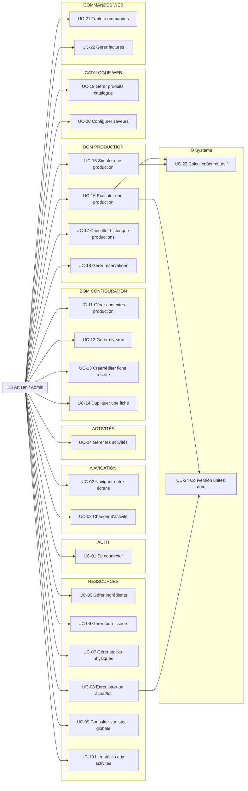
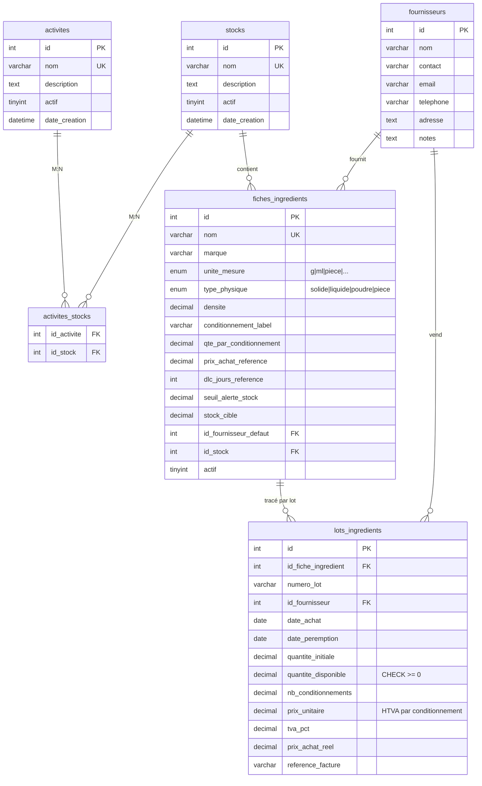
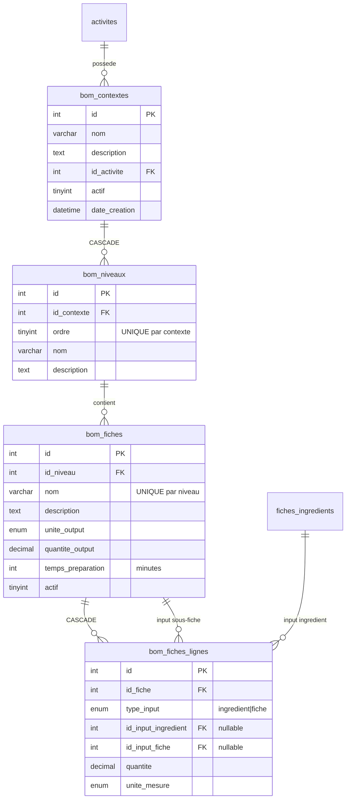
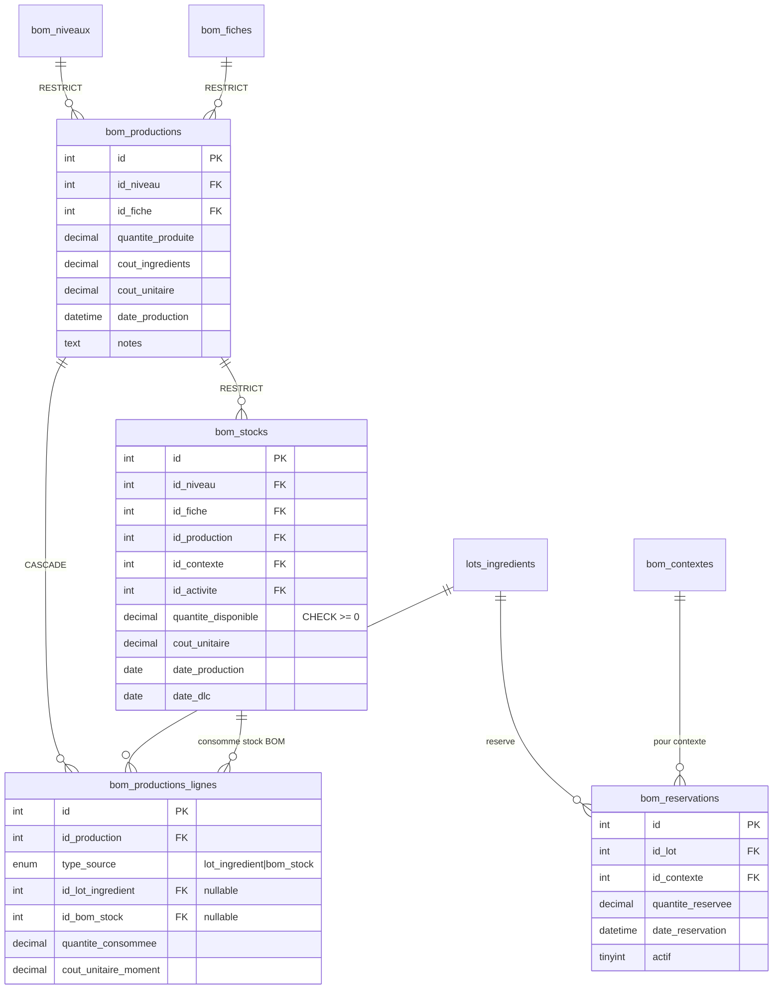
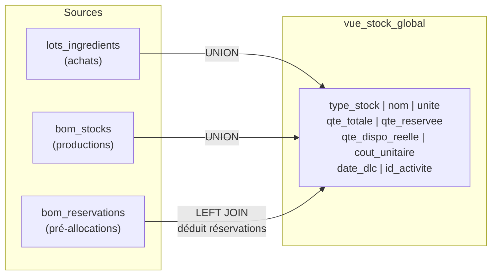
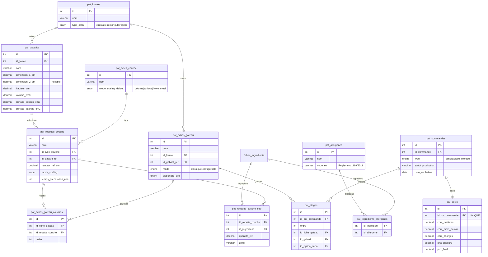

# ArtisaStock — Document BA & FA
> **Business Analysis & Functional Analysis**
> Dernière mise à jour : 2026-05-19
> Branche : `feat/refactoring-sprints-p0-p3`

---

## 1. Vue d'ensemble

**ArtisaStock** est un ERP (Enterprise Resource Planning — logiciel de gestion intégré) artisanal conçu pour les métiers de bouche (chocolaterie, pâtisserie, glacier, etc.).

| Composant | Stack | Rôle |
|-----------|-------|------|
| **App Desktop** | C# WinForms · .NET 4.8.1 · MySQL 9.6 | Gestion production, stocks, achats, recettes |
| **Site Web** | Laravel 11 · PHP 8.3 · MySQL | E-commerce vitrine + configurateur (non démarré) |
| **Base de données** | `charlesnadejda` · MySQL · UTF8MB4 | Partagée entre les deux apps |

**Architecture C#** : SFA (Single-Form Architecture) — une seule fenêtre shell (`FrmPrincipal`) avec navigation dynamique via `SidebarPanel` + `ScreenRouter` + `AppState`.

---

## 2. Acteurs

| Acteur | Description | Accès |
|--------|-------------|-------|
| **Artisan / Admin** | Gérant de l'atelier. Accès complet à l'app desktop | C# WinForms |
| **Client Web** | Acheteur en ligne. Consulte le catalogue, configure, commande | Laravel (futur) |
| **Système** | Calculs automatiques (FIFO, coûts, conversions, alertes) | Interne |

---

## 3. Modules & Fonctionnalités

### 3.1 — AUTH (Authentification)

| # | Fonctionnalité | Statut |
|---|----------------|--------|
| F-01 | Login par email + mot de passe (BCrypt) | ✅ |
| F-02 | Rôle unique `admin` (pas de gestion multi-rôles) | ✅ |
| F-03 | Interopérabilité BCrypt PHP ↔ C# | ✅ |

---

### 3.2 — NAVIGATION (Shell ERP)

| # | Fonctionnalité | Statut |
|---|----------------|--------|
| F-04 | Shell SFA : TitleBar + Sidebar (224px) + StatusBar + ContentFill | ✅ |
| F-05 | Sidebar 3 groupes : Workflow / Stock & Achats / Référentiels | ✅ |
| F-06 | Sélecteur d'activité (ComboBox) dans la sidebar | ✅ |
| F-07 | Navigation par `ScreenRouter` (13 NavItemId → 9 ScreenId) | ✅ |
| F-08 | État global observable (`AppState`) avec événements | ✅ |
| F-09 | Badges compteurs dans la sidebar | ✅ |

---

### 3.3 — ACTIVITÉS (Domaines métier)

| # | Fonctionnalité | Statut |
|---|----------------|--------|
| F-10 | CRUD Activités (Chocolaterie, Pâtisserie, Glacier…) | ✅ |
| F-11 | Soft delete (`actif = 0`) avec validation dépendances | ✅ |
| F-12 | Liaison M:N Activité ↔ Stock (multi-entrepôts) | ✅ |
| F-13 | Filtrage contextuel : toutes les vues filtrées par activité active | ✅ |

---

### 3.4 — RESSOURCES (Ingrédients, Stocks, Fournisseurs, Achats)

| # | Fonctionnalité | Statut |
|---|----------------|--------|
| **Ingrédients** |||
| F-14 | CRUD Ingrédients avec unité de base (g, ml, pièce) | ✅ |
| F-15 | Type physique (solide/liquide/poudre/pièce) + densité | ✅ |
| F-16 | Conditionnement (label + quantité par paquet) | ✅ |
| F-17 | Seuil d'alerte stock + Stock cible (jauge 4 couleurs) | ✅ |
| F-18 | Prix par unité de base calculé automatiquement | ✅ |
| F-19 | Filtres par chips (type, fournisseur) | ✅ |
| **Stocks** |||
| F-20 | CRUD Stocks (emplacements physiques/logiques) | ✅ |
| F-21 | Liaison M:N Stock ↔ Activité | ✅ |
| **Fournisseurs** |||
| F-22 | CRUD Fournisseurs (nom, contact, email, tel, adresse) | ✅ |
| **Achats / Lots** |||
| F-23 | Enregistrement achats avec n° lot AFSCA | ✅ |
| F-24 | Prix HTVA + TVA% par lot | ✅ |
| F-25 | DLC (Date Limite de Consommation) par lot | ✅ |
| F-26 | Quantité en conditionnements → conversion auto en unité de base | ✅ |

---

### 3.5 — BOM Configuration (Contextes, Niveaux, Fiches)

> BOM = Bill of Materials — nomenclature de production décrivant les composants et quantités nécessaires pour fabriquer un produit.

| # | Fonctionnalité | Statut |
|---|----------------|--------|
| F-27 | CRUD Contextes de production (liés à une activité) | ✅ |
| F-28 | CRUD Niveaux ordonnés dans un contexte (1, 2, 3…) | ✅ |
| F-29 | Niveau N ne peut consommer que des entrées de niveaux < N | ✅ |
| F-30 | Suppression de niveau uniquement par le haut (dernier ordre) | ✅ |
| F-31 | CRUD Fiches recettes avec lignes d'entrée | ✅ |
| F-32 | Ligne = ingrédient OU sous-fiche (type_input polymorphe) | ✅ |
| F-33 | Quantité output par batch + unité de sortie | ✅ |
| F-34 | Temps de préparation estimé (minutes) | ✅ |
| F-35 | Duplication de fiche (clone header + lignes) | ✅ |
| F-36 | Verrouillage unité après sélection d'un input | ✅ |

---

### 3.6 — BOM Production (Simulation & Exécution)

| # | Fonctionnalité | Statut |
|---|----------------|--------|
| F-37 | Sélection en cascade : Contexte → Niveau → Fiche | ✅ |
| F-38 | **Simulation** : dry-run sans effet sur les stocks | 🔄 |
| F-39 | Vérification de disponibilité (retourne liste `BomManque`) | ✅ |
| F-40 | DGV coloré (vert = OK, rouge = rupture) | 🔄 |
| F-41 | **Exécution atomique** (TX MySQL : vérif → consomme → produit) | ✅ |
| F-42 | Consommation FIFO stricte (lot le plus ancien d'abord) | ✅ |
| F-43 | Conversion d'unités obligatoire avant toute comparaison | ✅ |
| F-44 | Création automatique de `bom_stocks` en sortie | ✅ |
| F-45 | Coût récursif multi-niveaux (`BomCoutDAL`) | ✅ |
| F-46 | Détection de cycles dans les fiches (anti boucle infinie) | ✅ |
| F-47 | Historique des productions avec traçabilité lignes | ✅ |
| F-48 | Réservations de lots (pré-allocation sans consommation) | ✅ |
| F-49 | `quantiteCible` = nombre de batches (pas quantité finale) | ✅ |

---

### 3.7 — VUE STOCK GLOBALE

| # | Fonctionnalité | Statut |
|---|----------------|--------|
| F-50 | Vue unifiée lots ingrédients + produits fabriqués (VIEW MySQL) | ✅ |
| F-51 | 3 sections : Ingrédients / Intermédiaires / Finaux | ✅ |
| F-52 | Jauge stock cible (ratio actuel/cible, 4 couleurs) | ✅ |
| F-53 | Filtre par activité / contexte / niveau | ✅ |
| F-54 | Réservations déduites de la disponibilité réelle | ✅ |

---

### 3.8 — CATALOGUE WEB (Laravel — futur)

| # | Fonctionnalité | Statut |
|---|----------------|--------|
| F-55 | CRUD Produits web (chocolats) | ❌ |
| F-56 | Configurateur saveurs (exactement `capacite_max` saveurs) | ❌ |
| F-57 | Upload images Cloudinary | ❌ |

---

### 3.9 — COMMANDES WEB (Laravel — futur)

| # | Fonctionnalité | Statut |
|---|----------------|--------|
| F-58 | Workflow commandes (en_attente → confirmée → en_préparation → prête → livrée) | ❌ |
| F-59 | Paiement Stripe | ❌ |

---

### 3.10 — MODULE PÂTISSERIE (Tables `pat_*` — futur)

| # | Fonctionnalité | Statut |
|---|----------------|--------|
| F-60 | Formes de gâteau (circulaire, rectangulaire, libre) | ❌ |
| F-61 | Gabarits (tailles avec volumes/surfaces calculés) | ❌ |
| F-62 | Types de couches avec mode de scaling (volume/surface/fixe/manuel) | ❌ |
| F-63 | Recettes de couches avec ingrédients | ❌ |
| F-64 | Fiches gâteau : mode classique OU configurable | ❌ |
| F-65 | Commandes pâtisserie : pièce montée multi-étages | ❌ |
| F-66 | Devis automatique (matières + main-d'œuvre + charges + marge) | ❌ |
| F-67 | Allergènes UE (Règlement 1169/2011) liés aux ingrédients | ❌ |

---

## 4. Use Cases — Vue synthétique

### Diagramme Use Cases global

### Détail des Use Cases clés

#### UC-01 — Se connecter
| | |
|---|---|
| **Acteur** | Artisan |
| **Précondition** | Compte existant en DB |
| **Scénario** | 1. Saisir email + mot de passe → 2. `BCrypt.Verify()` → 3. Accès au shell |
| **Alternatif** | Identifiants invalides → message d'erreur, pas de verrouillage |

#### UC-08 — Enregistrer un achat / lot
| | |
|---|---|
| **Acteur** | Artisan |
| **Précondition** | Ingrédient et fournisseur existent |
| **Scénario** | 1. Sélectionner ingrédient → 2. Renseigner : fournisseur, n° lot AFSCA, quantité (conditionnements), prix HTVA, TVA%, DLC → 3. Calcul auto : `quantité_initiale = nb_conditionnements × qte_par_conditionnement` → 4. INSERT lot |
| **Règles** | RG-FIFO (lots triés par date_achat ASC), CHECK `quantite_disponible ≥ 0` |

#### UC-13 — Créer / éditer une fiche recette
| | |
|---|---|
| **Acteur** | Artisan |
| **Précondition** | Contexte + Niveau existent |
| **Scénario** | 1. Header : nom, description, unité output, quantité output, temps → 2. Ajouter lignes (ingrédient OU sous-fiche de niveau inférieur) → 3. Transaction atomique (INSERT header + lignes) |
| **Règles** | Nom unique par niveau. Unité verrouillée après sélection input. Niveau N consomme uniquement < N |

#### UC-15 — Simuler une production
| | |
|---|---|
| **Acteur** | Artisan |
| **Précondition** | Fiche avec lignes, stocks existants |
| **Scénario** | 1. Cascade : Contexte → Niveau → Fiche → Nb batches → 2. `Simuler()` : explosion BOM récursive → 3. Pour chaque input : vérif FIFO dispo → 4. Affichage DGV coloré (vert/rouge) + liste manquants |
| **Règles** | Aucun effet sur les stocks. Conversion unités obligatoire |

#### UC-16 — Exécuter une production
| | |
|---|---|
| **Acteur** | Artisan |
| **Précondition** | Simulation OK (pas de manquants) |
| **Scénario** | 1. `Executer()` dans une TX MySQL → 2. Re-vérifier dispo (anti TOCTOU) → 3. Consommer FIFO lot par lot → 4. INSERT `bom_productions` + `bom_productions_lignes` → 5. INSERT `bom_stocks` (output produit) → 6. Libérer réservations |
| **Règles** | Transaction atomique. FIFO strict. Coûts au moment de la consommation. `quantiteCible` = batches |

---

## 5. Règles Métier

| Code | Règle | Module |
|------|-------|--------|
| **RG-FIFO** | Stock consommé par ordre chronologique (date_achat / date_production ASC) | Production, Stock |
| **RG-UNIT** | Conversion d'unités obligatoire avant toute comparaison ou décrémentation | Transversal |
| **RG-BOM-LEVEL** | Niveau N consomme uniquement niveaux < N | BOM Config |
| **RG-SOFT-DELETE** | Désactivation (`actif=0`) au lieu de suppression physique quand dépendances | Activités |
| **RG-STOCK-CIBLE** | Jauge 4 couleurs : vert (>75%) / jaune (50-75%) / orange (25-50%) / rouge (<25%) | Stock |
| **RG-TX** | Toute opération multi-tables dans une transaction MySQL avec ROLLBACK | Production |
| **RG-FK-GUARD** | Vérification des dépendances FK avant suppression (RESTRICT) | Tous |
| **RG-N0** | Premier niveau auto-créé à la création d'un contexte | BOM Config |
| **RG-RESERVATION** | Réservation = pré-allocation déduite de la dispo réelle sans consommer | Stock |
| **RG-BATCH** | `quantiteCible` = nombre de batches. Quantité réelle = batches × `quantite_output` | Production |
| **RG-CYCLE** | Détection de cycles par HashSet dans le calcul de coûts récursif | BOM Coûts |
| **RG-CHECK** | Contraintes CHECK en DB : `quantite_disponible ≥ 0` sur lots et bom_stocks | DB |

---

## 6. Schéma de Base de Données (ERD)

### 6.1 — Noyau : Activités, Stocks, Ingrédients

### 6.2 — BOM : Contextes, Niveaux, Fiches, Lignes

### 6.3 — Production & Stocks BOM

### 6.4 — Vue Stock Globale (VIEW MySQL)

### 6.5 — Module Pâtisserie (tables `pat_*` — futur)

---

## 7. Couverture d'implémentation

| Module | Use Cases | Implémentés | Couverture |
|--------|-----------|-------------|------------|
| AUTH | 1 | 1 | **100%** ✅ |
| NAVIGATION | 2 | 2 | **100%** ✅ |
| ACTIVITÉS | 4 | 4 | **100%** ✅ |
| RESSOURCES | 6 | 6 | **100%** ✅ |
| BOM Config | 4 | 4 | **100%** ✅ |
| BOM Production | 4 | 2 complets + 2 partiels | **~75%** 🔄 |
| CATALOGUE WEB | 3 | 0 | **0%** ❌ |
| COMMANDES WEB | 2 | 0 | **0%** ❌ |
| **TOTAL** | **26** | **19 complets + 2 partiels** | **~73%** |

### Prochaines étapes

1. **Finaliser BOM Production** — écran Simulation WinForms (DGV coloré, KPI bar)
2. **Corriger tickets P0** — secrets exposés (App.config, .env, FrmLogin)
3. **Démarrer Laravel** — Catalogue web + Configurateur saveurs
4. **Module Pâtisserie** — tables `pat_*` prêtes en DB, code à implémenter

---

## 8. Sécurité — Règles vérifiées

| Code | Règle | Statut |
|------|-------|--------|
| SEC-01 | Requêtes SQL paramétrées (jamais de concaténation) | ✅ |
| SEC-02 | Transactions MySQL atomiques | ✅ |
| SEC-03 | FK guards avant suppression | ✅ |
| SEC-04 | Conversion unités avant comparaison | ✅ |
| SEC-05 | Soft delete systématique | ✅ |
| SEC-06 | FIFO strict | ✅ |
| SEC-07 | Validation entrées UI | ✅ |
| SEC-08 | Exception handling | ✅ |
| SEC-09 | Chaîne connexion App.config | ⚠️ **Secrets en clair (P0)** |

---

## 9. Glossaire

| Terme | Définition |
|-------|------------|
| **Activité** | Domaine métier (Chocolaterie, Pâtisserie…). Filtre contextuel global |
| **Stock** | Emplacement physique/logique de stockage d'ingrédients |
| **Lot** | Achat traçable d'un ingrédient (n° AFSCA, DLC, FIFO) |
| **BOM** | Bill of Materials — nomenclature de production |
| **Contexte** | Configuration de production liée à une activité |
| **Niveau** | Couche de transformation (1 = matières premières, 2+ = produits intermédiaires/finis) |
| **Fiche** | Recette / process à un niveau donné. Produit Q unités par batch |
| **Ligne** | Entrée d'une fiche : ingrédient OU sous-fiche de niveau inférieur |
| **Batch** | Une exécution de fiche. `quantiteCible` = nombre de batches |
| **FIFO** | First In, First Out — consommation par ordre chronologique |
| **DLC** | Date Limite de Consommation |
| **AFSCA** | Agence Fédérale pour la Sécurité de la Chaîne Alimentaire (Belgique) |
| **HTVA** | Hors Taxe sur la Valeur Ajoutée |
| **SFA** | Single-Form Architecture — une fenêtre shell, contenu dynamique |
| **DAL** | Data Access Layer — couche d'accès aux données (pas d'ORM) |
| **Soft delete** | Désactivation logique (`actif=0`) au lieu de suppression physique |
| **TOCTOU** | Time Of Check to Time Of Use — risque de race condition entre vérification et exécution |
