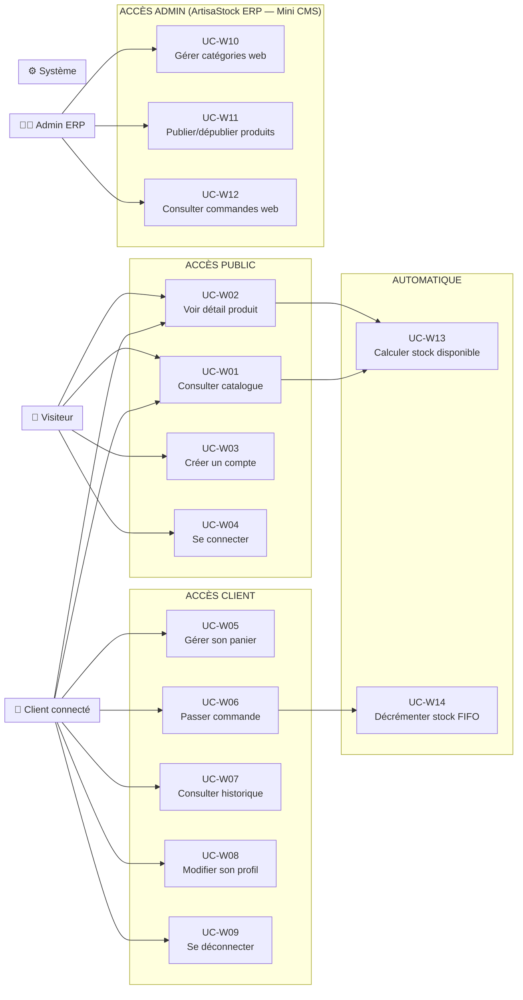

# Fondations du Projet — ArtisaStock Boutique Web (PDWEB)
> mentalyas · Full-Stack Dev
> Date : 2026-05-19
> Statut : Brainstorm finalisé — prêt pour implémentation
> Contexte : Examen PDWEB — fusion avec PDSGBD (ArtisaStock C# WinForms)

---

## 1. Concept Global

**ArtisaStock Boutique Web** est la vitrine e-commerce du système ArtisaStock. Elle permet aux **clients** de consulter le catalogue de produits artisanaux publiés par l'admin depuis l'ERP C#, de créer un compte, de constituer un panier et de passer commande (simulation de paiement).

**L'admin ne gère rien depuis le web.** Toute la gestion (catalogue, stock, prix, images) se fait depuis ArtisaStock WinForms. Le site web est en **lecture + commande uniquement** côté client.

Les deux applications partagent la **même base de données MySQL** `charlesnadejda`. Le stock affiché sur le web est réel (issu de `bom_stocks`), et une commande validée **décrémente immédiatement** le stock.

**Vision long terme** : l'ERP WinForms sera remplacé par une app React. Laravel reste le backend permanent. Cette V1 pose les fondations.

---

## 2. Fonctionnalités

### Fonctionnalités core (MVP — Examen PDWEB)

#### Côté Laravel (Client Web)
- [x] **Inscription client** — formulaire avec validation complète (nom, prénom, email, mot de passe, adresse, téléphone)
- [x] **Login / Logout client** — sessions PHP, BCrypt interopérable avec C#
- [x] **Catalogue public** — liste des produits publiés par l'admin, avec prix, image, description, état stock
- [x] **Page détail produit** — description complète, image, prix, stock disponible, bouton "Ajouter au panier"
- [x] **Panier** — ajout/suppression d'items, modification quantités, calcul total dynamique (AJAX)
- [x] **Passage de commande** — récapitulatif + simulation paiement → décrémentation `bom_stocks` → statut `payee`
- [x] **Historique commandes** — le client consulte ses commandes passées avec statut
- [x] **Contenu conditionnel** — visiteur (catalogue seul) vs client connecté (panier, commandes, profil)

#### Côté ArtisaStock C# (Admin ERP — Mini CMS à implémenter)
- [x] **Écran "Boutique en ligne"** — nouveau NavItemId dans la sidebar, module CMS (Content Management System — interface de gestion de contenu web)
- [x] **CRUD Catégories web** — l'admin crée/modifie/supprime des catégories de produits (ex : Chocolats, Pralinés, Coffrets)
- [x] **Publication de produits** — l'admin sélectionne une `bom_fiche` et la publie avec : catégorie, nom commercial, description, prix de vente, image (1 photo, upload local), publié/dépublié
- [x] **Dépublication** — l'admin peut retirer un produit de la boutique sans le supprimer (toggle `en_vente`)
- [x] **Stock dynamique** — la quantité affichée est calculée depuis `bom_stocks` (SUM quantite_disponible pour la fiche)
- [x] **Consultation commandes web** — DGV listant les commandes passées par les clients, statuts, détails

### Fonctionnalités secondaires (v2+)
- [ ] Configurateur saveurs (le client compose son coffret)
- [ ] Paiement réel Stripe
- [ ] Upload images Cloudinary (remplacement du stockage local)
- [ ] Notifications email (confirmation commande)
- [ ] Système d'avis / commentaires
- [ ] Gestion promotions / codes promo
- [ ] Migration ERP WinForms → React + API REST complète
- [ ] Workflow commandes avancé (en_attente → confirmée → en_préparation → prête → expédiée → livrée)

### Hors scope (explicitement exclu pour l'examen)
- Paiement réel (Stripe, PayPal)
- Déploiement en production
- Panel admin web (tout se fait depuis l'ERP C#)
- Configurateur de saveurs
- Gestion des livraisons / transporteurs
- Multi-langue

---

## 3. Structure de Base de Données

### Nouvelles tables (à ajouter via migration SQL)

| Table | Rôle | Relation principale |
|-------|------|---------------------|
| `clients` | Comptes clients web | Standalone |
| `categories_web` | Catégories de produits (gérées par l'admin ERP) | Standalone |
| `produits_web` | Fiches BOM publiées en boutique | FK → `bom_fiches`, FK → `categories_web` |
| `commandes_web` | Commandes passées par les clients | FK → `clients` |
| `commandes_web_lignes` | Lignes de commande (produit, qté, prix au moment) | FK → `commandes_web`, FK → `produits_web` |

### Tables existantes impactées

| Table | Impact |
|-------|--------|
| `bom_stocks` | Décrémentation à la commande (FIFO) |
| `bom_fiches` | Référencée par `produits_web` |

### Détail des nouvelles tables

```sql
-- =============================================
-- MIGRATION v15 — Boutique Web
-- =============================================

CREATE TABLE clients (
    id              INT AUTO_INCREMENT PRIMARY KEY,
    nom             VARCHAR(100)    NOT NULL,
    prenom          VARCHAR(100)    NOT NULL,
    email           VARCHAR(255)    NOT NULL UNIQUE,
    mot_de_passe    VARCHAR(255)    NOT NULL,   -- BCrypt hash
    telephone       VARCHAR(20),
    adresse_rue     VARCHAR(255),
    adresse_cp      VARCHAR(10),
    adresse_ville   VARCHAR(100),
    adresse_pays    VARCHAR(100)    DEFAULT 'Belgique',
    actif           TINYINT(1)      DEFAULT 1,
    date_creation   DATETIME        DEFAULT CURRENT_TIMESTAMP,
    date_modification DATETIME      DEFAULT CURRENT_TIMESTAMP ON UPDATE CURRENT_TIMESTAMP
) ENGINE=InnoDB DEFAULT CHARSET=utf8mb4 COLLATE=utf8mb4_unicode_ci;

CREATE TABLE categories_web (
    id              INT AUTO_INCREMENT PRIMARY KEY,
    nom             VARCHAR(150)    NOT NULL UNIQUE,
    description     TEXT,
    ordre_affichage INT             DEFAULT 0,
    actif           TINYINT(1)      DEFAULT 1,
    date_creation   DATETIME        DEFAULT CURRENT_TIMESTAMP
) ENGINE=InnoDB DEFAULT CHARSET=utf8mb4 COLLATE=utf8mb4_unicode_ci;

CREATE TABLE produits_web (
    id              INT AUTO_INCREMENT PRIMARY KEY,
    id_bom_fiche    INT             NOT NULL,
    id_categorie    INT,
    nom_commercial  VARCHAR(200)    NOT NULL,
    description     TEXT,
    prix_vente      DECIMAL(10,2)   NOT NULL,
    image_path      VARCHAR(500),               -- chemin local storage/
    en_vente        TINYINT(1)      DEFAULT 1,  -- publié ou dépublié
    ordre_affichage INT             DEFAULT 0,
    date_creation   DATETIME        DEFAULT CURRENT_TIMESTAMP,
    date_modification DATETIME      DEFAULT CURRENT_TIMESTAMP ON UPDATE CURRENT_TIMESTAMP,

    CONSTRAINT fk_prodweb_bomfiche
        FOREIGN KEY (id_bom_fiche) REFERENCES bom_fiches(id) ON DELETE RESTRICT,
    CONSTRAINT fk_prodweb_categorie
        FOREIGN KEY (id_categorie) REFERENCES categories_web(id) ON DELETE SET NULL,
    CONSTRAINT uk_prodweb_fiche
        UNIQUE (id_bom_fiche)       -- une fiche BOM = un seul produit web
) ENGINE=InnoDB DEFAULT CHARSET=utf8mb4 COLLATE=utf8mb4_unicode_ci;

CREATE TABLE commandes_web (
    id              INT AUTO_INCREMENT PRIMARY KEY,
    id_client       INT             NOT NULL,
    statut          ENUM('panier','payee','annulee')
                                    DEFAULT 'panier',
    total_ttc       DECIMAL(10,2)   DEFAULT 0.00,
    adresse_livraison TEXT,         -- snapshot adresse au moment de la commande
    date_commande   DATETIME,       -- NULL tant que panier, set à la validation
    date_creation   DATETIME        DEFAULT CURRENT_TIMESTAMP,

    CONSTRAINT fk_cmdweb_client
        FOREIGN KEY (id_client) REFERENCES clients(id) ON DELETE RESTRICT
) ENGINE=InnoDB DEFAULT CHARSET=utf8mb4 COLLATE=utf8mb4_unicode_ci;

CREATE TABLE commandes_web_lignes (
    id              INT AUTO_INCREMENT PRIMARY KEY,
    id_commande     INT             NOT NULL,
    id_produit_web  INT             NOT NULL,
    quantite        INT             NOT NULL DEFAULT 1,
    prix_unitaire   DECIMAL(10,2)   NOT NULL,   -- snapshot prix au moment de l'ajout
    sous_total      DECIMAL(10,2)   GENERATED ALWAYS AS (quantite * prix_unitaire) STORED,

    CONSTRAINT fk_cmdligne_cmd
        FOREIGN KEY (id_commande) REFERENCES commandes_web(id) ON DELETE CASCADE,
    CONSTRAINT fk_cmdligne_prodweb
        FOREIGN KEY (id_produit_web) REFERENCES produits_web(id) ON DELETE RESTRICT
) ENGINE=InnoDB DEFAULT CHARSET=utf8mb4 COLLATE=utf8mb4_unicode_ci;
```

### Diagramme ERD — Nouvelles tables + liens existants

```mermaid
erDiagram
    clients {
        int id PK
        varchar nom
        varchar prenom
        varchar email UK
        varchar mot_de_passe "BCrypt"
        varchar telephone
        varchar adresse_rue
        varchar adresse_cp
        varchar adresse_ville
        varchar adresse_pays
        tinyint actif
    }

    categories_web {
        int id PK
        varchar nom UK
        text description
        int ordre_affichage
        tinyint actif
    }

    produits_web {
        int id PK
        int id_bom_fiche FK-UK
        int id_categorie FK
        varchar nom_commercial
        text description
        decimal prix_vente
        varchar image_path "1 photo locale"
        tinyint en_vente "publie ou depublie"
        int ordre_affichage
    }

    commandes_web {
        int id PK
        int id_client FK
        enum statut "panier|payee|annulee"
        decimal total_ttc
        text adresse_livraison "snapshot"
        datetime date_commande
    }

    commandes_web_lignes {
        int id PK
        int id_commande FK
        int id_produit_web FK
        int quantite
        decimal prix_unitaire "snapshot"
        decimal sous_total "GENERATED"
    }

    bom_fiches {
        int id PK
        varchar nom
        decimal quantite_output
        varchar unite_output
    }

    bom_stocks {
        int id PK
        int id_fiche FK
        decimal quantite_disponible
    }

    clients ||--o{ commandes_web : "passe"
    commandes_web ||--o{ commandes_web_lignes : "contient"
    produits_web ||--o{ commandes_web_lignes : "concerne"
    categories_web ||--o{ produits_web : "classe"
    bom_fiches ||--o| produits_web : "publie en boutique"
    bom_fiches ||--o{ bom_stocks : "stock reel"
```

---

## 4. Diagrammes Use Cases

### UC global — Boutique Web



### Détail des Use Cases clés

#### UC-W03 — Créer un compte client
| | |
|---|---|
| **Acteur** | Visiteur |
| **Précondition** | Email non existant en DB |
| **Scénario** | 1. Formulaire : nom, prénom, email, mot de passe (×2), téléphone, adresse → 2. Validation serveur (champs requis, format email, mdp ≥ 8 car., confirmation match) → 3. Hash BCrypt → 4. INSERT `clients` → 5. Auto-login (session) → 6. Redirect catalogue |
| **Erreurs** | Email déjà pris, validation échouée → re-remplissage + messages par champ |
| **Critère PDWEB** | ✅ Formulaire + validation + sessions + MySQL |

#### UC-W05 — Gérer son panier
| | |
|---|---|
| **Acteur** | Client connecté |
| **Précondition** | Session active |
| **Scénario** | 1. Clic "Ajouter au panier" (AJAX) → 2. INSERT/UPDATE `commandes_web_lignes` (commande statut `panier`) → 3. Mise à jour compteur panier (AJAX) → 4. Page panier : modifier quantités (AJAX), supprimer item, voir total |
| **Règles** | Quantité demandée ≤ stock dispo. Prix snapshot au moment de l'ajout |
| **Critère PDWEB** | ✅ AJAX + sessions + MySQL |

#### UC-W06 — Passer commande (simulation paiement)
| | |
|---|---|
| **Acteur** | Client connecté |
| **Précondition** | Panier non vide, stock suffisant |
| **Scénario** | 1. Récapitulatif panier + adresse → 2. Bouton "Payer" (simulation) → 3. TX MySQL : re-vérif stock → décrémenter `bom_stocks` FIFO → UPDATE commande statut `payee` + `date_commande` + snapshot adresse → 4. Page confirmation |
| **Erreurs** | Stock insuffisant entre-temps → message + retour panier |
| **Critère PDWEB** | ✅ Formulaire + MySQL + sessions + logique métier |

#### UC-W10 — Gérer catégories web (ERP C#)
| | |
|---|---|
| **Acteur** | Admin (ArtisaStock WinForms) |
| **Précondition** | Aucune |
| **Scénario** | 1. Écran "Boutique en ligne" > onglet Catégories → 2. CRUD catégories (nom, description, ordre, actif) → 3. Les catégories apparaissent comme filtres sur le site web |
| **Règles** | Nom unique. Suppression → FK `SET NULL` sur produits associés |

#### UC-W11 — Publier / dépublier un produit (ERP C#)
| | |
|---|---|
| **Acteur** | Admin (ArtisaStock WinForms) |
| **Précondition** | `bom_fiche` existante |
| **Scénario** | 1. Écran "Boutique en ligne" > onglet Produits → 2. Sélectionner une fiche BOM non encore publiée → 3. Remplir : catégorie, nom commercial, description, prix de vente, image (FileDialog → copie locale) → 4. INSERT `produits_web` → 5. Toggle `en_vente` pour publier/dépublier |
| **Règles** | Une fiche = un seul produit web (UNIQUE). Stock calculé dynamiquement depuis `bom_stocks`. Dépublier masque le produit sans le supprimer |

---

## 5. Stack Technologique

| Couche | Technologie | Justification |
|--------|-------------|---------------|
| **Backend Web** | Laravel 11 · PHP 8.3 | Imposé par l'examen PDWEB |
| **Frontend Web** | Blade + Tailwind CSS | Templates Laravel natifs, utility-first CSS |
| **JavaScript** | Vanilla JS (ou Alpine.js) | AJAX panier + interactions. Pas besoin de framework lourd |
| **ERP Desktop** | C# WinForms · .NET 4.8.1 | Existant (PDSGBD) |
| **Base de données** | MySQL 9.6 · `charlesnadejda` | Partagée entre les deux apps |
| **Auth** | BCrypt (PHP `password_hash` + C# `BCrypt.Net`) | Interopérable, déjà en place |
| **Images** | Stockage local `storage/app/public/produits/` | Examen local, pas de déploiement |
| **Serveur dev** | `php artisan serve` + Docker MySQL | Environnement local uniquement |

---

## 6. Algorithmes & Patterns Techniques

### Pattern : Stock dynamique via `bom_stocks`
Le stock affiché sur le web n'est **pas un champ statique** dans `produits_web`. Il est **calculé à la volée** :

```sql
SELECT COALESCE(SUM(bs.quantite_disponible), 0) AS stock_dispo
FROM bom_stocks bs
WHERE bs.id_fiche = :id_bom_fiche
  AND bs.quantite_disponible > 0
```

L'admin ne met jamais à jour le stock manuellement sur le web. Il produit dans l'ERP → `bom_stocks` augmente → le site reflète automatiquement.

### Pattern : Décrémentation FIFO à la commande
Quand un client valide sa commande, le stock est décrémenté en FIFO (lot le plus ancien d'abord), identique au pattern déjà implémenté dans `BomProductionDAL.Executer()` :

```
Pour chaque ligne de commande :
    1. Récupérer bom_stocks pour la fiche, triés par date_production ASC
    2. Boucle FIFO : décrémenter quantite_disponible lot par lot
    3. Si lot épuisé (= 0), passer au suivant
    4. Si stock insuffisant → ROLLBACK toute la commande
```

### Pattern : Snapshot prix
Le `prix_unitaire` dans `commandes_web_lignes` est un **snapshot** (copie au moment de l'ajout au panier). Si l'admin change le prix dans l'ERP, les commandes en cours ne sont pas affectées.

### Pattern : Panier = commande statut `panier`
Pas de table `paniers` séparée. Le panier est une `commandes_web` avec `statut = 'panier'`. Un client a au plus un panier actif. À la validation → statut passe à `payee`.

### Pattern : Session PHP pour l'auth
```php
// Login
$_SESSION['client_id'] = $client->id;
$_SESSION['client_nom'] = $client->prenom . ' ' . $client->nom;

// Middleware maison ou check dans les routes
if (!isset($_SESSION['client_id'])) {
    redirect('/login');
}
```

---

## 7. Sécurité — Bloc Dédié

### Niveau de sensibilité des données
**Moyen** — données personnelles clients (nom, adresse, email), mots de passe hashés, historique d'achats. Pas de données bancaires réelles (simulation paiement).

### Vulnérabilités à anticiper

| Risque | Vecteur | Mitigation |
|--------|---------|------------|
| Injection SQL | Formulaires, paramètres URL | Eloquent ORM (requêtes paramétrées). Jamais de `DB::raw()` avec input |
| XSS (Cross-Site Scripting) | Affichage données utilisateur | Blade escape par défaut `{{ }}`. Jamais `{!! !!}` sur du user input |
| CSRF (Cross-Site Request Forgery) | Formulaires POST | Token `@csrf` sur tous les formulaires Laravel |
| Brute force login | Page login | Rate limiting (`throttle` middleware Laravel) |
| Accès non autorisé | Routes protégées | Middleware session check sur routes `/panier`, `/commandes`, `/profil` |
| Manipulation panier | Quantité négative, prix modifié | Validation serveur. Prix recalculé depuis DB, jamais depuis le client |
| Race condition stock | Deux commandes simultanées | Transaction MySQL avec re-vérification stock dans la TX |
| Upload malicieux | Image produit (ERP) | Validation extension + MIME type. Stockage hors webroot |

### Checklist sécurité minimale
- [x] Hash BCrypt pour mots de passe (`password_hash()` PHP)
- [x] HTTPS non requis (local exam only)
- [x] Variables d'env pour credentials DB (`.env` Laravel)
- [x] Rate limiting sur `/login` et `/register`
- [x] Validation serveur sur TOUS les formulaires (Form Requests Laravel)
- [x] Token CSRF sur tous les POST
- [x] Escape Blade systématique
- [x] Transaction MySQL pour la décrémentation stock
- [x] Pas de données bancaires stockées (simulation)

---

## 8. Mapping Critères Examen PDWEB

| Critère examen | Où c'est couvert | Points |
|----------------|------------------|--------|
| **PHP** | Tout le backend Laravel (routes, controllers, models, helpers) | /10 |
| **Formulaire + erreurs** | Inscription (7+ champs, validation, re-remplissage), Login, Profil | /10 |
| **Sessions** | Login/Logout, panier persistant, contenu conditionnel visiteur vs client | /10 |
| **MySQL** | 4 nouvelles tables + lecture `bom_fiches`/`bom_stocks`, CRUD complet, jointures, transactions | /10 |
| **AJAX** | Ajout panier sans reload, mise à jour quantités, compteur header, calcul total live | /5 |
| **Ampleur** | ~6 pages (accueil, catalogue, détail, panier, confirmation, profil + login/register) | Viser 20-25/25 |

### Pages à implémenter

| # | Page | Route | Auth requise | Critères couverts |
|---|------|-------|--------------|-------------------|
| 1 | Accueil / Catalogue | `GET /` | Non | PHP, MySQL, Sessions (conditionnel) |
| 2 | Détail produit | `GET /produit/{id}` | Non | PHP, MySQL, AJAX (ajout panier) |
| 3 | Inscription | `GET/POST /register` | Non | Formulaire, validation, MySQL, Sessions |
| 4 | Login | `GET/POST /login` | Non | Formulaire, Sessions |
| 5 | Panier | `GET /panier` | Oui | AJAX (quantités, total), Sessions, MySQL |
| 6 | Confirmation commande | `POST /commande/valider` | Oui | MySQL (transaction FIFO), Sessions |
| 7 | Historique commandes | `GET /mes-commandes` | Oui | MySQL (jointures), Sessions |
| 8 | Profil | `GET/POST /profil` | Oui | Formulaire, MySQL, Sessions |

---

## 9. Références

| Référence | Ce qui est inspirant | Ce qu'on fait différemment |
|-----------|---------------------|---------------------------|
| Shopify | Catalogue simple, panier fluide | Pas de paiement réel, pas de thèmes |
| Odoo e-commerce | Lien direct ERP ↔ boutique | Stock calculé depuis BOM, pas depuis un module stock e-commerce |
| WooCommerce | Gestion produits depuis l'admin | Admin = ERP desktop C#, pas un panel web |

---

## 10. Vers le Cahier des Charges

### Résumé exécutif
ArtisaStock Boutique Web est la vitrine client d'un ERP artisanal. Le problème : les artisans gèrent leur production dans un logiciel desktop mais n'ont pas de canal de vente en ligne connecté. La solution : une boutique Laravel qui lit directement les stocks de production et permet aux clients de commander. Le marché cible : artisans chocolatiers, pâtissiers, glaciers belges. Modèle : vente directe sans intermédiaire.

### Décisions prises
- [x] **Catégories** → oui, gérées par l'admin dans l'ERP (mini CMS). Table `categories_web`, 1 produit = 1 catégorie. FK `SET NULL` si catégorie supprimée.
- [x] **Images** → 1 photo par produit (stockage local `storage/`). V2+ : galerie multi-images + Cloudinary.
- [x] **Annulation commande** → hors scope V1. Le statut `annulee` existe dans l'ENUM mais n'est pas implémenté côté client.
- [x] **Email confirmation** → hors scope V1.
- [x] **Vision long terme** → WinForms = examen PDSGBD uniquement. L'ERP sera migré en React. Laravel reste le backend permanent.

### Architecture fichiers Laravel (estimation)

```
site-laravel/
├── app/
│   ├── Http/
│   │   ├── Controllers/
│   │   │   ├── AuthController.php          # login, register, logout
│   │   │   ├── CatalogueController.php     # index, show
│   │   │   ├── PanierController.php        # add, update, remove (AJAX)
│   │   │   ├── CommandeController.php       # valider, historique
│   │   │   └── ProfilController.php         # show, update
│   │   ├── Middleware/
│   │   │   └── ClientAuth.php              # vérifie session client
│   │   └── Requests/
│   │       ├── RegisterRequest.php          # validation inscription
│   │       ├── LoginRequest.php             # validation login
│   │       └── ProfilUpdateRequest.php      # validation profil
│   └── Models/
│       ├── Client.php
│       ├── ProduitWeb.php                   # relation → BomFiche
│       ├── CommandeWeb.php                  # relation → Client, Lignes
│       ├── CommandeWebLigne.php             # relation → CommandeWeb, ProduitWeb
│       ├── BomFiche.php                     # lecture seule (modèle existant)
│       └── BomStock.php                     # lecture seule (stock réel)
├── resources/views/
│   ├── layouts/
│   │   └── app.blade.php                   # layout principal (header, nav, footer)
│   ├── auth/
│   │   ├── login.blade.php
│   │   └── register.blade.php
│   ├── catalogue/
│   │   ├── index.blade.php                 # grille produits
│   │   └── show.blade.php                  # détail produit
│   ├── panier/
│   │   └── index.blade.php                 # panier avec AJAX
│   ├── commandes/
│   │   ├── confirmation.blade.php
│   │   └── historique.blade.php
│   └── profil/
│       └── edit.blade.php
├── routes/
│   └── web.php                             # toutes les routes
├── public/
│   ├── css/                                # Tailwind compilé
│   ├── js/                                 # scripts AJAX
│   └── images/produits/                    # symlink → storage
└── database/
    └── migrations/
        └── xxxx_create_boutique_tables.php  # migration v15
```

### Prochaines étapes

1. **Valider ce brainstorm** avec mentalyas
2. **Migration SQL v15** — créer les 4 nouvelles tables
3. **Scaffold Laravel** — routes, controllers, models, vues Blade
4. **Écran ERP "Boutique en ligne"** — CRUD `produits_web` dans ArtisaStock C#
5. **Implémenter les 8 pages** dans l'ordre : Auth → Catalogue → Panier → Commande
6. **Tests manuels** — vérifier la boucle complète : publier dans ERP → visible sur web → commande → stock décrémenté
7. **Préparer l'oral** — être capable d'expliquer chaque ligne de code
