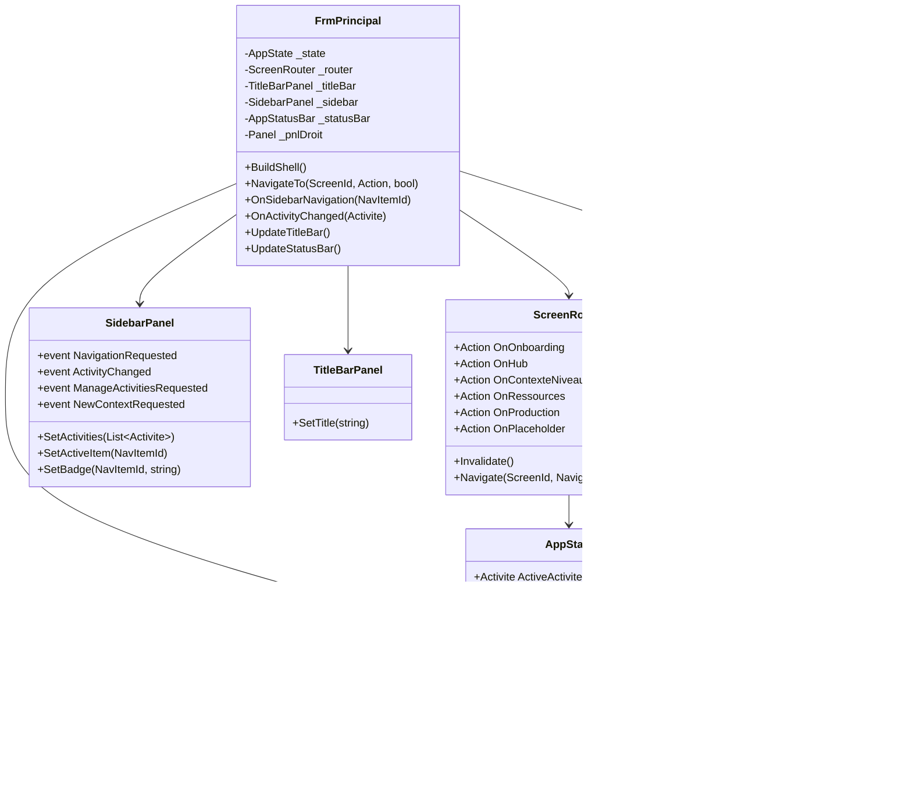

# Shell & Navigation ERP
> Communautes graphify : C_Architecture, C_UI, C_WinForms
> Derniere mise a jour : 2026-05-16

## Responsabilite

Le module Shell constitue l'enveloppe visuelle et le systeme de navigation de l'application SFA (Single-Form Application). Il orchestre l'affichage des ecrans inline dans un panneau central unique (`_pnlDroit`), gere le cycle de vie des activites/contextes/niveaux, et fournit un feedback permanent via la TitleBar et la StatusBar.

Le pattern SFA evite les fenetres multiples : un seul `Form` (FrmPrincipal) heberge tous les ecrans, reconstruits dynamiquement dans le panneau droit lors de chaque navigation.

## Diagramme

## Fichiers source

| Fichier | Role |
|---------|------|
| `Forms/FrmPrincipal.cs` | Hub principal SFA — construction du shell, routage, gestion des evenements sidebar |
| `Forms/Shell/TitleBarPanel.cs` | Bandeau superieur 38px — logo, titre document, indicateur MySQL, avatar utilisateur |
| `Forms/Shell/SidebarPanel.cs` | Sidebar 224px style Odoo — ActivitySwitcher, 3 groupes nav, badges, hover/active |
| `Forms/Shell/StatusBarPanel.cs` | Barre de statut inferieure 26px — connexion, activite, contexte, niveau, hints clavier |
| `Navigation/AppState.cs` | Etat global observable — activite, contexte, niveau, ecran actif, filtre alertes |
| `Navigation/ScreenRouter.cs` | Routeur d'ecrans avec guard de re-navigation (singleton pattern) |
| `Navigation/NavigationParams.cs` | DTO de parametres de navigation (ScrollToId, Entity, IsEdit, FiltreAlertes) |
| `Navigation/NavItemId.cs` | Enum des items de la sidebar (Hub, Production, StocksLiaisons, Ingredients, etc.) |
| `Navigation/ScreenId.cs` | Enum des ecrans inline (Onboarding, Hub, ContexteNiveaux, Ressources, Production) |
| `Navigation/RessourceType.cs` | Enum des sous-ecrans Ressources (Stocks, Ingredients, Fournisseurs, Achats, VueStock) |

## Methodes cles

### FrmPrincipal

| Methode | Signature | Description |
|---------|-----------|-------------|
| BuildShell | `private void BuildShell()` | Construit les 4 composants shell (TitleBar, StatusBar, Sidebar, PnlDroit) dans l'ordre WinForms correct |
| InitRouter | `private void InitRouter()` | Cable les delegates du ScreenRouter vers les methodes Show* |
| NavigateTo | `private void NavigateTo(ScreenId screen, Action stateSetup = null, bool forceRefresh = false)` | Point d'entree unique de navigation — execute stateSetup, invalide si forceRefresh, delegue au router |
| OnSidebarNavigation | `private void OnSidebarNavigation(NavItemId id)` | Mappe NavItemId vers ScreenId + RessourceType, met a jour sidebar/titlebar/statusbar |
| OnActivityChanged | `private void OnActivityChanged(Activite act)` | Change l'activite dans AppState, recharge les contextes, force la navigation |
| UpdateTitleBar | `private void UpdateTitleBar()` | Met a jour le titre du document dans la TitleBarPanel |
| UpdateStatusBar | `private void UpdateStatusBar()` | Appelle AppStatusBar.UpdateState() avec l'etat courant |
| ClearAndDisposePanel | `private void ClearAndDisposePanel()` | Dispose tous les controles enfants de _pnlDroit puis Clear() (regle #18) |

### AppState

| Methode | Signature | Description |
|---------|-----------|-------------|
| SetActivite | `public void SetActivite(Activite a)` | Change l'activite — reinitialise contexte et niveau si changement reel |
| SetContexte | `public void SetContexte(BomContexte c)` | Change le contexte — reinitialise le niveau |
| SetNiveau | `public void SetNiveau(BomNiveau n)` | Change le niveau actif |
| SetRessource | `public void SetRessource(RessourceType type)` | Change le sous-ecran ressource actif |
| SetFiltreAlertes | `public void SetFiltreAlertes(bool alertesSeulement)` | US-08 : active le filtre alertes pour la navigation vers Ingredients |

### ScreenRouter

| Methode | Signature | Description |
|---------|-----------|-------------|
| Navigate | `public void Navigate(ScreenId screen, NavigationParams parms = null)` | Navigue vers un ecran — guard singleton evite les reconstructions inutiles |
| Invalidate | `public void Invalidate()` | Force le prochain Navigate a reconstruire l'ecran (apres CRUD, changement activite) |

### TitleBarPanel

| Methode | Signature | Description |
|---------|-----------|-------------|
| SetTitle | `public void SetTitle(string title)` | Change le titre du document affiche dans la barre — Invalidate() pour repaint |

### SidebarPanel

| Methode | Signature | Description |
|---------|-----------|-------------|
| SetActivities | `public void SetActivities(List<Activite> activities)` | Peuple le ComboBox ActivitySwitcher |
| SetSelectedActivity | `public void SetSelectedActivity(Activite act)` | Selectionne une activite dans le ComboBox par Id |
| SetActiveItem | `public void SetActiveItem(NavItemId id)` | Met en surbrillance l'item de navigation actif (barre doree + fond) |
| SetBadge | `public void SetBadge(NavItemId id, string text)` | Affiche/masque un badge (pill) sur un item de navigation |

### AppStatusBar

| Methode | Signature | Description |
|---------|-----------|-------------|
| UpdateState | `public void UpdateState(AppState state)` | Met a jour les labels de la barre (activite, contexte, niveau) |

## Relations inter-modules

- **Appelle** : DAL/ActiviteDAL, DAL/BomContexteDAL, DAL/BomNiveauDAL (chargement initial)
- **Appele par** : Program.cs (point d'entree apres authentification)
- **Heberge** : Tous les ecrans inline (Production, Ressources, ContexteNiveaux, Hub, Onboarding)

## Regles metier (JOURNAL.md)

| # | Regle |
|---|-------|
| 11 | Ordre d'ajout WinForms (Controls.Add programmatique) : Fill en index 0, puis Bottom, puis Top en dernier. Le docking est traite en ordre inverse. |
| 18 | `Controls.Clear()` ne Dispose PAS les enfants — implementer un helper qui itere et dispose chaque enfant avant Clear. Symptome : latence a la fermeture. |
| 20 | `DataGridView.AutoResizeColumns(AllCells)` est couteux — preferer `AllCellsExceptHeader` ou largeurs fixes. Toujours SuspendLayout/ResumeLayout. |
| 23 | Ne jamais nommer une classe `StatusBarPanel` dans un projet WinForms — conflit avec `System.Windows.Forms.StatusBarPanel`. Preferer `AppStatusBar`. |
| 26 | `Panel.Paint` est invisible quand un controle enfant Dock=Fill couvre toute la surface. Pour des separateurs, utiliser un Panel physique dedie entre les colonnes. |
