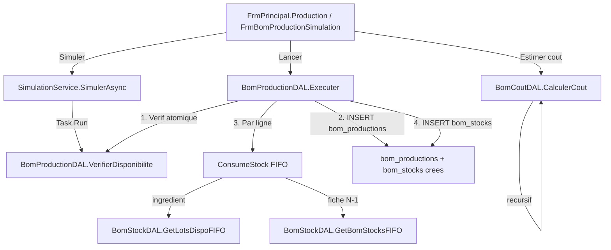

# BOM Production & Couts
> Communautes graphify : C_Production, C_Stock, C_BOM, C_Couts
> Derniere mise a jour : 2026-05-16

## Responsabilite

Le module Production gere l'execution des recettes BOM (Bill of Materials) : verification de disponibilite stock, consommation FIFO (First In First Out) des lots/stocks intermediaires, creation des enregistrements de production avec tracabilite complete, et calcul recursif du cout de revient multi-niveaux.

Le pattern de production est **non-recursif cote utilisateur** : l'operateur lance les productions sequentiellement niveau par niveau (N1 d'abord, puis N2, etc.). Les couts, eux, sont calcules recursivement par `BomCoutDAL` via une regle de 3 inter-niveaux.

## Diagramme

## Fichiers source

| Fichier | Role |
|---------|------|
| `DAL/BomProductionDAL.cs` | Moteur de production — verification, execution transactionnelle, consommation FIFO |
| `DAL/BomStockDAL.cs` | Acces aux stocks BOM intermediaires et lots ingredients (FIFO, disponibilite nette) |
| `DAL/BomCoutDAL.cs` | Calcul recursif du cout de revient par regle de 3 inter-niveaux + detection de cycle |
| `Services/SimulationService.cs` | Couche applicative — appelle Simuler() en async et projette en SimulationResultat |
| `Forms/FrmPrincipal.Production.cs` | Ecran Production inline dans le shell SFA — parametres, simulation, historique |
| `Forms/FrmBomProductionSimulation.cs` | Formulaire modal legacy (ShowDialog) — simulation + lancement production |
| `Models/BomProduction.cs` | Modele d'un enregistrement de production (header) |
| `Models/BomProductionLigne.cs` | Modele d'une ligne de consommation (tracabilite lot/bom_stock) |
| `Models/BomStock.cs` | Modele d'un stock BOM intermediaire (produit par une production) |
| `Models/BomManque.cs` | Modele d'un manque de stock detecte avant production |
| `Models/RapportCout.cs` | Resultat du calcul de cout recursif (lignes detaillees + totaux) |

## Methodes cles

### BomProductionDAL

| Methode | Signature | Description |
|---------|-----------|-------------|
| GetByNiveau | `static List<BomProduction> GetByNiveau(int idNiveau)` | Liste les productions d'un niveau (tri date DESC) |
| GetRecentByActivite | `static List<BomProduction> GetRecentByActivite(int idActivite, int limit = 10)` | Dernieres productions d'une activite |
| GetDuJourByActivite | `static List<BomProduction> GetDuJourByActivite(int idActivite)` | Productions du jour (CURDATE()) pour une activite |
| VerifierDisponibilite | `static List<BomManque> VerifierDisponibilite(int idNiveau, int idFiche, decimal quantiteCible)` | Verifie si le stock est suffisant — retourne la liste des penuries (vide = OK) |
| Simuler | `static List<BomManque> Simuler(int idNiveau, int idFiche, decimal quantiteCible)` | Retourne TOUTES les lignes avec Manque calcule (pas uniquement les penuries) |
| Executer | `static int Executer(int idNiveau, int idFiche, decimal quantiteCible, string notes = null, int delaiConservationJours = 0)` | Execute une production atomique (transaction MySQL) — retourne l'id cree |
| ConsumeStock | `static decimal ConsumeStock(conn, tx, BomFicheLigne, decimal, int, BomNiveau)` | Consomme le stock en FIFO — retourne le cout total de la ligne |
| InsertLigne | `static void InsertLigne(conn, tx, int, string, int?, int?, decimal, decimal)` | Insere une ligne de tracabilite dans bom_productions_lignes |
| GetIdNiveauDeFiche | `static int GetIdNiveauDeFiche(int idFiche)` | Retourne l'id du niveau auquel appartient une fiche |

### BomStockDAL

| Methode | Signature | Description |
|---------|-----------|-------------|
| GetByNiveau | `static List<BomStock> GetByNiveau(int idNiveau)` | Stock disponible d'un niveau (quantite_disponible > 0, tri FIFO) |
| GetDisponible | `static decimal GetDisponible(int idNiveau, int idFiche)` | Quantite totale disponible d'une fiche dans un niveau |
| GetDisponibleIngredient | `static decimal GetDisponibleIngredient(int idFicheIngredient)` | Stock net d'un ingredient (lots - reservations actives) |
| GetLotsDispoFIFO | `static List<(int, decimal, decimal)> GetLotsDispoFIFO(int idFicheIngredient)` | Lots ingredient tries FIFO avec dispo nette et prix unitaire base |
| GetBomStocksFIFO | `static List<(int, decimal, decimal)> GetBomStocksFIFO(int idNiveau, int idFiche)` | Stocks BOM intermediaires tries FIFO |

### BomCoutDAL

| Methode | Signature | Description |
|---------|-----------|-------------|
| CalculerCout | `static RapportCout CalculerCout(int idFiche, decimal nBatches)` | Point d'entree unique — calcul recursif multi-niveaux avec detection de cycle |
| CalculerLigneIngredient | `static LigneCout CalculerLigneIngredient(BomFicheLigne, decimal)` | Cout d'une ligne ingredient = qte x prix moyen pondere des lots |
| CalculerLigneFiche | `static LigneCout CalculerLigneFiche(BomFicheLigne, decimal, HashSet)` | Cout d'une ligne fiche = appel recursif via regle de 3 (nBatchesSrc = qte / QuantiteOutput) |
| GetPrixMoyenIngredient | `static decimal GetPrixMoyenIngredient(int idFicheIngredient)` | Prix moyen pondere par unite de base (fallback: prix reference, puis 0) |

### SimulationService

| Methode | Signature | Description |
|---------|-----------|-------------|
| SimulerAsync | `static async Task<List<SimulationResultat>> SimulerAsync(int idNiveau, int idFiche, decimal quantiteCible)` | Appelle Simuler() sur Task.Run et projette en SimulationResultat |

### FrmPrincipal (partial Production)

| Methode | Signature | Description |
|---------|-----------|-------------|
| ShowProductionScreen | `private void ShowProductionScreen(NavigationParams p)` | Construit l'ecran Production inline (header, KPI, parametres, simulation, historique) |
| BuildProdHeader | `private Panel BuildProdHeader()` | Section header avec titre et sous-titre |
| BuildProdKpiBar | `private Panel BuildProdKpiBar(int, decimal, int, int)` | Barre KPI (productions 7j, cout 7j, alertes, fiches) |
| BuildProdParams | `private Panel BuildProdParams()` | Section parametres (contexte, niveau, fiche, quantite, delai, notes) |
| BuildProdSimulation | `private Panel BuildProdSimulation()` | Section simulation avec DGV resultats et boutons Simuler/Lancer |

## Flux d'execution detaille

1. **Parametrage** : L'utilisateur selectionne Contexte > Niveau > Fiche > Quantite (nombre de batches)
2. **Simulation** (optionnelle) : `SimulationService.SimulerAsync()` affiche toutes les lignes avec coloration vert/rouge
3. **Lancement** : `BomProductionDAL.Executer()` dans une transaction MySQL :
   - Verification de disponibilite DANS la transaction (evite TOCTOU)
   - INSERT dans `bom_productions` (header, cout temporaire = 0)
   - Pour chaque ligne de la fiche : `ConsumeStock()` en FIFO
     - **Ingredient** : parcourt lots (date_achat ASC), decremente, libere reservations
     - **Fiche N-1** : parcourt bom_stocks (date_production ASC), decremente
   - UPDATE cout_ingredients et cout_unitaire dans bom_productions
   - INSERT dans `bom_stocks` (stock produit au niveau N)
   - COMMIT (ou ROLLBACK si erreur)

## Relations inter-modules

- **Appelle** : BomFicheDAL, BomNiveauDAL, BomStockDAL, BomReservationDAL, UnitConvertisseur
- **Appele par** : FrmPrincipal.Production, FrmBomProductionSimulation
- **Produit** : Entrees dans bom_productions, bom_productions_lignes, bom_stocks

## Regles metier (JOURNAL.md)

| # | Regle |
|---|-------|
| 15 | `quantiteCible` = nombre de batches. Quantite reellement produite = quantiteCible x fiche.QuantiteOutput. Confondre les deux = stock x10 trop faible. |
| 16 | Dans la branche TypeInput == "fiche", `UnitConvertisseur.Convertir()` est OBLIGATOIRE avant toute comparaison ou decrementation de bom_stocks. Omettre = penurie fantome (g vs kg). |
