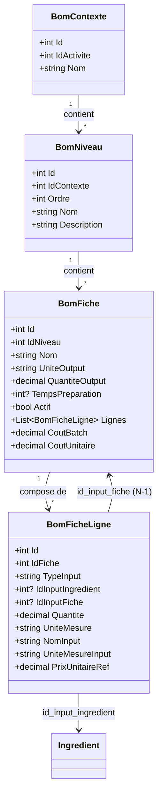

# BOM Fiches & Niveaux
> Communautes graphify : C_BOM, C_Referentiels, C_CRUD
> Derniere mise a jour : 2026-05-16

## Responsabilite

Le module Fiches & Niveaux constitue le referentiel de recettes BOM (Bill of Materials). Une **Fiche** represente une recette (liste d'inputs et output attendu). Un **Niveau** represente une etape de transformation dans un contexte donne (ex: N1 = ingredients bruts, N2 = preparations intermediaires, N3 = produits finis).

Chaque fiche appartient a un niveau precis. Ses lignes referencent soit des ingredients (N1), soit des fiches d'un niveau strictement inferieur. Ce systeme generique multi-niveaux permet de modeliser n'importe quelle chaine de production artisanale.

## Diagramme

## Fichiers source

| Fichier | Role |
|---------|------|
| `DAL/BomFicheDAL.cs` | CRUD complet des fiches BOM — insert/update transactionnels avec lignes, duplication, comptages |
| `DAL/BomFicheLigneDAL.cs` | Lecture des lignes d'une fiche (jointure ingredients + fiches), recherche d'utilisation |
| `DAL/BomNiveauDAL.cs` | CRUD des niveaux — ordre auto-incremente, suppression uniquement du dernier niveau |
| `Forms/FrmBomFiches.cs` | Liste des fiches d'un niveau — herite de FrmListeBase, colonnes formatees avec unite |
| `Forms/FrmBomFicheEdit.cs` | Formulaire creation/modification fiche — inputs contextuels selon l'ordre du niveau |
| `Forms/FrmBomNiveaux.cs` | Liste des niveaux d'un contexte — herite de FrmListeBase |
| `Forms/FrmBomNiveauEdit.cs` | Formulaire creation/modification de niveau |
| `Models/BomFiche.cs` | Modele fiche : header + lignes optionnelles + cout calcule |
| `Models/BomFicheLigne.cs` | Modele ligne de fiche : type (ingredient/fiche), quantite, unite, prix reference |
| `Models/BomNiveau.cs` | Modele niveau : ordre sequentiel dans un contexte |

## Methodes cles

### BomFicheDAL

| Methode | Signature | Description |
|---------|-----------|-------------|
| GetByNiveau | `static List<BomFiche> GetByNiveau(int idNiveau)` | Fiches actives d'un niveau, triees par nom |
| GetAll | `static List<BomFiche> GetAll(int idActivite = 0)` | Toutes les fiches actives (filtrable par activite), triees contexte/ordre/nom |
| GetById | `static BomFiche GetById(int id, bool avecLignes = true)` | Fiche par id, avec chargement optionnel des lignes via BomFicheLigneDAL |
| NomExiste | `static bool NomExiste(string nom, int idNiveau, int excludeId = 0)` | Unicite du nom dans le scope du niveau |
| Insert | `static int Insert(BomFiche f)` | Insere fiche + lignes dans une transaction — retourne l'id cree |
| Update | `static void Update(BomFiche f)` | Met a jour le header + supprime/reinsere toutes les lignes (transaction) |
| Delete | `static void Delete(int id)` | Suppression physique de la fiche |
| Duplicate | `static int Duplicate(int idFiche)` | Duplique une fiche avec nom unique ("Copie de...") dans le meme niveau |
| GetCountsByContexte | `static Dictionary<int,int> GetCountsByContexte(int idContexte)` | Nombre de fiches actives par niveau — une seule requete pour tous les badges |
| InsertLignes | `static void InsertLignes(conn, tx, int idFiche, List<BomFicheLigne>)` | Insere les lignes d'une fiche avec validation TypeInput/FK |

### BomFicheLigneDAL

| Methode | Signature | Description |
|---------|-----------|-------------|
| GetByFiche | `static List<BomFicheLigne> GetByFiche(int idFiche)` | Charge toutes les lignes avec jointure ingredient/fiche (COALESCE nom + unite) |
| GetFichesUtilisant | `static List<string> GetFichesUtilisant(int idIngredient)` | Noms des fiches qui consomment un ingredient donne |
| GetFichesConsommant | `static List<string> GetFichesConsommant(int idFiche)` | Noms des fiches de niveaux superieurs qui consomment une fiche donnee |

### BomNiveauDAL

| Methode | Signature | Description |
|---------|-----------|-------------|
| GetByContexte | `static List<BomNiveau> GetByContexte(int idContexte)` | Niveaux d'un contexte tries par ordre croissant |
| GetById | `static BomNiveau GetById(int id)` | Niveau par id avec jointures contexte/activite |
| GetOrdreMax | `static int GetOrdreMax(int idContexte)` | Ordre maximum actuel (pour auto-increment) |
| Insert | `static int Insert(BomNiveau n)` | Insere avec ordre = MAX(ordre) + 1 dans le contexte (sous-requete) |
| Update | `static void Update(BomNiveau n)` | Met a jour nom et description uniquement (pas l'ordre) |
| Delete | `static void Delete(int id)` | Supprime uniquement le dernier niveau (leve exception sinon) |
| GetByContexteEtOrdre | `static BomNiveau GetByContexteEtOrdre(int idContexte, int ordre)` | Niveau par contexte + ordre (pour navigation inter-niveaux) |

### FrmBomFicheEdit

| Methode | Signature | Description |
|---------|-----------|-------------|
| Constructeur | `FrmBomFicheEdit(BomFiche fiche, BomNiveau niveau)` | Mode creation (fiche=null) ou edition — charge inputs disponibles selon l'ordre du niveau |
| Valider | heritee de FrmEditBase | Verifie nom non vide, quantite > 0, au moins une ligne |
| Sauvegarder | heritee de FrmEditBase | Appelle BomFicheDAL.Insert ou Update selon _isEdit |

### FrmBomFiches

| Methode | Signature | Description |
|---------|-----------|-------------|
| Constructeur | `FrmBomFiches(BomNiveau niveau)` | Liste liee a un niveau precis |
| ChargerDonnees | `override List<BomFiche> ChargerDonnees()` | Appelle BomFicheDAL.GetByNiveau |
| ConfigurerColonnes | `override void ConfigurerColonnes()` | Cache les colonnes FK, formate QuantiteOutput avec unite via CellFormatting |

## Regles de composition des lignes

- **Niveau 1** : les lignes ne peuvent referencer que des **ingredients** (type_input = "ingredient")
- **Niveau N (N >= 2)** : les lignes peuvent referencer des ingredients ET des fiches de **tout niveau strictement inferieur** (pas uniquement N-1)
- L'unite de la ligne est toujours verrouillee a l'unite de l'input source (UniteMesureInput) — toute saisie dans une autre unite passerait par UnitConvertisseur
- Un niveau N ne peut jamais referencer une fiche du meme niveau ou d'un niveau superieur

## Relations inter-modules

- **Appelle** : IngredientDAL (pour lister les inputs disponibles dans FrmBomFicheEdit)
- **Appele par** : BomProductionDAL (lecture fiche + lignes pour execution), BomCoutDAL (calcul cout), FrmPrincipal (ecran ContexteNiveaux)
- **Dependance** : BomContexteDAL (un niveau appartient a un contexte)

## Regles metier (JOURNAL.md)

| # | Regle |
|---|-------|
| 4 | `bom_fiches` liee a un niveau specifique (id_niveau) — sans ce lien, impossible de filtrer par niveau ni d'imposer que les inputs viennent du N-1. |
| 5 | Quand on ajoute un champ au Model, verifier les 4 endroits du DAL : SELECT, INSERT, UPDATE, Map(). Oublier l'un = champ toujours NULL. |
| 7 | L'unite d'une ligne de fiche BOM est celle de l'ingredient/fiche source. Le ComboBox d'unite doit etre verrouille (Enabled=false) apres selection de l'input. |
