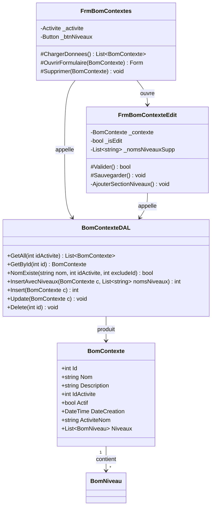

# BOM Contextes
> Communautes graphify : C_BOM, C_Production, C_Activites
> Derniere mise a jour : 2026-05-16

## Responsabilite

Le module BOM Contextes gere les contextes de production — un contexte regroupe des niveaux de transformation pour une ligne de production specifique (ex : "Chocolaterie Noel 2026"). Chaque contexte est lie a une activite et contient N niveaux ordonnes (N1 = ingredients de base, N2+ = niveaux superieurs definis par l'artisan). Le CRUD est transactionnel : l'insertion cree le contexte ET ses niveaux en une seule transaction.

## Diagramme

## Fichiers source

| Fichier | Role |
|---------|------|
| `Models/BomContexte.cs` | Modele de donnees — proprietes, liste de niveaux chargee optionnellement |
| `DAL/BomContexteDAL.cs` | Acces DB — CRUD avec insertion transactionnelle contexte+niveaux |
| `Forms/FrmBomContextes.cs` | Liste CRUD heritant de FrmListeBase, bouton navigation vers niveaux |
| `Forms/FrmBomContexteEdit.cs` | Formulaire creation/edition avec gestion dynamique des niveaux inline |

## Methodes cles

### BomContexteDAL

| Methode | Signature | Description |
|---------|-----------|-------------|
| GetAll | `static List<BomContexte> GetAll(int idActivite = 0)` | Charge tous les contextes actifs, filtre optionnel par activite. Jointure avec `activites` pour le nom. |
| GetById | `static BomContexte GetById(int id)` | Charge un contexte par son id avec jointure activite. |
| NomExiste | `static bool NomExiste(string nom, int idActivite, int excludeId = 0)` | Unicite du nom au sein d'une meme activite. |
| InsertAvecNiveaux | `static int InsertAvecNiveaux(BomContexte c, List<string> nomsNiveaux)` | Insert contexte + niveaux en transaction. N1 "Ingredients" garanti minimum. Retourne l'id cree. |
| Insert | `static int Insert(BomContexte c)` | Alias de InsertAvecNiveaux avec niveaux=null (N1 par defaut). |
| Update | `static void Update(BomContexte c)` | Met a jour nom, description, id_activite. |
| Delete | `static void Delete(int id)` | Suppression physique du contexte (cascade via FK sur bom_niveaux). |

### FrmBomContextes

| Methode | Signature | Description |
|---------|-----------|-------------|
| ChargerDonnees | `override List<BomContexte> ChargerDonnees()` | Delegue a `BomContexteDAL.GetAll` avec filtre activite. |
| OuvrirFormulaire | `override Form OuvrirFormulaire(BomContexte element)` | Ouvre FrmBomContexteEdit en mode creation ou edition. |
| Supprimer | `override void Supprimer(BomContexte element)` | Appelle `BomContexteDAL.Delete`. |

### FrmBomContexteEdit

| Methode | Signature | Description |
|---------|-----------|-------------|
| Valider | `override bool Valider()` | Verifie nom obligatoire, activite selectionnee, unicite nom/activite. |
| Sauvegarder | `override void Sauvegarder()` | Insert ou Update selon mode. En creation, collecte N1 + niveaux supp et appelle InsertAvecNiveaux. |
| AjouterSectionNiveaux | `void AjouterSectionNiveaux()` | Construit la section UI niveaux (N1 fixe + ListBox N2+, boutons +/-). Mode creation uniquement. |
| BtnAjouterNiveau_Click | `void BtnAjouterNiveau_Click(...)` | Dialogue modal pour nommer un nouveau niveau superieur. |
| BtnSupprimerDernierNiveau_Click | `void BtnSupprimerDernierNiveau_Click(...)` | Supprime le dernier niveau ajoute (pile LIFO). |

## Relations inter-modules

- **Appelle** : ActiviteDAL (chargement combo activites), BomNiveauDAL (implicite via FK)
- **Appele par** : FrmPrincipal (navigation hub), module Production (selection contexte pour lancer une production)

## Regles metier (JOURNAL.md)

| # | Regle |
|---|-------|
| 8 | Migration ENUM vers FK — les types d'activite ne sont plus un ENUM mais une table `activites` avec FK. Le contexte reference `id_activite` (FK) au lieu d'un champ enum. |
