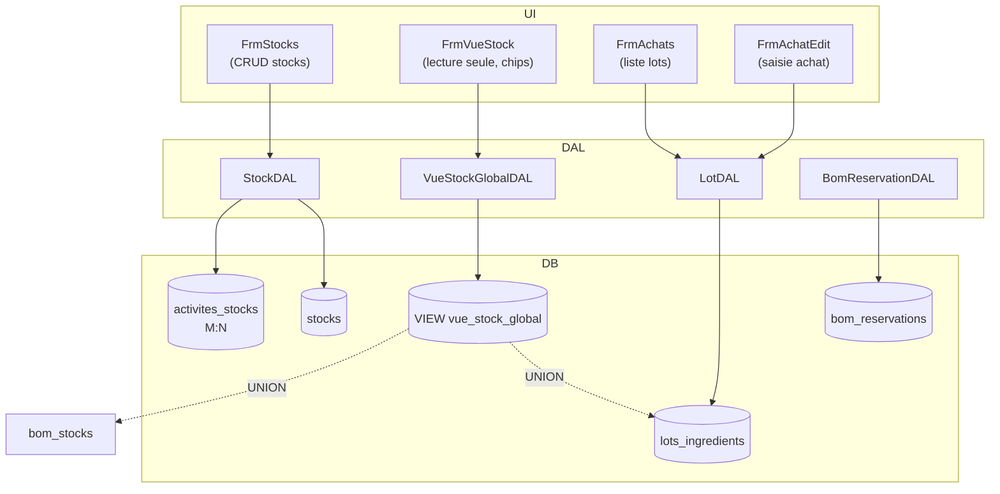

# Stock & Achats
> Communautes graphify : C_Stock, C_Achats, C_Lots, C_Reservations, C_Production
> Derniere mise a jour : 2026-05-16

## Responsabilite

Le module Stock & Achats gere l'ensemble du cycle de vie des matieres premieres et produits fabriques. Il comprend : la definition des stocks physiques/logiques (contenants), l'enregistrement des achats (lots avec DLC, prix, fournisseur), une vue unifiee du stock global via une VIEW SQL (`vue_stock_global`) qui fusionne lots d'ingredients et produits fabriques, et un systeme de reservations qui permet de marquer des quantites comme reservees pendant la planification de production. Le tri FIFO (First In First Out) par date de peremption est applique pour la consommation des lots.

## Diagramme

## Fichiers source

| Fichier | Role |
|---------|------|
| `Models/Stock.cs` | Modele stock physique (contenant logique) — Id, Nom, Description, Actif |
| `Models/Lot.cs` | Modele lot d'achat — quantites, prix, DLC, fournisseur, conditionnement |
| `Models/VueStockGlobal.cs` | Modele lecture seule de la VIEW — unifie lots et produits fabriques |
| `DAL/StockDAL.cs` | CRUD stocks + liaison M:N activites_stocks avec verifications de suppression |
| `DAL/VueStockGlobalDAL.cs` | Lecture seule de vue_stock_global avec filtres activite/contexte/niveau |
| `DAL/LotDAL.cs` | CRUD lots_ingredients avec jointures fiche+fournisseur, calcul quantite en base |
| `DAL/BomReservationDAL.cs` | Gestion des reservations de stock pour la production (soft delete) |
| `Forms/FrmVueStock.cs` | Vue stock global — DGV avec chips filtrage activite, coloration alertes/DLC |
| `Forms/FrmAchats.cs` | Liste des achats heritant FrmListeBase avec CellFormatting unites |
| `Forms/FrmAchatEdit.cs` | Formulaire saisie achat — prix HTVA/TVAC, DLC optionnelle, calculs auto |
| `Forms/FrmStocks.cs` | Gestion des stocks — CRUD + panel liaison CheckedListBox activites (M:N) |

## Methodes cles

### StockDAL

| Methode | Signature | Description |
|---------|-----------|-------------|
| GetAll | `static List<Stock> GetAll(bool includeInactifs = false)` | Liste des stocks, filtre actifs par defaut. |
| GetById | `static Stock GetById(int id)` | Un stock par id. |
| GetByActivite | `static List<Stock> GetByActivite(int idActivite)` | Stocks lies a une activite via jonction M:N `activites_stocks`. |
| NomExiste | `static bool NomExiste(string nom, int excludeId = 0)` | Unicite du nom de stock. |
| Insert | `static int Insert(Stock s)` | Creation, retourne l'id. |
| Update | `static void Update(Stock s)` | Modification nom/description. |
| Delete | `static void Delete(int id)` | Suppression avec double verification (fiches liees + lots actifs). Leve InvalidOperationException si bloque. |
| LierActivite | `static void LierActivite(int idActivite, int idStock)` | INSERT IGNORE dans activites_stocks. |
| DelierActivite | `static void DelierActivite(int idActivite, int idStock)` | DELETE dans activites_stocks. |
| GetActivitesLiees | `static List<int> GetActivitesLiees(int idStock)` | Ids des activites liees a un stock (pour CheckedListBox). |

### VueStockGlobalDAL

| Methode | Signature | Description |
|---------|-----------|-------------|
| GetAll | `static List<VueStockGlobal> GetAll()` | Tout le stock, tri par type puis DLC croissante. |
| GetByActivite | `static List<VueStockGlobal> GetByActivite(int idActivite)` | Lots via activites_stocks (M:N) + produits via id_activite direct (discriminant v11). |
| GetByContexte | `static List<VueStockGlobal> GetByContexte(int idContexte)` | Lots avec reservations actives pour un contexte (JOIN bom_reservations). |
| GetByNiveau | `static List<VueStockGlobal> GetByNiveau(int idNiveau)` | Stock fabrique d'un niveau BOM donne. |

### LotDAL

| Methode | Signature | Description |
|---------|-----------|-------------|
| GetAll | `static List<Lot> GetAll(int idActivite = 0)` | Tous les lots, filtre optionnel par activite via activites_stocks. Jointure fiche+fournisseur. |
| GetById | `static Lot GetById(int id)` | Un lot par id avec toutes ses jointures. |
| Insert | `static void Insert(Lot lot)` | Insertion — quantite_disponible = quantite_initiale a la creation. |
| Update | `static void Update(Lot lot)` | Mise a jour — recalcule quantite_disponible en preservant la consommation deja effectuee via GREATEST(0, ...). |
| Delete | `static void Delete(int id)` | Suppression physique du lot. |

### BomReservationDAL

| Methode | Signature | Description |
|---------|-----------|-------------|
| GetByContexte | `static List<BomReservation> GetByContexte(int idContexte)` | Reservations actives pour un contexte, avec jointures nom ingredient/contexte. |
| GetTotalReservePourLot | `static decimal GetTotalReservePourLot(int idLot)` | Somme des quantites reservees (tous contextes) pour un lot. Sert au calcul dispo reelle. |
| Insert | `static int Insert(BomReservation res)` | Cree une reservation active. |
| Update | `static void Update(BomReservation res)` | Modifie quantite/notes. |
| Liberer | `static void Liberer(int id)` | Soft delete — passe actif=0 pour liberer la quantite. |
| LibererToutContexte | `static void LibererToutContexte(int idContexte)` | Libere toutes les reservations actives d'un contexte. |

### VueStockGlobal (modele)

| Methode | Signature | Description |
|---------|-----------|-------------|
| EstLot | `bool EstLot` | true si TypeStock == "lot_ingredient". |
| EstEnAlerte | `bool EstEnAlerte` | true si QuantiteDispoReelle <= 0. |
| ADesReservations | `bool ADesReservations` | true si QuantiteReservee > 0. |

## Relations inter-modules

- **Appelle** : ActiviteDAL (chips de filtrage), IngredientDAL (selection ingredient dans FrmAchatEdit), FournisseurDAL (combo fournisseurs)
- **Appele par** : Module Production (reservations, consommation lots), FrmPrincipal (hub navigation), Module BOM (calcul disponibilites)

## Regles metier (JOURNAL.md)

| # | Regle |
|---|-------|
| 14 | Le champ s'appelle `date_peremption` en DB (et `DatePeremption` en C#) — la VIEW expose `date_dlc` comme alias pour l'affichage. Ne pas confondre les deux noms. |
| 17 | VIEW missing FK label — quand une VIEW ne joint pas une table de reference, le label FK reste NULL. Toujours LEFT JOIN dans la VIEW pour garantir l'affichage. |
| 25 | Sort desactive avec section headers — quand le DGV affiche des sections (par type_stock), le tri utilisateur est desactive pour ne pas casser le regroupement visuel. |
