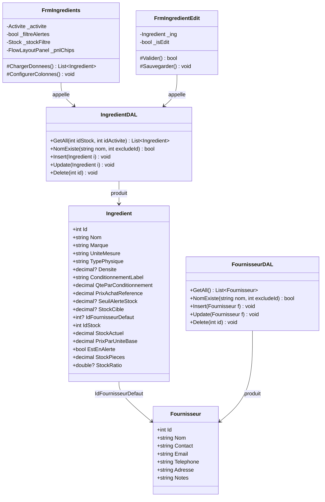

# Catalogue (Ingredients & Fournisseurs)
> Communautes graphify : C_Catalogue, C_Ingredients, C_Fournisseurs, C_Stock
> Derniere mise a jour : 2026-05-16

## Responsabilite

Le module Catalogue gere le referentiel des matieres premieres (fiches ingredients) et des fournisseurs. Chaque fiche ingredient definit l'unite de base (g, ml, piece), le conditionnement commercial (label + quantite par conditionnement), le prix de reference, le seuil d'alerte, le stock cible (pour jauge), et la liaison au stock physique et fournisseur par defaut. Le module propose un filtrage par chips de stock et une coloration conditionnelle des lignes en alerte. Les fournisseurs suivent un CRUD simple avec coordonnees completes.

## Diagramme

## Fichiers source

| Fichier | Role |
|---------|------|
| `Models/Ingredient.cs` | Modele fiche ingredient — unite de base, conditionnement, prix, stock cible, proprietes calculees |
| `Models/Fournisseur.cs` | Modele fournisseur — coordonnees completes (nom, contact, email, tel, adresse) |
| `DAL/IngredientDAL.cs` | CRUD fiches_ingredients avec agrégat stock actuel (SUM lots), filtres stock/activite |
| `DAL/FournisseurDAL.cs` | CRUD fournisseurs — requetes parametrees simples |
| `Forms/FrmIngredients.cs` | Liste heritant FrmListeBase — chips de filtrage par stock, coloration alertes |
| `Forms/FrmIngredientEdit.cs` | Formulaire creation/edition — champs conditionnels selon type_physique (densite) |
| `Forms/FrmFournisseurs.cs` | Liste fournisseurs — partial class Designer (ancien pattern pre-migration) |
| `Forms/FrmFournisseurEdit.cs` | Formulaire fournisseur — herite FrmEditBase, champs texte simples |

## Methodes cles

### IngredientDAL

| Methode | Signature | Description |
|---------|-----------|-------------|
| GetAll | `static List<Ingredient> GetAll(int idStock = 0, int idActivite = 0)` | Liste ingredients actifs avec stock actuel calcule (SUM lots). Filtre par stock direct OU par activite (via activites_stocks). GROUP BY fi.id. |
| NomExiste | `static bool NomExiste(string nom, int excludeId = 0)` | Unicite du nom d'ingredient. |
| Insert | `static void Insert(Ingredient i)` | Insertion fiche avec tous les champs (12 parametres dont nullables). |
| Update | `static void Update(Ingredient i)` | Mise a jour complete sauf id. |
| Delete | `static void Delete(int id)` | Suppression physique de la fiche. |

### FournisseurDAL

| Methode | Signature | Description |
|---------|-----------|-------------|
| GetAll | `static List<Fournisseur> GetAll()` | Tous les fournisseurs tries par nom. |
| NomExiste | `static bool NomExiste(string nom, int excludeId = 0)` | Unicite du nom de fournisseur. |
| Insert | `static void Insert(Fournisseur f)` | Insertion avec 6 champs (nom obligatoire, reste nullable). |
| Update | `static void Update(Fournisseur f)` | Mise a jour complete. |
| Delete | `static void Delete(int id)` | Suppression physique. |

### Ingredient (modele — proprietes calculees)

| Methode | Signature | Description |
|---------|-----------|-------------|
| PrixParUniteBase | `decimal PrixParUniteBase { get; }` | Prix de reference / QteParConditionnement. Cout unitaire en euros/g, euros/ml ou euros/piece. |
| EstEnAlerte | `bool EstEnAlerte { get; }` | true si stock actuel <= seuil d'alerte (quand seuil defini). |
| StockPieces | `decimal StockPieces { get; }` | Nombre de conditionnements complets en stock (Math.Floor). |
| StockRatio | `double? StockRatio { get; }` | Ratio stock actuel / stock cible (null si pas de cible). Alimente la jauge UI. |

### FrmIngredients

| Methode | Signature | Description |
|---------|-----------|-------------|
| ChargerDonnees | `override List<Ingredient> ChargerDonnees()` | Charge via IngredientDAL.GetAll, filtre par stock-chip et/ou alertes seulement. |
| ConfigurerColonnes | `override void ConfigurerColonnes()` | Cache colonnes techniques, configure largeurs, active CellFormatting pour unites. |

### FrmIngredientEdit

| Methode | Signature | Description |
|---------|-----------|-------------|
| Constructeur | `FrmIngredientEdit(Ingredient ing, Stock stockDefaut = null)` | Mode creation ou edition. Affichage conditionnel du champ densite selon type_physique. |

## Relations inter-modules

- **Appelle** : StockDAL (combo stock dans FrmIngredientEdit), FournisseurDAL (combo fournisseur par defaut)
- **Appele par** : Module Achats (selection ingredient lors d'un achat), Module BOM (composants des recettes), Module Stock (affichage jauge)

## Regles metier (JOURNAL.md)

| # | Regle |
|---|-------|
| 5 | 4 places dans le DAL — convention interne : chaque methode DAL doit utiliser exactement 4 places dans les parametres numeriques pour eviter les erreurs de precision SQL. |
| 6 | DGV sizing — colonnes en mode `Fill` avec MinimumWidth pour garantir la lisibilite. Eviter les largeurs fixes sur des grilles redimensionnables. |
| 24 | CellFormatting pour unites — l'affichage des unites (g, ml, piece, kg) dans le DGV passe par un event CellFormatting qui convertit et formate dynamiquement selon l'unite de base de l'ingredient. |
| 27 | Migration avant app launch — toute migration DB doit etre executee automatiquement au demarrage de l'application avant l'affichage du formulaire principal. |
| 28 | Conversion pieces — quand unite_mesure = 'piece', l'affichage et la saisie se font directement en pieces (pas de conversion g/ml). Le conditionnement represente le nombre de pieces par paquet. |
